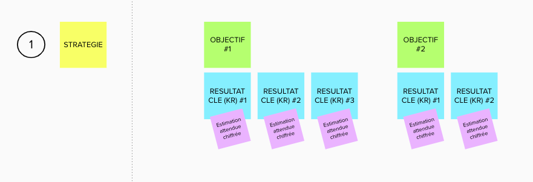

J'ai eu la chance de participer à la première version de la formation Stratégie Produit et Objective Key Result (OKR) animée par Tiphanie. Cette formation a été évidemment l'occasion de parler d'un sujet cher aux personnes évoluant dans un milieu dit "agile" : L'IMPACT.

# La méthode OKR en bref

## OKR Stratégiques - horizon ~1 an

La  première étape de la méthode OKR est de fixer et de partager un, deux voire  trois objectifs stratégiques (O) et les résultats clés (KR) associés que l'on souhaite atteindre et suivre (cf. figure ci-dessous). Les OKRs Stratégiques seront sans doute fixés par la direction, dans ce cas, les équipes en hériteront.
Le nombre d'Objectifs et de KR est donné ici à titre d'exemple, il se peut que pour un contexte il faille 3 Objectifs avec chacun 2 KR, … Il me semble important d'avoir au moins de KRs par Objectifs et de ne pas dépasser 5. Idem pour les Objectifs
Les KR seront les outils de mesure de votre objectif. Dans la méthode, Objectif stratégique signifie objectif à peu près 1 an.

## OKR tactiques

Ces OKR seront ensuite déclinés par les équipes en N objectifs tactiques (O) pour une période de 4 semaines à 3 mois (en fonction de votre contexte), y seront également associés des résultats clés (KR) (cf. figure ci-dessous).
Pour créer les objectifs tactiques, vous pouvez vous poser des questions comme *"Comment pouvons contribuer aux OKRs parents ?"* ou *"Quel Key result de l'OKR parent allons-nous pouvoir impacter ?"*

Je rappelle comme le titre le disait : ceci est un résumé très court de la méthode.

# Se mettre en capacité de mesurer
Après ces phases de réflexions pour la direction ou pour les équipes, il y a de multiples mesures à suivre. 
Prenons le cas d'une équipe qui vient de terminer la définition des OKRs tactiques sur la période 1 comme indiqué dans la figure 2, il y aura 9 mesures à suivre.
