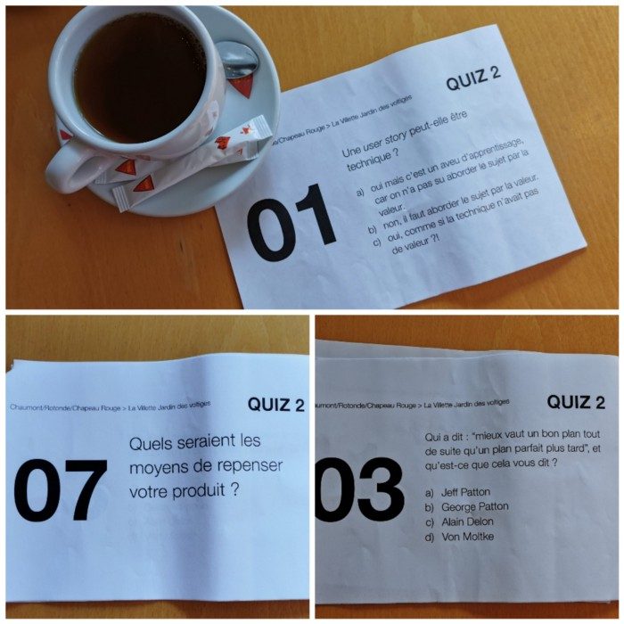
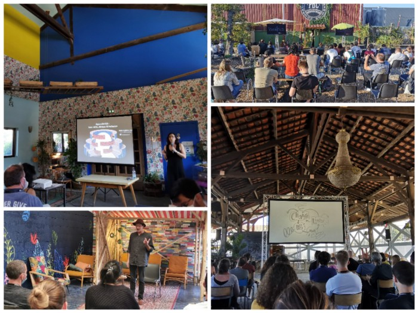
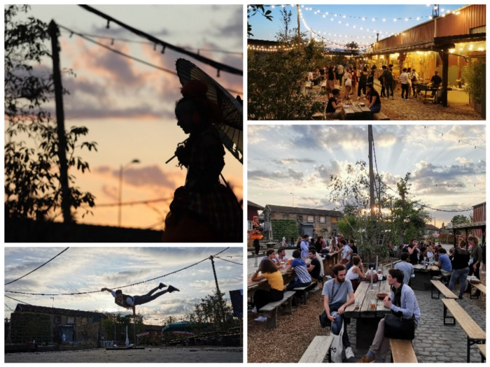

# School of Product Ownership — Outdoor Edition 2020

La School of Product Ownership 2020 cela devait être une journée de talks avec des speakers reconnus dans un lieu clos dans le centre chic de Paris.

Et puis le COVID et son lot d’imprévus , de contraintes qui changent tous les mois voir toutes les semaines. Annulation de la conférence ou plutôt décalage dans le temps. Tout le monde raye la date de mars et coche celle du 22 septembre. Mais, personne ne sait si cela sera possible ni quelle en sera la forme.

> *22 septembre, les surprises vont se succéder*

## Le matin

Le rendez-vous est donné au cimetière du Père Lachaise, les participants s’organisent en groupe de 10–12 personnes. Armés de Quiz au format A4, chaque groupe va déambuler jusqu’à la Cité Fertile à Pantin. Les groupes échange sur les buts d’ateliers produit, les différence entre MVP et prototype, les redevabilités du PO et du PM. Parfois, c’est croyance contre croyance, parfois personne ne sait, parfois un sachant partage, répond aux questions. C’est enrichissant, intéressant, inattendu. Tout le monde joue le jeu. De nouveaux quizz surgissent des poches des organisateurs, les duos, trios se défont, d’autres de reforment. Les cartes quizz s’échangent comme des images Panini.

Et pendant ce temps, les paysages parisiens défilent : Les Buttes Chaumont et ses rues pavées avoisinantes, le parc de la Villette, les berges de son canal, des boutiques inattendues.

## Arrivée à la Cité Fertile et début des talks

Ca sent le calme, le zen. Le soleil omniprésent et le ciel tout bleu donne des airs de vacances à ce lieu très aéré. Agréable. Incroyable. Le repas du midi est prospice aux récits des “exploits” du matin à des amis que l’on ne voit qu’en conférence, à des collègues.

L’après-midi, le format est plus classique même si le cadre est très différent de tout ce que tout le monde a l’habitude de voir.

Le Keynote de John Cutler (en remote) est retransmise en plein air ou sous un porche. Celia Hodent parle d’UX et d’éthique, Hervé le Jacq nous dévoile, au fil de ses contes, des “trucs” pour éveiller les grands. Gabrielle Benefield présente un “jeu” autour de la Moebius Loop. Il y avait aussi Jeff Gothelf, Amy Jo Kim, Srdja Popovic que je n’ai pu voir. Du très beau monde dont leurs propos nourissent cahiers, calepins et tablettes. Jeff Patton clôture une riche après-midi de talks et d’échanges par une keynote inspirante en remote et en live.

## Fin de journée

Aurore, notre game designer chez benext, nous a concocté une soirée dont elle a le secret. Quelques artistes déambulent avec ou sans échasses, divertisent les participants au gré de leurs acrobaties et de jonglages.

Le stress des organisateurs retombent, plusieurs profitent, “refont le match”. Les conversations (chères aux product owners) vont bon train ;-)

## Un beau renouveau

On dit ou entend parfois “tout est produit”. La School of Product Ownership 2020 n’y échappe, elle parle de Produit mais est aussi un Produit.

J’ai envie de parler de pivot, mais pas de celui du lean startup. Pivoter, renouveller, réinventer…

Sur la forme, l’équipe d’organisation a su casser plusieurs croyances liées aux conférences (marcher, remote, lieu en plein air…). Certains de leurs prestataires leur ont dit “ça on n’a jamais fait”.

Le fond est toujours différent mais toujours avec cette même inspiration.
BRAVO et MERCI ! 👏

On en redemande.

> *Revivez la conf via les [tweets échangés](https://twitter.com/i/events/1308678134712209410) dans cette journée*

#humilité #recherchedexcellence #nobullshit #fun