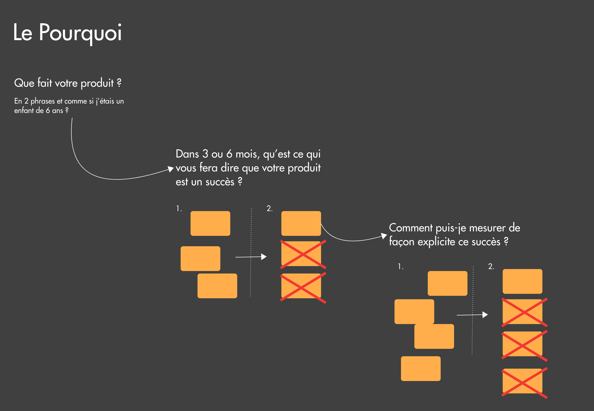
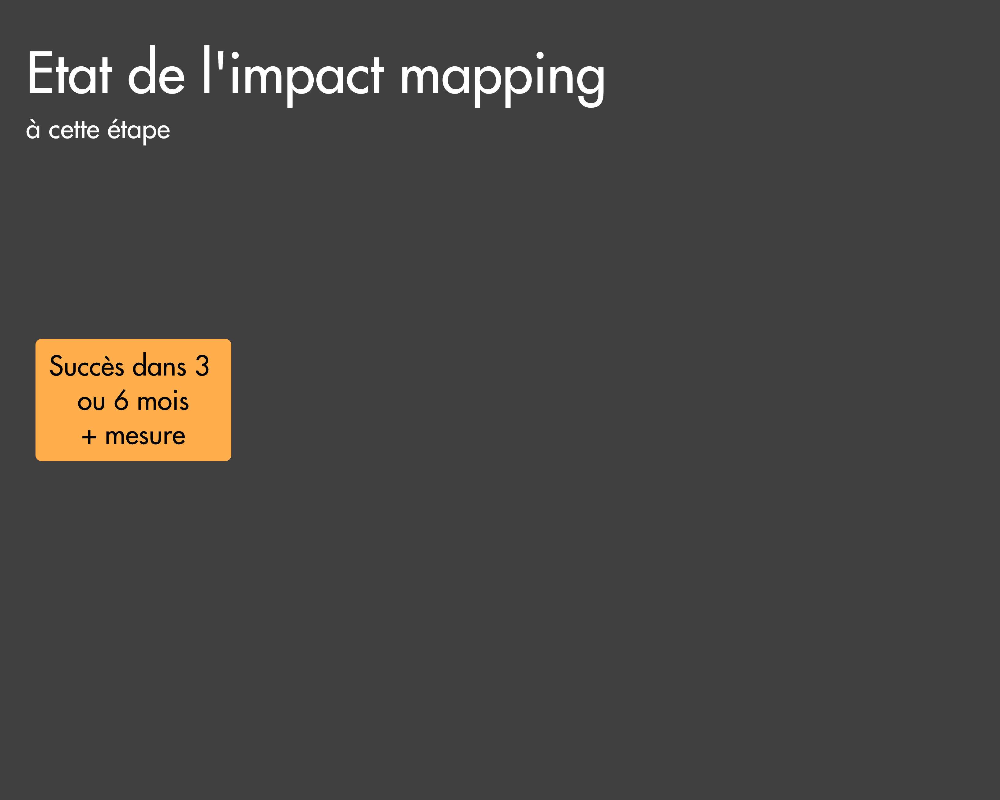
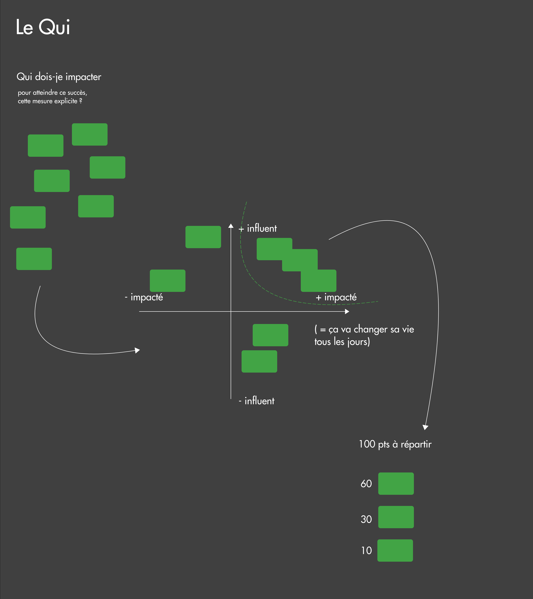
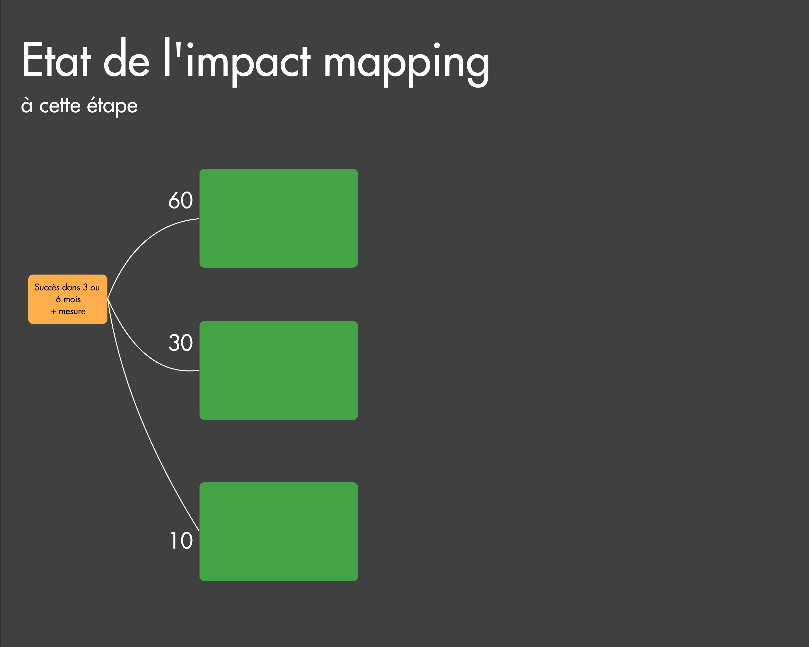
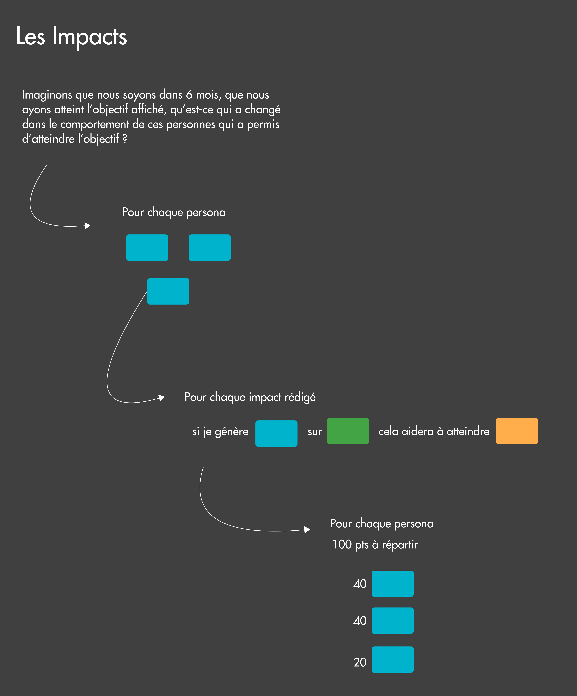
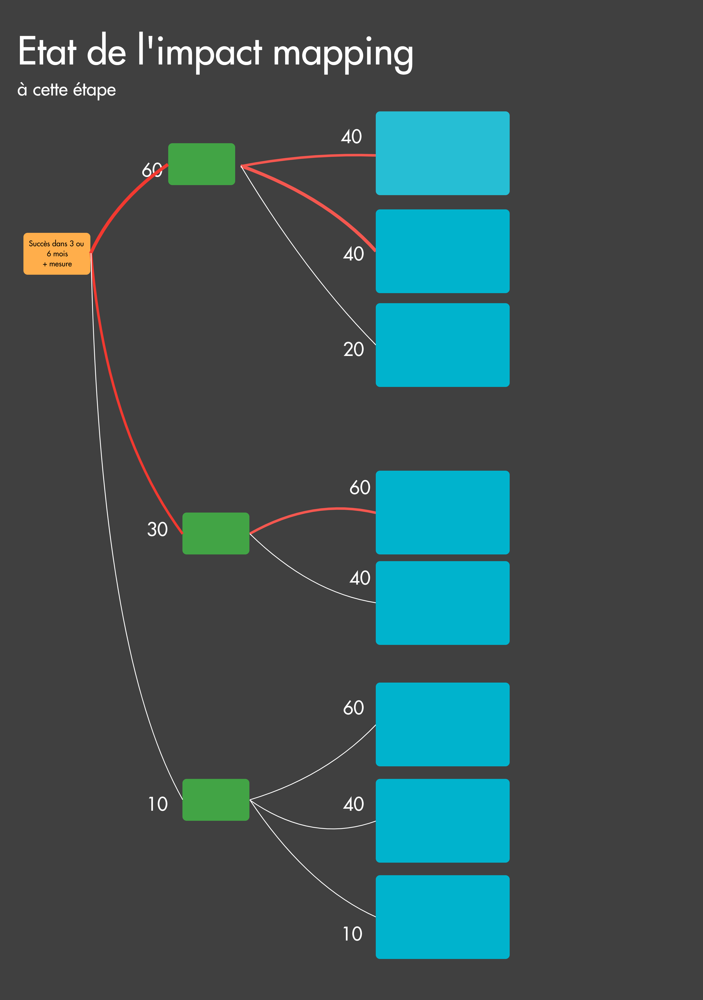
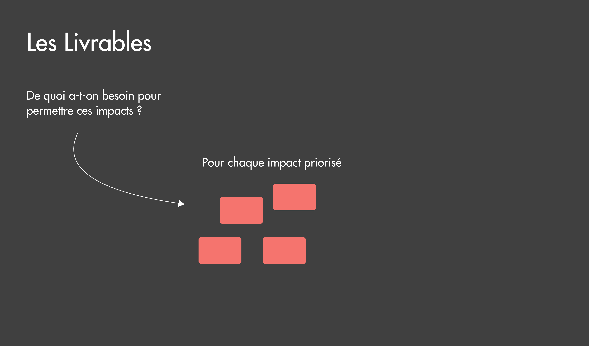
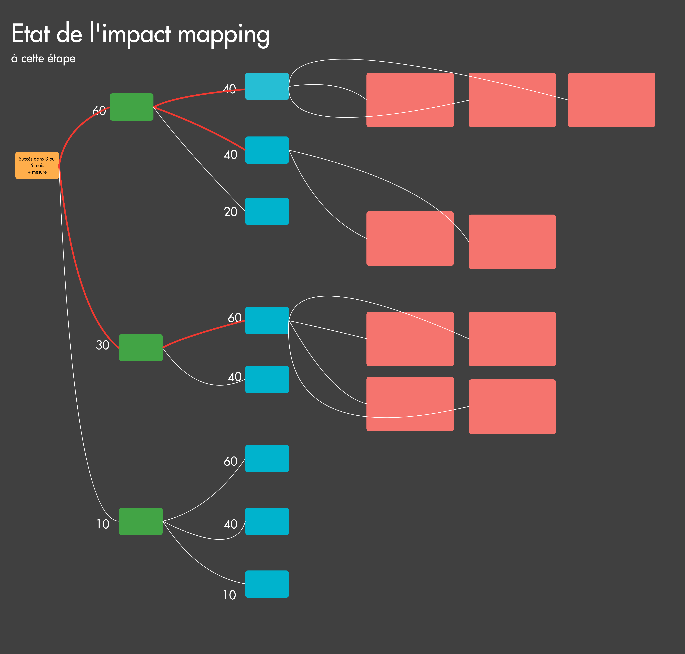

Le mois dernier, sur le slack de benext, une coach se demandait comment elle devait animer un atelier impact mapping. Après quelques échanges, elle a trouvé des réponses. Les échanges que nous avons eus, sont les mêmes que ceux entendus à un becom, journée de partage pour tous les benexters, où <a href="http://pablopernot.fr/" target="_blank">Pablo</a> avait animé une session d'une heure sur le sujet. Merci à <a href="https://www.linkedin.com/in/laurence-wolff-524a261b/" target="_blank">Laurence</a> d'avoir noté ce jour-là la plupart des propos. Et évidemment merci à eux pour les échanges, leurs retours d’expérience sur l’animation de cet atelier.
Ce qui suit est ma version de ces échanges, de ces notes...

# Objectifs 

L'impact mapping est un atelier pour déterminer une stratégie à suivre : mettre en évidence les chemins critiques, les chemins clés pour atteindre rapidement la vision établie.

Lors d'une animation, je fournis un exemple de carte d'impact aux personnes présentes. L'exercice n'est pas forcément simple et je trouve important que les participants puissent se projeter. Vous pouvez en construire un fictif sorti tout droit de votre imagination ou en trouver sur le site <a href="https://www.impactmapping.org" target="_blank">impactmapping.org</a> et notamment sur <a href="https://www.impactmapping.org/example.html" target="_blank">cette page</a>.

# Le Pourquoi ?

Un impact mapping se fait, généralement, en 4 étapes : le **pourquoi** que l’on veut atteindre, le **qui** va intervenir, les **impacts** que l’on veut voir, que l’on veut apporter et enfin les **livrables** que l’on va mettre en place. Parfois, les livrables sont détaillés, on peut imaginer le cas de livrables dont la taille nécessite un nouveau découpage et une nouvelle priorisation, comme des fonctionnalités ou des applications.

Pour travailler le pourquoi, je demande aux personnes *Que fait votre produit ? En 2 phrases. Et comme si j’étais un enfant de 6 ans ?* (La technique de l'enfant vient d'une citation de A. Einstein : *"Si vous ne pouvez expliquer un concept à un enfant de six ans, c'est que vous ne le comprenez pas complètement"*).

Ensuite, deuxième question : *Dans 3 ou 6 mois, qu’est ce qui vous fera dire que votre produit est un succès ?* Notez les réponses, les idées sur votre tableau (physique ou numérique). Les personnes trouveront, sans doute, plusieurs facteurs pour qualifier de succès le produit, priorisez-les. Retenez et conservez le premier.

Troisième question : *Comment puis-je mesurer de façon explicite ce succès ?* Là encore, vous aurez sans doute plusieurs réponses. Là encore, on priorise et on conserve le premier critère.

A cette étape : 

# Le Qui ?

Le but de cette deuxième partie est d'identifier les personas, les catégories de personnes voire les personnes, qui peuvent nous aider à atteindre l'objectif qui vient d'être défini.

Plusieurs questions sont possibles, n'hésitez pas à les proposer. En fonction du profil des personnes, certaines formulations parleront plus que d'autres. Voici deux exemples de questions :

* *Qui dois-je impacter pour atteindre ce succès, cette mesure explicite ?*
* *Qui peut nous aider ?*

Vous pouvez éventuellement identifier aussi qui est "contre nous".

Il se peut qu'il y ait beaucoup d'idées, de post-it, de personas. J'utilise principalement deux techniques pour montrer l’importance des personas. La première est de positionner les personas sur ce diagramme. L'axe vertical évalue l'influence des personas sur le produit, dans l'organisation. L'axe horizontal évalue l'impact sur les personas, si un persona est positionné tout à droite, cela peut signifier que ce produit va changer sa vie tous les jours. Une fois que tout est positionné sur ce diagramme, seuls les personas situés dans la partie en haut à droite sont conservés.
La deuxième s'apparente à un *"Buy the feature"* appliquée aux personas conservés, c'est-à-dire que je distribue 100 points qu'il faut répartir. Pour favoriser les choix, la priorisation, je demande parfois à ce qu'il y ait une "branche" de la carte qui soit à 50 ou plus.

Comme dans la partie "Le Pourquoi ?", nous sommes passés par deux grandes étapes : une première de divergence où l'on crée des options et une deuxième de convergence où l'on fait des choix.

A cette étape : 

# Les impacts ?

Tout le monde doit être alerte à cette étape, le facilitateur ET les participants. C’est LA phase clé. Et c'est aussi la plus compliquée. Compliquée pour deux raisons.

La première est d’écrire des impacts et pas des moyens. Un impact c'est un changement d’usage, de comportement, de bénéfice, alors qu’un moyen c’est une solution.
Quelques exemples pour illustrer :

* “Recevoir une notification” n’est pas un impact, mais un moyen, une solution. L’impact, c’est “être alerté rapidement et à chaque fois qu'un tel événement survient”.
* “Utiliser ParisLibrairie.fr” est un moyen. L’impact pourrait être “trouver une librairie qui possède le livre que je souhaite acheter".

La deuxième réside dans la question à poser à cette étape, à savoir quelque chose comme "Comment ils nous aident ?", "Comment dois-je impacter ces personnes pour atteindre mon objectif ?".
Ces questions ne font pas forcément naître des impacts. LA question que je pose (héritage direct de Laurence et Pablo, comme beaucoup de choses dans cet article, mais celui-là c'est du copyright) :

**"Imaginons que nous soyons dans 6 mois, que nous ayons atteint l’objectif affiché, qu’est-ce qui a changé dans le comportement de ces personnes qui a permis d’atteindre l’objectif ?"**

Je vous donne encore d'autres questions, à vous de trouver celle avec laquelle vous êtes à l'aise, celle qui parle le plus aux participants, celle qui vous donne des impacts :

* *"Quel impact faut-il avoir sur ce persona pour atteindre mon objectif ?"*
* *"Qu’est-ce qui a changé dans son quotidien ?"*
* *"Quels sont les bénéfices qu’elle retire ?"*
* *"Comment est-elle impactée ?"*

Pensez à bien valider ces impacts en faisant une phrase du type *"si je génère [cet impact] sur [cette personne], cela poussera à atteindre mon objectif"* et répéter la pour chaque impact, pour chaque persona

Maintenant, que tous les impacts ont été écrits, lus, partagés et "validés", la phase de divergence, d'émission d'options est terminée. Comme pour la phase "Qui ?", le groupe doit faire des choix (et converger), ici pas de diagramme, j'utilise la même technique qu'au-dessus à savoir 100 points à répartir pour les impacts d'un persona. Pour chaque persona, le groupe a 100 points à distribuer pour les impacts.

Cette nouvelle étape de priorisation permet au groupe de visualiser les chemins critiques, les chemins qui a priori mènent le plus rapidement à l'impact souhaité. Je conseille de ne conserver que 3 ou 4 chemins.

A cette étape : 

# Les livrables ?

Pour chacun des chemins conservés, le groupe doit se poser des questions comme *"De quoi a-t-on besoin pour permettre ces impacts ?"*, ou *"On fait quoi pour rendre ce comportement possible ?"*

C'est une partie plus simple que la précédente, mais elle est facile car le groupe a passé beaucoup de temps à prioriser, à choisir des options et à en éliminer plein. Imaginez si aucune priorisation n'avait été faite à l'étape "Pourquoi ?" sur l'impact souhaité, puis sur l'indicateur à suivre, puis à l'étape "Qui" et enfin à l'étape "Impacts"...

A cette étape : 

# Ensuite ?

Ensuite, vous pouvez éventuellement décliner la mise en œuvre en user stories, en petits bouts implémentables rapidement. Et, une nouvelle fois, vous priorisez ;-)
Ces user stories intégreront rapidement vos backlogs puisqu’elles seront à implémenter en premier. Les autres branches ne sont pas à ignorer et à jeter, elles constituent vos pistes de réflexions, les autres hypothèses que vous pensez moins pertinentes, impactantes pour le moment. Cette carte est un complément à votre backlog, elle représente la partie Stratégie quand le backlog est la déclinaison Tactique.

Pensez à revoir régulièrement la carte, suivez l’évolution de votre mesure, de votre “pourquoi” souhaité.

# Pour compléter
Je compte à peu près 3h pour l’ensemble de l’atelier pour laisser le temps aux réflexions individuelles puis collectives, aux conversations, à l’échange. Ce temps n’est pas ni un plafond ni un seuil, juste une indication.
L’atelier n’est pas linéaire, certaines phases demanderont plus de temps que d’autres.

