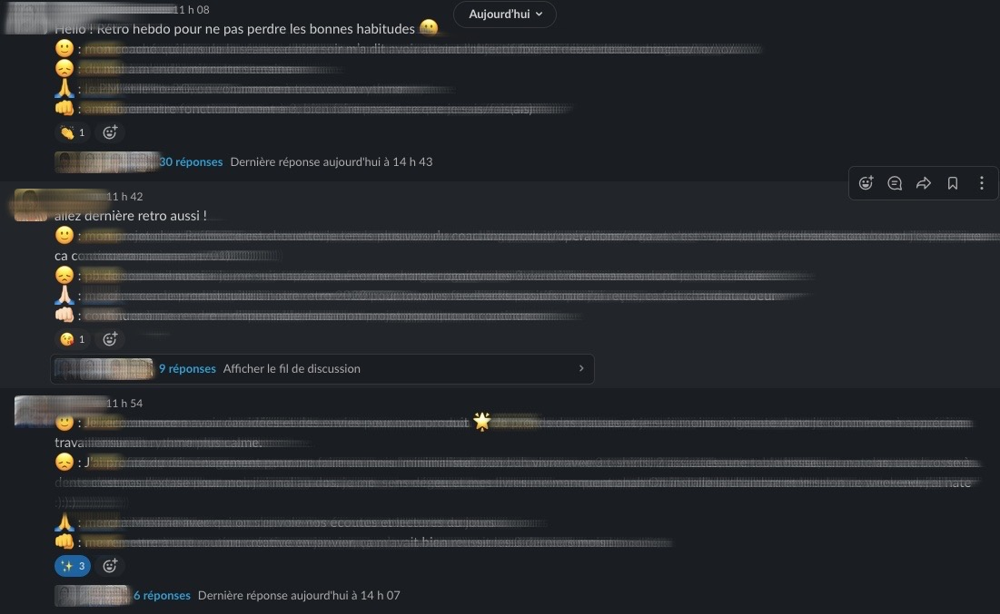

> "*Essayer encore. Rater encore. Rater mieux.*" S.Beckett

# Mise en place
## Les débuts
Chez benext, nous avons mis en place, il y a un peu plus d'un an, le mentoring. Dans un premier temps, il a été mis en place dans la communauté agile, comme un test, puis  dans la communauté tech. Je ne parlerai ici que du mentoring de la communauté agile. Ce dispositif vient en compléter d'autres à disposition des benexters pour leur suivi, recherche d'excellence : les boussoles RH, les coachings individuels, les communautés de pratiques centrées autour d'un métier.

## Pourquoi ?
Alors, pourquoi lancer une nouvelle initiative ?
Les becoms, journées de partage avec tous les benexters, n'étaient plus assez focalisés sur la recherche d'excellence, il semblait aussi que certains basiques des rôles n'étaient pas maîtrisés. Les espaces que le mentoring allait créer devaient apporter de la connaissance, de la maîtrise, l'expertise d'un coach.
Nous ne savions pas ce que cela allait donner, si cela était une bonne idée. Le lancement était clairement sous le signe du test, de l'expérimentation.

## Comment ?
Nous avons choisi de créer des groupes animés par un coach ou un duo et composés de 5 à 6 personnes occupant les rôles de product owner, de scrum master, de product designer ou de product manager. Ca c'était le début, le lancement. Nous n'avions mis aucune règle pour l'animation : chaque groupe s'est donc organisé comme il le souhaitait. Il n'y avait pas non plus de date de fin, nous savions que nous partions pour 3 mois au moins.
Des pratiques communes sont rapidement apparues : channel Slack dédié (public ou privé selon les groupes), un point en groupe tous les 15 jours servant très souvent à de l'intervision, des points individuels pour certaines personnes désireuses.
De notre côté, côté mentor/coach, nous avons partagé notre suivi, nos pratiques, avons piqué d'autres celles qui faisaient sens pour nous : fiche de suivi, historisation des messages, point informel hors des locaux...

## La Covid
Le confinement a rebattu beaucoup de cartes : les rencontres en présentiel se sont faites en visio, les points se sont faits plus fréquents (les intervisions sont vite devenues hebdomadaires). Par ailleurs, en l'absence des becoms qui sont revenus depuis, les groupes de mentoring ont offert des espaces d'échange, de partage semblables à ceux de ces journées : ils ont aidé à maintenir le sentiment d'appartenance. Des moments que n'offrent pas les communautés de pratiques. Les groupes de mentoring réunissent des profils de métiers différents, des personnes qui ne se connaissaient pas plus que ça. Les communautés de pratiques, au contraire, réunissent des profils similaires et, à force, se connaissent.
Le confinement nous a demandé une forte adaptation sur le comment du mentoring mais aussi sur les sujets abordés ; les sujets autour de l'organisation du temps de travail en remote, sur les émotions, la fatigue ont pris une part non négligeables. Les temps informels, de fun avaient beaucoup de sens, et ont renforcé la cohésion, la connaissance, la confiance du groupe.

## Saison 2
Au bout de 6 mois, les groupes avaient trouvé leur vitesse de croisière, une aisance dans les échanges, les pratiques, les feedbacks. Nous avons décidé de changer les groupes pour en refaire d'autres, cette décision n'était pas consensuelle. Il y avait les "pour", ceux qui prônaient le changement de mentor, de discours, de format, que ces changements allaient apporter autre chose, un air frais, des remises en question, quelque chose l'on ne pouvait décrire. Il y avait les "contre", pas farouchement opposés mais plutôt sceptiques qui souhaitaient profiter de cette zone de confort pour continuer à faire mieux. Les avis étaient aussi partagés parmi les mentorés, partagés entre cette envie de profiter encore du groupe actuel et de se confronter à autre chose.

Avec le recul, rebattre les cartes a apporté beaucoup de bénéfices. En novembre, la fin de l'année approche, la saison 2 aussi et courant décembre, les coaches/mentors décident, une nouvelle fois, de rebattre les cartes. Cette fois-ci ce sont les mentorés qui choisissent de constituer les groupes avec l'objectif de *réussir le mentoring*. Personne sait ce que cela signifie réellement, chacun se fait sa propre idée et prend le temps de réfléchir au mentoring et à ses apports.

# Faire, échouer, apprendre, répéter
Le mentoring est un échange où chacune des parties, mentors et mentorés, en ressortent avec des apprentissages. Ces renouvellements, tous les six mois, sont, d'un point de vue personnel, très enrichissants. Cela me donne l'occasion de reparticiper à la création d'un groupe, de repenser au comment s'y prendre.

## Un nom du groupe
Pour les deux premières "saisons", j'avais créé un channel Slack. Le premier s'appelait "Les poussins" du nom de la catégorie d'âge de joueurs de rugby avec laquelle j'avais  pris le plus de plaisir à entraîner. Aussi, parce qu' inconsciemment, elle était celle qui correspondait à l'image que je me faisais du mentoring à cette époque, à savoir une transmission de connaissances, l'organisation des rituels, quasi unilatérale (de moi vers eux). Les participants à ces échanges ont adoré le nom, écrivent régulièrement des "piu-piu" (aujourd'hui encore), l'icône poussin de Slack est sur-utilisé.
Pour le deuxième, je me suis laissé le temps de la réflexion, au début le nom était "nom-de-channel-à-définir", je cherchais toujours dans le monde du rugby l'idée de la transmission. Et puis, "je-prends-je-donne" est venu, ce refrain que tous les joueurs de rugby ont entendu des centaines de fois qui signifie qu'il faut vite donner le ballon, vite le faire vivre, après l'avoir reçu. Ce nom est plus proche de ma vision actuelle du mentoring en groupe, où chacun a un rôle à jouer, au niveau de la connaissance, des compétences mais aussi sur la vie du groupe.
Pour la troisième saison (pas débutée à l'heure de l'écriture de ces lignes), je crois que je laisserai le groupe le définir.

## Des attentes
Demander ce qu'attendent du groupe les personnes présentes dans le groupe me paraît évident. En fonction des réponses de chacun, des valeurs communes apparaissent, d'autres n'apparaissent qu'une seule fois. Je complète le thème de la chaîne Slack en fonction, il vit au fil des réponses. Le premier était *"0 tabou, confidentialité, sécurité, partage."*, le deuxième *"V0.3 : Espace “sécurisé” pour échanger nos problématiques, nos questions, des recommandations/solutions (intervision ?), des articles/podcasts, du soutien, un espace pour grandir ensemble, puiser de l’énergie, de l’inspiration et digresser librement."*
De mon côté, mes attentes dans l'expérience de mentoring en groupe évoluent, en plus de ces notions, j'attends du groupe qu'il amène des sujets dans cet espace sécurisé et confidentiel, qu'il l'alimente en matière. J'attends aussi que le groupe prenne la main sur la façon de s'organiser, qu'il n'attende plus que je fasse. Ca me demande aussi de ne pas toujours prendre la main (ce qui n'est pas toujours facile pour moi :) ).
Lors de la première saison, j'avais demandé aux personnes de compléter une fiche que j'avais piquée à [Pablo Pernot](https://pablopernot.fr/) avec des questions comme :  
- *Je suis ?*  
- *Qui est mon client ?*  
- *Dans 6 mois mon client aurait le sourire si... ?*  
- *Critères (3 max) de succès de mon intervention ?*  
- *Qu’est ce qui ferait du bien à l’organisation que j’accompagne ?*  
- *Mes plus soucis ou freins : ... ?*  
Une série de questions qui me permettait de mieux connaître les personnes, de les faire s'interroger sur le mentoring et de mieux cerner leurs attentes.

## Des rituels
Après les attentes, nous réfléchissons aux rituels que nous souhaitons, en vrac : invitation à tout le groupe pour des rendez-vous d'une heure en visio toutes les 1 ou 2 semaines, invitation individuelle de trente minutes en visio tous les 15 jours, une rétrospective individuelle hebdomadaire de nos semaines respectives (sur tous les sujets : équipe client, perso, mentoring, benext, produit, ...). La rétrospective est très succincte et permet à chacun de faire de l'introspection sur sa semaine, de récupérer des feedbacks, des idées, de l'encouragement, ...

🙂 : Ce que j'ai aimé de ma semaine, ce qui m'a donné du boost  
😞 : Ce qui m'a rendu triste, m'a énervé  
🙏 : Un merci à quelqu'un (qui engendre l'action de dire merci à cette personne)  
👊 : Mon action #1 de la semaine qui vient  

A chaque saison, le groupe a également pris le temps de faire une rétrospective. La première fois à mi-parcours, la deuxième fois à la fin.

# Merci

Le mentoring en groupe est une belle expérience et une bonne pratique. Elle permet la recherche d'excellence, la remise en question, la confrontation. Par ailleurs, le fait que la dynamique redémarre régulièrement est très bénéfique, cela permet de patiner son discours, d'entendre de nouvelles expériences, de découvrir de nouvelles pratiques, de nouveaux blogs (comme celui-là sur le [produit](https://svpg.com/)), etc.
Elle permet de continuer à se poser des questions sur ce que l'on attend de cette expérience : "*Essayer encore. Rater encore. Rater mieux.*" S.Beckett
