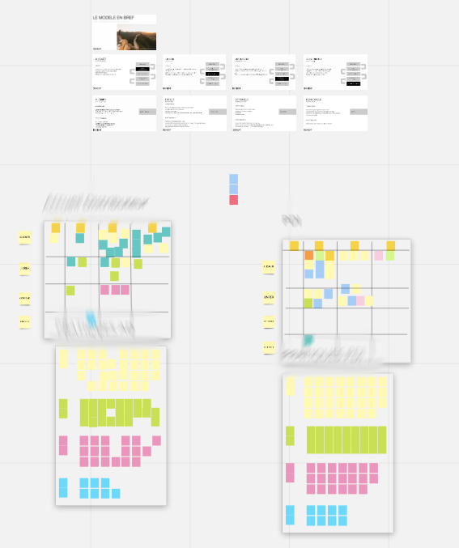
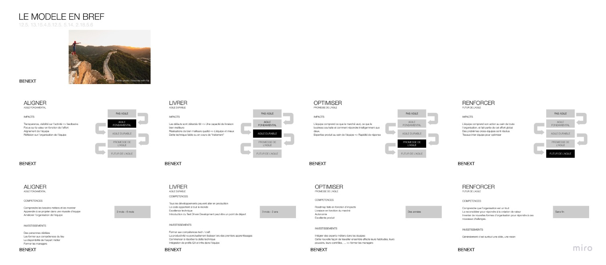
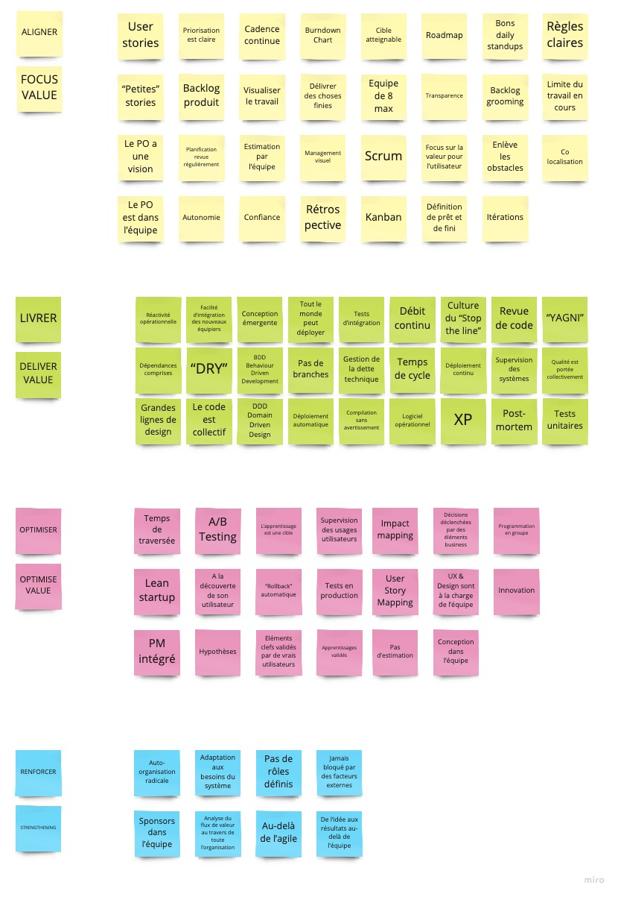

On m'a demandé, en fin d'année, d'animer un atelier sur le modèle Agile Fluency avec des équipes travaillant à distance. Il y a quelques temps, j'avais écrit un [post](https://medium.com/benextcompany/agile-fluency-en-mode-workshop-c36a37b52f92) où j'avais détaillé l'animation, en présentiel. Un autre temps :)

Cet article est donc en quelque sorte une mise à jour du post précédemment cité, que je vous invite à (re)lire.

# Le modèle Agile Fluency
Pourquoi utiliser ce modèle ? Que peuvent attendre les équipes, les managers de son utilisation ?   

- Pour comprendre quels sont les avantages à attendre de la part des équipes  
- ou pour réaliser les investissements qui seront à faire pour obtenir ces avantages  
- ou pour savoir où regarder lorsque les avantages attendus n'apparaissent pas.  

# A distance, mais comment ?
Animer ce type d'atelier à distance a soulevé quelques questions. Entre autres :  

- Est-ce la distance ne va pas nuire à l'impact ?  
- Quelle animation, quelle organisation dois-je mettre en place pour espérer le même impact qu'en présentiel ?  
- Avec quels outils ?  
- L'atelier dure 3h, quid de l'attention des personnes en remote pendant ce temps "long" ?  

## Déroulé de l'atelier
Nous avons conservé le même déroulé qu'en présentiel, à savoir :  

1 - Présentation du modèle Agile Fluency (la notion d'aisance, les lieux, leurs bénéfices, leurs investissements, les compétences à acquérir)  
2 - Première session en équipe : Vous êtes où ? Chaque équipe liste entre 10 et 15 pratiques et les classe dans un tableau avec les colonnes *A acquérir*, *En cours d'acquisition*, *Acquises* et *Abandonnées*  
3 - Debrief, feedbacks  de cette première session  
4 - Pause  
5 - Deuxième session en équipe : Où vous voulez-vous aller ? Invitation des équipes à choisir 10-20 pratiques parmi 90 et à les insérer sur leur tableau  
6 - Debrief, feedbacks de la deuxième session et de l'atelier au global. Projections sur la suite.  
7 - Clôture  

## Animation / Facilitation
Quand je prépare un atelier de genre, avec plusieurs dizaines de personnes, je réfléchis au déroulé évidemment et également à l'animation, rendue différente par le contexte sanitaire que nous connaissons tous.

Je me suis beaucoup appuyé sur les scrum masters des équipes : rencontre en amont du jour de l'atelier, présentation du modèle, réflexion ensemble sur les possibilités techniques, échanges sur la facilitation, sur les questions à poser aux équipes, ...  

Ces échanges, réflexions ont été beaucoup plus nourries que si j'avais dû animer en présentiel. J'avais l'impression qu'il leur fallait un niveau d'autonomie supérieur. En présentiel, je peux avoir un oeil, une oreille sur toute la salle, là je ne pourrai observer, écouter qu'une équipe à la fois.  

Nous avons échangé sur ce que j'attendais d'eux, sur ce qu'ils attendaient de moi, sur les questions que je pose habituellement, des questions comme *"Qu'est-ce qui vous fait dire que cette pratique est acquise ?"*, *"Que manque-t-il à cette pratique pour être acquise ?"*, *"Pour vous, c'est quoi un/une* [pratique à renseigner] *acquis/acquise ?"*, ...

Nous avons décidé de créer plusieurs "salles" dans un outil de visioconférence :  

- une salle principale pour l'accueil, la présentation du modèle, les retours, la clôture. Une sorte d'amphi.  
- et une salle par équipe (pour les deux sessions de réflexions, d'échanges sur leurs pratiques d'équipe). Un scrum master par salle (idéalement celui de l'équipe).  

En tant qu'animateur, j'ai accès à toutes les salles. Je peux naviguer, observer, écouter, relancer, expliciter les consignes, me déplacer. A ma guise ou à la demande des scrum masters, nous avions également créé un canal de conversations entre nous.

Enfin, les durées de chaque exercice, session, sous-partie sont précisées à l'avance. Une personne de chaque groupe est responsable du temps :  

- Accueil des personnes : 10 minutes  
- Présentation du modèle : 30 minutes  
- Vous êtes où ? : 40 minutes  
- Defrief, feedbacks : 10 minutes  
- Pause : 15 minutes  
- Où vous voulez-vous aller ? : 1 heure  
- Defrief, feedbacks : 10 minutes  
- Clôture : 5 minutes

## Un support collaboratif
Un atelier de ce type, en présentiel, c'est des murs, des rouleaux de papier craft, des post-its, des feutres, des thermos de café, des viennoiseries... En remote, pour permettre le travail collaboratif, ce sont des outils comme Teams, Meet, Jitsi pour la visio et des outils comme Miro, Mural ou Draft.io pour le management visuel.

Voici une partie du squelette du support utilisé :  

1 - En haut le rappel de la présentation avec les bénéfices, les compétences à acquérir et les investissements de chaque lieu du modèle 

2 - Au milieu les tableaux des équipes  

3 - En bas de chaque board (des propositions de pratiques)

Selon la maturité, selon l'expérience des personnes face à ces outils, il faudra parfois prévoir une prise en main de quelques minutes en début d'atelier. 

## En résumé
- une présentation du modèle
- un outil permettant la visio (une salle principale + une salle par équipe)  
- un canal de communication pour l'ensemble des facilitateurs  
- des chronomètres :)  
- un outil pour le travail visuel collaboratif  
 
# Quelques feedbacks des participants
Les retours à chaud des participants ont plu aux scrums masters qui les accompagnent au quotidien, ils nous renseignent sur l'impact que cet atelier a pu avoir sur les personnes, sur les équipes.
En voici quelques uns :  

- *"C'est comme une rétro de nos pratiques"*  
- *"Nous croyions que nous maitrisions notre organisation, nos pratiques. En fait, non"*  
- Et un qui fait toujours plaisir *"c'était trop court"* (pour un atelier de 3h)

Beaucoup de choses ont été partagées, chaque membre d'équipe a pu s'exprimer, la conscience collective s'est agrandie, s'est vue renforcée. Maintenant que plus de choses ont été dites, partagées, conscientisées, il est plus facile pour les équipes, les scrums masters, les managers d'en parler, d'agir, de décider.

Les équipes savent où elles se placent dans cette nouvelle grille de lecture, elles disposent maintenant d'un plan pour améliorer leurs pratiques. Elles deviennent conscientes que les avantages qu'elles désirent sont pour bientôt ou pour bien plus tard ce qu'elles croyaient. Peu importe, elles savent, elles sont conscientes, elles peuvent agir, décider. Elles deviennent un peu plus autonomes.

# Une suite ?
Depuis, les scrum masters, les équipes ont retravaillé ce qui n'avait pu l'être et un prochain atelier avec encore plus d'équipes est programmé :)

Merci à [Mathilde](https://www.linkedin.com/in/mathildecurien/), [Thomas](https://www.linkedin.com/in/thomas-aubry-14765075/), [Hao](https://www.linkedin.com/in/hao-lay-745b86150/) et [Yoann](https://www.linkedin.com/in/yoanngalland/) pour l'invitation et l'animation.

