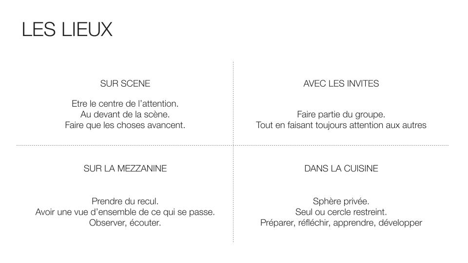

Mon actualité m'a replongé dans un atelier autour du Host Leaderhip que j'avais co-créé il y a quelques mois avec Loïc Le Molgat et Fleur Saillofest. Nous l'avions animé pour du co-développement avec une communauté de managers. Aujourd'hui, c'est dans un cadre de mentoring individuel que je l'utilise.
Je vous propose donc de découvrir un atelier pertinent aussi bien en collectif qu'en individuel.

# Host Leadership
Le leadership peut prendre plusieurs formes. J'en mentionnerai ici trois : celle du héros, celle du *servant* et celle de l'hôte.

L'image du leader a longtemps été celle d'un **héros**, le héros qui commande, qui décide, qui sauve, qui sait tout, qui contrôle, qui dicte les plans de la direction à des groupes de subordonnés. Une approche descendante qui fonctionnait en entreprise à l'ère industrielle.

Le concept du **servant leader** est apparu dans les années 1970 suite aux travaux de Robert Greenleaf. Wikipedia définit le servant [leadership](https://fr.wikipedia.org/wiki/Servant_leadership) comme : *une conception du leadership suivant laquelle un leader ou un manager est au service de ses subordonnés pour les aider à accomplir l'objectif commun.*

Nous devons le modèle de **Host Leadership** à Mark McKergow pour qui la métaphore du *"leader as hero"* présente des lacunes de plus en plus évidentes. La métaphore du *servant leadership* ne le satisfait pas non plus. Il écrit [ici](http://hostleadership.com/about/) *"[servant leadership] also suffers from problems of misinterpretation and lack of apparent relevance"*, que je traduirais par "qui souffre également d'erreurs d'interprétations erronées et de manque de pertinence évident".  

# Atelier Host Leadership
Le but de cet atelier est de faire découvrir ce modèle aux managers et aux scrum masters que j'accompagne, d'essayer de trouver des réponses à des questions comme *"Dois-je me mettre en avant, agir ?"*, *" Dois-je observer, me retirer ?"*.

Côté matériel, en présentiel : une salle, des chaises, des feuilles ou des post-its, des feutres, stylos. En distanciel, une application de visio-conférence, un support collaboratif et une bonne connexion ;-)  
Prévoir 1h30 - 2h.  
Par ailleurs, je vous invite à prendre une feuille ou des post-its, un feutre et à réaliser l'atelier pour vous, pour l'un de vos défis que vous rencontrez en tant que leader (d'équipe, de communauté, d'association, ...).

## Définition d'un défi
La première question que je pose est *"Avez-vous des défis, des challenges à relever dans votre équipe ?"*. Je propose aux participants de formuler leurs phrases en commençant par *"Comment pourrais-je ... ?"* ou *"Comment pourrions-nous... ?"*. Un format que j'ai piqué au design sprint.  
Cette première étape nécessite quelques minutes de réflexion de la part des participants. Certains en trouveront un, d'autres trois ou plus, ce sera facile pour certains de répondre à cette question, pour d'autres moins. A la fin, chaque participant ne doit conserver qu'un défi sur lequel travailler.

Ensuite, je pose ces 4 questions les unes après les autres, en m'assurant à chaque fois que chacun a eu le temps de répondre :  

- *"Quels bénéfices vois-tu à relever ce défi ?"*  
- *"Qu’est-ce que cela t’apportera ?"*  
- *"Qui d’autre en tirera des bénéfices ? Lesquels ?"*  
- *"Pense comme un hôte : quels seront tes premiers invités à ce défi ?"*  

En groupe, j'invite les personnes à se mettre par deux et de présenter, tour à tour, leur défi à leur binôme. Au cours d'un [meetup](https://www.meetup.com/fr-FR/Beyond-Scrum-Mastering/), Fleur avait constitué des trinômes : A présente à B et C, ...

## Présentation du Host Leadership
Une fois le contour du défi défini, j'expose ce que représente la notion de Host Leadership (ce que j’ai écrit plus haut) et j'introduis les lieux.

## Les lieux du Host Leadership
Le Host Leadership décrit quatre lieux distincts :  

- L'hôte peut être **sur scène** pour être le centre de l’attention, pour faire que les choses avancent.  
- Il peut également être **avec les invités** et faire partie du groupe, tout en faisant toujours attention aux autres (il reste l'hôte).  
- Il peut également explorer **la mezzanine** pour prendre du recul et avoir une vue d’ensemble de ce qui se passe. Il observe, écoute. En anglais, l'auteur utilise le terme *balcony* qui est le balcon dans une salle de théâtre.  
- Enfin, l'hôte peut être **dans la cuisine**, c'est sa sphère privée, il y est seul ou cercle restreint. Là, il prépare, réfléchit, apprend, développe.  

Ces lieux théoriques existent dans le réel, ils seront évidemment différents pour chaque hôte. Je vous propose deux exemples :  

- Organisation d'un weekend au vert avec des proches  

Le samedi matin, tout le monde est réuni dehors, sur la terrasse d'un gîte. Vous vous placez seul devant tout le monde pour donner le programme de la journée : **vous êtes sur scène**.  
Les activités sont lancées, vous participez à l'une d'entre elles, vous êtes **avec les invités**.
C'est l'heure d'une pause, tout le monde se déasltère, grignote. Vous faites un pas, deux pas en arrière pour observer, écouter le groupe. Bienvenue **sur une mezzanine**.  
Tout ce qui se passe pendant ce weekend : le gîte réservé, les invités, les activités réservées, ... a été réalisé devant votre ordinateur personnel chez vous. C'est **votre cuisine**.  

- Animation d'un atelier (en présentiel)  

Etre **sur scène** pourrait signifier être debout devant le tableau blanc face aux participants.  
Etre **avec les invités** serait quelque chose comme se tenir debout face aux tableau parmi les participants, avec le même matériel.  
**La mezzanine** s'atteint peut-être par quelques pas de côté ou quelques pas de recul. Pour passer de l'un à l'autre, quelques pas suffisent, l'auteur parle de "danse".  
**La cuisine** est l'endroit où l'hôte a imaginé le contenu de l'atelier, où il a réfléchi à qui inviter, au lieu à réserver : une salle de réunion, un bureau, sa salle à manger... Le jour de l'atelier, la cuisine pourrait être un coin de table loin du tableau pour adapter et réfléchir à la suite.  

Le fait que les lieux théoriques du modèle aient une représentation physique vous autorise facilement et consciemment à passer de l'un à l'autre. Un pas de côté et vous quittez la scène, un autre et vous y revenez. Un pas en arrière et vous vous retrouvez sur une mezzanine, ...

## Où sont ces lieux pour vous ?
Revenons au défi. Une fois le host leadership et ses lieux présentés, j'invite les personnes à utiliser le modèle pour les faire réfléchir sur leur posture et trouver des pistes de réponses à leur défi. 

Premières questions : *"Où se situent ces lieux pour toi ? Où est ta cuisine par exemple ? De quelles mezzanines as-tu profité récemment ?"*  
Ensuite, je les invite à identifier le lieu dans lequel ils se sentent le plus à l’aise et de lister tout ce qu'ils font de bien dans ce lieu. J'attends une dizaine de bénéfices (comme souvent les premières idées arriveront rapidement, atteindre 9 ou 10 demandera un peu de temps, j'observe souvent un blanc, un temps réellement dédié à l'introspection).  
Enfin, même type de question mais là il s'agit d'identifier le lieu dans lequel ils se sentent le moins à l’aise et de lister tous les bénéfices que pourrait apporter ce lieu (~10 bénéfices). Les personnes sont souvent surprises par l'apport de lieux qu'ils ne fréquentent pas souvent. Par exemple, j'ai rencontré des introvertis qui avaient peur d'aller sur scène, qui réalisaient la valeur, les atouts de ce lieu. La confrontation de leurs habitudes et des bénéfices était intéressante à observer, à questionner.

Comme lors de la précédente phase d'introspection, j'invite les personnes à se mettre par deux et à présenter, tour à tour, leurs réflexions à leur binôme. En coaching individuel, je prends, à ce moment le rôle du binôme.

## Pistes de résolution du défi en utilisant Host Leadership
Tous ces bénéfices vont aider les participants à modeler des actions concrètes pour le défi identifié. Je laisse un peu de temps aux personnes pour formaliser des actions qu'ils pourraient mettre en place, des premiers petits pas actionnables à un horizon idéalement proche.

## Clôture de l'atelier
Pour conclure l'atelier, je réalise un tour de feedbacks lors duquel je pose des questions comme *"Ce que tu as aimé ?"*, *"Ce que tu aurais aimé ?"* et *"Avec quoi repars-tu ?"*.

# A vous de jouer
J'ai écrit cet article pour partager un modèle et une animation d'atelier, j'espère qu'il vous aura donné de billes, l'envie et la capacité de vous lancer.  
Et pour compléter, vous trouverez ci-dessous une présentation rapide des rôles du modèle et des liens (livres, vidéos, article)

# Annexes
## Un mot sur les rôles du Host Leadership
Host leadership comporte ces quatre lieux mais aussi des rôles. Dans cet atelier, je les aborde peu. Ils sont au nombre de six :

- **Initiateur** : déclenche les premières étincelles qui vont propager une initiative bien plus grande.  
- **Invitant** : invite les gens (ceux qui viendront seront les bonnes personnes et l'engagement sera meilleur).  
- **Créateur de l'espace** : crée l'espace et tout son environnement, autant physique qu'émotionnel, où quelque chose peut réellement se produire.  
- **Gardien de l'espace (de la porte)** : protège l'espace créé, le maintenir, parfois en le clarifiant, en le faisant respecter.  
- **Connecteur** : facilite la mise en relation de toutes ces personnes et soutient les potentielles conversations.  
- **Co-Participant** : agit et se montre comme un élément de l'écosystème, à part entière.  

Ils sont détaillés dans cet [article](https://www.hrreview.co.uk/analysis/analysis-hr-news/mark-mckergow-and-helen-bailey-the-six-new-roles-of-engagement/54146).

## Quelques liens pour continuer sur ce sujet :
- Un article de Pablo PERNOT : [Hôte d'écosystème - Host Leadership](https://pablopernot.fr/2018/01/hote-ecosysteme/)
- LE livre référence : [Host leadership](https://www.amazon.fr/Host-Mark-McKergow/dp/0954974980) par Mark MC KERGOW  
- Un livre en français : [Host leadership](https://www.lulu.com/fr/fr/shop/g%C3%A9ry-derbier-and-laurent-sarrazin/host-leadership/paperback/product-1ngkvpen.html?page=1&pageSize=4) par Laurent SARRAZIN et Géry DERBIER  
- Une vidéo : [Why "hosting" is an important type of leadership](https://www.ted.com/talks/mark_mckergow_host_leadership_why_hosting_is_an_important_type_of_leadership) par Mark MC KERGOW   