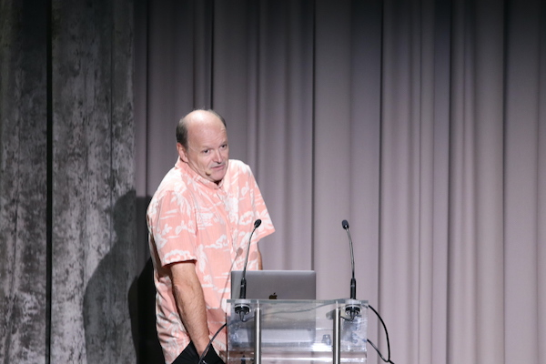

# Hall d'embarquement
  

21 Septembre 2021, il est à peine 8h, [Dragos](https://www.linkedin.com/in/dragosdreptate/) est déjà sur place, j'arrive avec [Tiphanie](https://www.linkedin.com/in/tiphanie-vinet-a7856143/) et [Souki](https://www.linkedin.com/in/souki-khamsyvoravong-b39a4a90/). Je découvre les lieux, le soleil est notre plus bel hôte, il nous attend sur les terrasses du Pavillon Chesnaie du Roy, dans le bois de Vincennes, avec le thé, le café. Les premiers benexters arrivent, tout ce petit monde, telles des fourmis, s'activent, ajustent les derniers réglages pour tenir le stand de remise de badges, pour installer les stands partenaires... Tout le monde prend ses marques, l'énergie, l'excitation monte, il y a des sourires partout. De la concentration aussi.
Les premiers participants arrivent, parmi eux des amis, des anciens clients, des anciens collègues...  

C'est parti ! Décollage !

# Décollage
## 9:30
Avec Hao, nous avons prévu de prendre des photos toute la journée. Je m'étais imaginé que je n'allais pas pouvoir suivre les sessions, en réalité je suis une sorte de papillon qui va de salle en salle, écoute les speakers, sonde les énergies, découvre des sujets. 
  
Comme lors de multiplex, émission sportive de tv qui retransmet plusieurs matches en même temps, je choisis de suivre une session en fil rouge, ce sera celle de [Thomas Pierrain](https://twitter.com/tpierrain). Il nous parle, en tant que dev/tech lead/architecte, de l'autre côté du miroir, de sa vision des produits en tant que membre de la team Tech. C'est bourré de messages simples et efficaces : *"Context is everything with sofware"*, *"Besoin de POs, pas de petits chefs, pas d'ingénieurs en roadmap"*, *"On a besoin de vous parler le plus souvent possible"* (en s'adressant à un public consituté à 95% de personnes aux rôles plus produit que tech), ... Il ne faudrait pas oublier que la compréhension des développeurs part en production.  
Vous pouvez retrouver ses slides [ici](https://fr.slideshare.net/ThomasPierrain/de-lautre-ct-du-miroir)  
  
Je passe voir [Jo](https://www.linkedin.com/in/jlitty/). La salle comble ! Le public semble conquis. Tellement content pour lui. En attendant les replays, vous pouvez retrouver sa session sur [ce fil twitter](https://twitter.com/SchoolOfPO/status/1440217880340041731).

## 10:45
  
Pour mon deuxième "mulitplex", le choix de la session fil rouge est plus compliqué : Luc Julia et l'intelligence artificielle ou [Hervé Lourdin](https://www.linkedin.com/in/hervelourdin/) et le *scaling* chez leboncoin. Je ne choisis pas, j'alterne entre ces sessions dont j'attends impatiemment les *replays*.  
Comme Thomas auparavant, [Luc Julia](https://www.linkedin.com/in/lucjulia/), que j'imagine sortant d'une plage de L.A. avec sa chemise à fleurs, présente simplement d'un sujet qui ne me le semble pas. Son storytelling m'embarque, il y a des histoires comme celle de du pourquoi l'*intelligence artificielle* s'appelle ainsi ou celle la [Pascaline](https://fr.wikipedia.org/wiki/Pascaline) dont j'apprends l'existence. Une calculette en 1642!  
Bref, à revoir.  
Merci [Jordan](https://www.linkedin.com/in/jordan-chapuy-064516a2/) pour ce  [fil twitter](https://twitter.com/Yupjoo/status/1440244631631904784).

Le sujet d'Hervé m'intéresse beaucoup, et il en parle bien. J'arrive au moment où il parle de TOO, de Travail d'Organisation Ouvert, dit autrement *"un outil pour expérimenter et s'adapter en continu face à une croissance constante"*. Leboncoin devient une organisation où *"certains chantiers sont impulsés par le management, d'autres directement par les collaborateurs"* et où il y a *"toujours un sponsor direction"* pour à la fois promouvoir et sécuriser l'organisation.

Presque l'intégralité de la session d'Hervé Lourdin sur ce [fil twitter](https://twitter.com/SchoolOfPO/status/1440236491637018624) !!  

## 11:40
Pas de session pour moi sur ce créneau. Les conférences en présentiel, c'est aussi cette joie de pouvoir débrancher des sessions et de créer des conversations inopées avec des amis ou des collègues. Thomas nous explique les dessous de sa conf, le DDD et les *bounded contexts* s'invitent à la conversation...

# En plein vol
## Sessions Off - fil rouge de mon après-midi
Quand Tiphanie et Souki m'ont proposé d'animer des sessions off, j'étais ravi. Pas mal de mes questions n'avaient pas de réponses ; elles savaient qu'elles avaient envie d'offrir un cadre à des conversations, un cadre plus structuré que celui des conversations devant le café ou les petits fours.  
[Olivia](https://www.linkedin.com/in/oliviadutheil/) était partante pour m'accompagner dans cette aventure. Nous les avons organisées sous la forme de lean coffee : les participants proposent leurs sujets puis les abordent en petits groupes. Ca c'est pour le côté *Off*.  
Pour le côté *Session*, nous avions essayé d'inviter tous les speakers à venir discuter avec les participants soit pour répondre à des questions de celles et ceux qui auraient assisté à leurs sessions, soit pour refaire en mode express leur session.  

Les réflexions sur ce format se sont faites dans les 15 jours qui ont précédé la conférence, nous avons eu plein d'autres idées que le temps ne nous a pas permis de mettre en place, nous reviendrons l'année prochaine. Stay tuned :D.

Merci à tous les speakers qui sont passés, qui ont refait leur session, répondu aux questions.
Merci à tous les participants notamment pour leurs feedbacks encourageants qui parlaient de fraîcheur, d'un côté calme, intimiste.
L'avantage d'avoir 3 sessions qui s'enchaînent c'est que l'on a pu itérer, tester des feedbacks reçus et améliorer l'expérience au fur et à mesure.

## 16h15
*Thinking, fast and slow*. C'est le titre du livre de Daniel Kahneman et c'est aussi le titre de la session de [Linda Rising](https://www.linkedin.com/in/lindarising/). Elle y présente un résumé de qualité du livre qu'elle décrit comme dense, compliqué. En français, le titre a été traduit par *Système 1 / système 2, les deux vitesses de pensée*. Il est, en effet, question de 2 systèmes de pensée : un système, le système 1, rapide, inconscient (24 / 24 et 7 / 7), peu énergivore, multi-tâches, mais inaccessible... et le second, le système 2 donc, lent, conscient, actif que lorsque nous sommes éveillé, énergivore, mono-tâche, qui oublie, ...  
Un [résumé](https://twitter.com/SchoolOfPO/status/1440321372400484365/photo/1 ) en image.  

L'apprentissage passe par le système 2, cela explique pourquoi cela nous fatigue, pourquoi cela prend du temps... Une fois les apprentissages acquis, réellement acquis, c'est le système 1 qui prendra le relais. Et tout devient soudain plus facile.    
Linda nous conseille notamment de ne pas gaspiller d'énergie sur des sujets inutiles, non pertinents, l'utilisation du Système 2 épuisera notre énergie. Elle illustre ce conseil avec une anecdote sur Obama qui explique pourquoi il ne s'habille qu'en costume gris ou bleu. Sa raison est simple : *"J'essaie de réduire les décisions. Je ne veux pas prendre de décisions sur ce que je mange ou porte parce que j'ai trop d'autres décisions à prendre."* CQFD. 

Le [fil twitter](https://twitter.com/SchoolOfPO/status/1440319320362422283) de sa session par le compte SchoolOfProduct.

# Alunissage
  

Jeff Patton ! Quelle keynote ! En deux dessins et une slide, il résume, vulgarise, conceptualise tellement de concepts. Inspirant !  
Je repars aussi avec ceci :  
  
> "I don't do customer interviews without having a developer in the room. The number of lightbulb moments... the empathy gained... it's phenomenal." - Sherif Mansour.

Je vous laisse lire les fils twitter de cette keynote, ils sont nombreux. En voici deux : [celui](https://twitter.com/SchoolOfPO/status/1440335002093248525) du compte officiel et [celui](https://twitter.com/Yupjoo/status/1440335294423715841) de Jordan.

# La tête dans les étoiles
Quelle journée! Quel voyage!  
De beaux échanges, de belles sessions, des messages inspirants pour faire de beaux #RêvesDeDemain.  
Mille mercis à l'équipe d'orga (Dragos, [Marion](https://www.linkedin.com/in/marionlecerf/), Tiphanie, [Aurélie](https://www.linkedin.com/in/aur%C3%A9lie-rolland-elia/), Souki et [Hugo](https://www.linkedin.com/in/hugo-perroux-65a42812/)) de rendre ces moments possibles. Il fallait du courage pour parier sur un événement en présentiel.  

Fin de journée avec l'apéritif, des séances photomaton... Have fun !  

  

*Crédits Photo : Nils Lesieur, Ta bobine*
