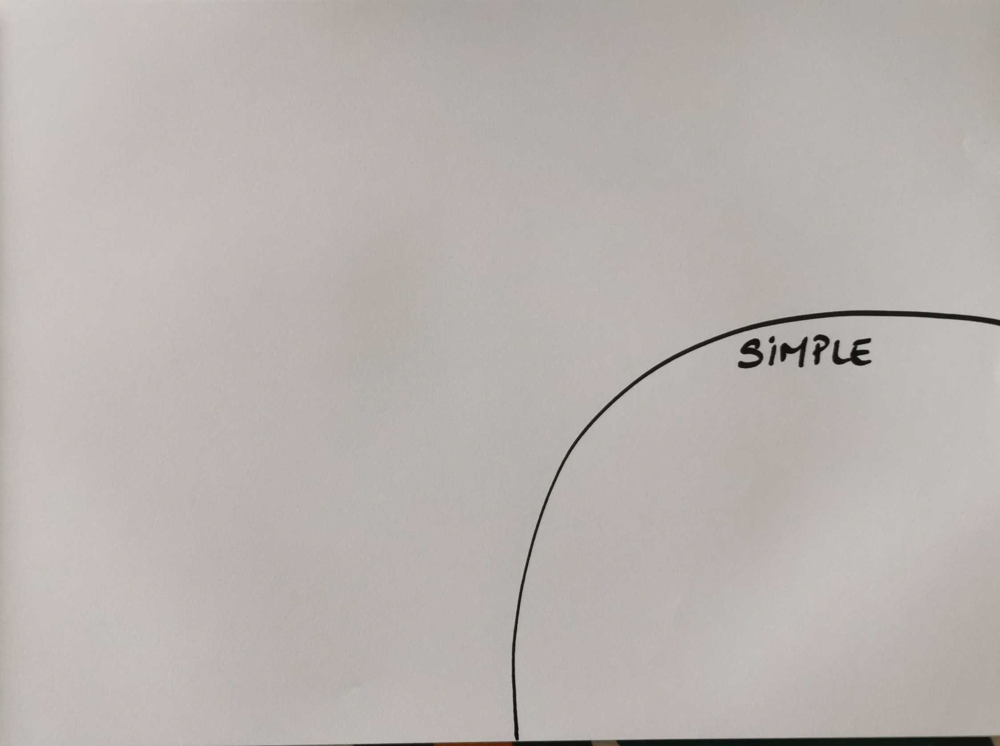
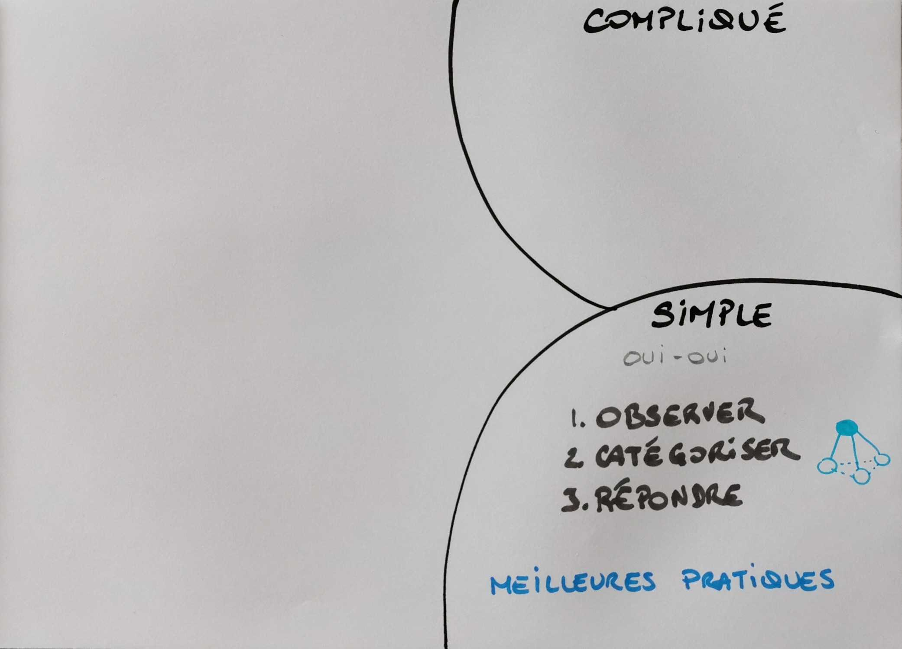
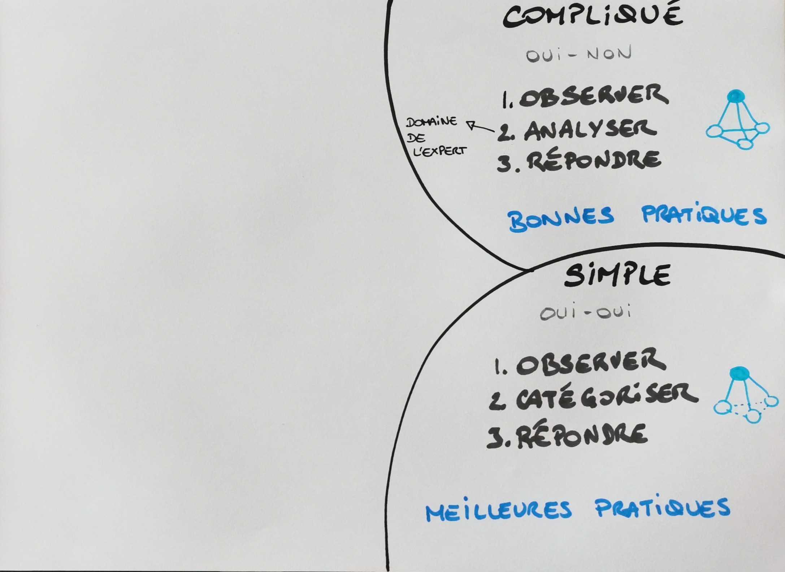
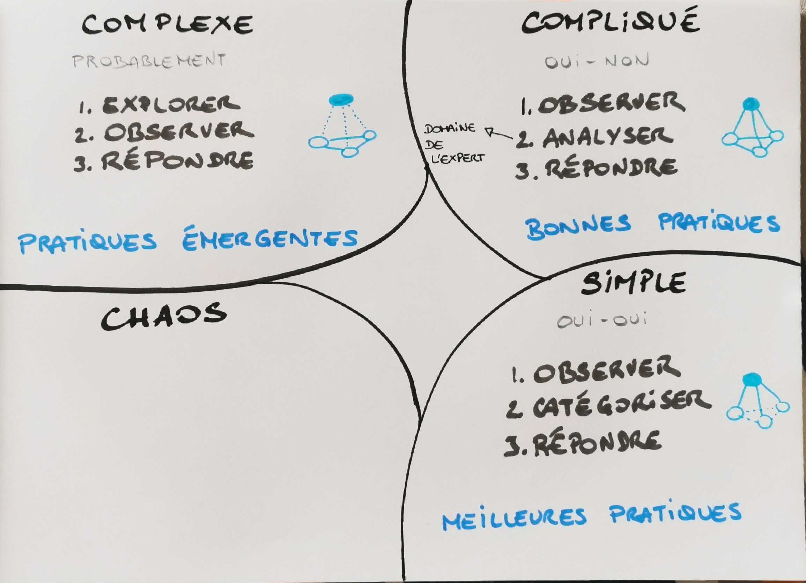
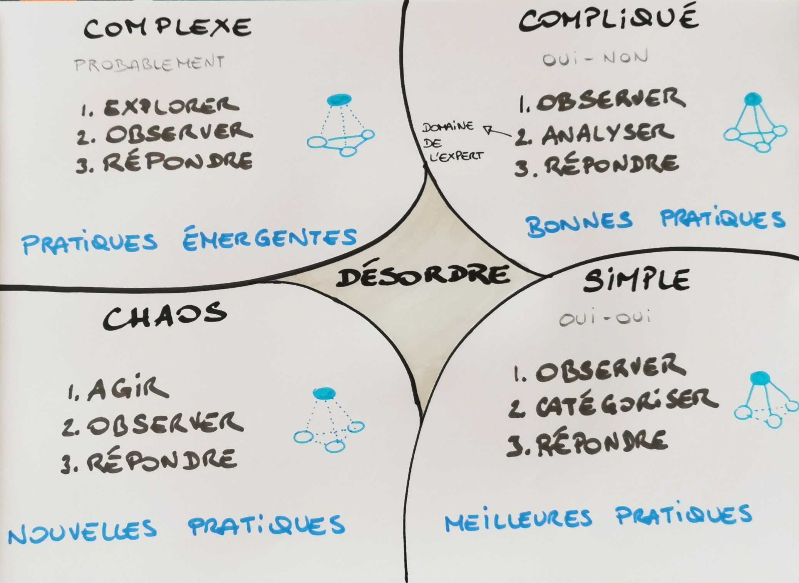
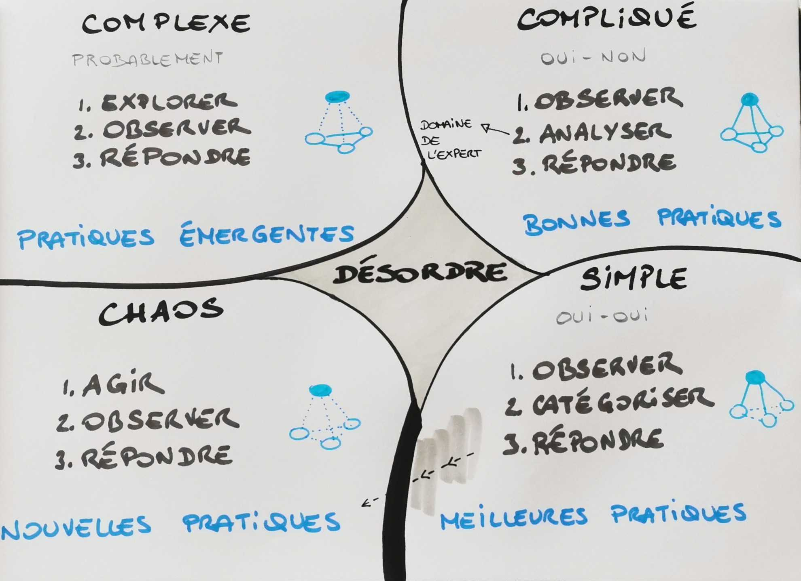
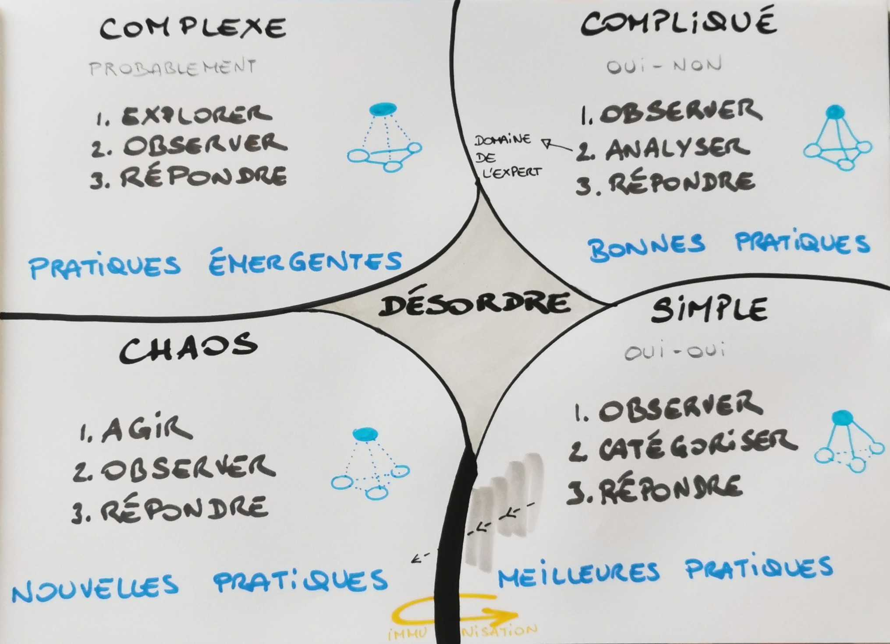

*Note : Cet article fait partie d'une série d'articles sur les grilles de lectures ou modèles. Vous pouvez retrouver l'article d'introduction de cette série [ici](https://www.nilslesieur.fr/2022/01/les-grilles-de-lecture-1/7-intro/).*

---

Chez benext, nous avons l’habitude d’accompagner nos clients et de les aider à comprendre que les problématiques qu’ils rencontrent ne sont pas liées à des personnes, que c’est plus complexe que cela, et que le problème c’est souvent le système. 

En nous replongeant dans le modèle pour écrire cet article, nous souhaitions vous présenter le modèle Cynefin et ses quatre lieux. Mais également faire un zoom sur le lieu appelé “Complexe” que nous et vous donner des clés de lecture pour savoir dans quel lieu vous vous trouvez, et en fonction du lieu, comment réagir, décider et communiquer en tant que personne faisant partie du système ou en tant qu’observateur (coach, scrum master, …).

Quand on mène ou gère des transitions agiles, c’est important de savoir face à quel type de système on se trouve. Une fois après avoir analysé et décodé ce qui se produit en termes de structures organisationnelles et de communication, on pourra adapter notre communication en cohérence et sera en capacité de proposer des outils mieux adaptés.

# Le modèle Cynefin

Les contextes Simple et Compliqué sont des contextes ordonnés, il existe des liens de cause à effet. La prédictibilité y est possible.

## Le Simple

Dans le Simple, il existe un lien direct entre cause et effet.
Sommes-nous dans un contexte simple ? Pour le savoir, deux questions face à une problématique : “est-ce qu’il y a une réponse?” et “est-ce que nous la connaissons ?”. Si les réponses sont “oui” et “oui”, alors nous y sommes ; oui, il y a une solution et oui nous la connaissons. Ici, il n’est pas très utile de beaucoup communiquer, tout le monde sait faire et est autonome. C’est le domaine de ce que l’on appelle les meilleures pratiques (alors pas besoin de papoter). La sur-communication est un risque.

Comment agit-on dans ce contexte ?  

- On observe  
- On catégorise  
- Et on répond  

Un exemple : trier des legos par couleur

## Le Compliqué

Encore un contexte ordonné dans lequel la prédictibilité est possible. A la différence de Simple : “est-ce qu’il y a une réponse ?” Oui. Et “est-ce que nous la connaissons ?” NON. Il va falloir réunir, rassembler des connaissances. Par exemple, nous voulons construire une fusée, une Ferrari. Nous savons que cela est possible, nous savons qu’il y a une réponse. La connaissons-nous ? A moins d’être un expert en fusée ou en Ferrari, non.  
Il va falloir nous entourer d’experts du domaine. Des experts pour analyser la problématique précise.
Maintenant, imaginons que nous interrogions plusieurs experts, combien y aura-t-il de réponses ? Plusieurs, à n’en pas douter. Oui, il y aura plusieurs façons de répondre. 

Il y a une forte communication entre les parties prenantes. Il faut d’ailleurs s’assurer que les experts peuvent communiquer et leur mettre à dispo le cadre approprié

N’avez-vous jamais assisté à une discussion entre experts/entre des coachs ? Le risque est de tomber dans un combat d’expert, de convictions et d’être paralysé par l’analyse.
Afin de ne pas tomber dans cette paralysie, il est préférable de mettre une limite de temps aux discussions. Les experts pourraient si on ne les limite pas débattre jusqu’à la nuit des temps. 

Exemple : le facilitateur qui donne un time boxing pour la phase de convergence d’un atelier et effectue un dot voting à la fin

Contrairement au Simple, nous ne pouvons pas catégoriser, il faut analyser.

La réponse du modèle dans ce contexte :  

- On évalue  
- On analyse  
- Et on répond  

On est dans le domaine des bonnes pratiques. 

## Le Complexe

Les contextes Complexe et Chaotique sont des contextes désordonnés. La prédictibilité y est peu probable, incertaine. 

“Est-ce qu’il y a une réponse ? Est-ce qu’on va réussir?” Probablement. Ce “probablement” est très différent du “oui” du Compliqué. Ça change tout ! Tout ! (A l’oral, nous laisserions un blanc pour appuyer, pour que ce message résonne. Prenez le temps la lecture d’assimiler cette différence).

On ne sait pas évaluer. Il n’y a pas de lien de cause à effet. Autrement dit, une même cause ne produira pas toujours les mêmes effets. Et inversement, un effet ne proviendra pas forcément de la même cause. Nous pouvons relier cette notion au fameux "ça dépend du contexte" des coaches.

Il faudra d’abord explorer. En explorant, des pratiques émergeront, différentes d’avant et uniques pour un contexte. Et c’est en multipliant les expérimentations que l’on va multiplier nos chances de trouver une réponse qui convient.
Pas de bonnes pratiques ici, encore moins de meilleures pratiques, ici place aux pratiques émergentes.
Une fois que l’on aura exploré, on pourra évaluer puis répondre.

La réponse proposée par le modèle dans ce contexte :  

- On explore  
- On évalue  
- Et on répond  

 

## Le Chaos

On ne sait pas s'il y a une réponse. 

Souvenez-vous du COVID en février 2020 ? En France, il n’y a plus de masques, les hôpitaux se remplissent, la fatigue chez les soignants grandit. Dans le monde, il n’y a pas de vaccin. Les tests sont quasi inexistants…
Alors quoi ? On agit! On confine! En France et dans pleins de pays.

Oui, il faut se mettre dans l’action et sortir du chaos pour se retrouver dans un autre contexte. Pas le temps pour l’exploration, ni pour l’analyse, on agit.

La réponse dans ce contexte :  

- On agit  
- On évalue  
- Et on répond  

## Le désordre

C’est là où on se trouve la plupart du temps. Quand on ne sait pas dans quel lieu on est, on est ici. Tout problème qui apparaît se trouve dans le désordre. Pour prendre des décisions, il va falloir qu’on se familiarise avec la situation. 

Le danger c’est de ne pas se poser la question (est-ce qu’il s’agit d’un problème simple, compliqué ou complexe ?). Pour sortir du désordre, il va falloir regrouper les informations, les analyser, puis se mettre en ordre de marche. 

# La frontière entre Simple et Chaos

Dans [cette vidéo](https://www.youtube.com/watch?v=N7oz366X0-8), je découvre que la frontière entre le simple et le chaos est de nature différente des autres. Dave Snowden explique :  

> “un autre aspect clé du cadre Cynefin qui est souvent oublié par les personnes qui essaient de simplifier à l’extrême est la frontière entre le simple et le chaos, elle est différente des autres frontières.  
Dans l’article de la Harvard Business Review, elle est représentée par une falaise, dans d’autres articles par une sorte de vague symbolique en bas. Le principe est le suivant : si vous commencez à croire que les choses sont simples, vous commencez à croire qu’elles sont ordonnées, vous commencez à croire en vos propres mythes, vous commencez à croire que les succès passés vous rendent invulnérables aux échecs futurs. Vous vous déplacez doucement vers la zone de complaisance qui est la frontière entre le simple et le chaotique et vous tombez dans le vide en cas de crise.  
Toutes les autres limites permettent des transitions, mais pour celle-ci, vous tombez dans le vide et la récupération est très coûteuse. Il s’ensuit donc que vous devriez gérer sur la base du compliqué et du complexe et ne déplacer qu’une très petite quantité de matériel vers le bas, dans le simple, car cela est en fait très vulnérable à un changement rapide ou accéléré.”

Il est possible de faire exprès de passer de Simple à Chaos en espérant revenir à simple, ça s’appelle l’immunisation. En faisant ce chemin, je cherche à m’immuniser de certaines dérives et à renforcer mes meilleures pratiques.
C’est ce que fait Netflix avec son Chaos monkey. Le Simple pour Netflix est de diffuser du contenu. Le chaos c’est les serveurs qui tombent les uns après les autres, voir tous les serveurs tombent. Leur chaos monkey fait exprès de faire tomber aléatoirement des serveurs, Netflix observe ensuite le résultat de cet aller du Simple vers le Chaos pour revenir dans le Simple.

Autre exemple, un des exercices de rugby que Nils faisait faire aux joueurs qu’il entraînait consistait à courir dans un carré dont les bords étaient symbolisés par des plots rouges, jaunes, bleus et verts. Tous les joueurs couraient dans ce carré, certains avaient un ballon, d’autres non. Tous les joueurs se passaient les ballons. Après l’annonce d’une couleur, les joueurs munis d’un ballon devaient aller marquer derrière la ligne de cette couleur, les autres devaient les plaquer. Nous sommes dans le Simple : j’ai un ballon, je marque, je n’en ai pas, je plaque. Cause à effet direct.  
Simple sauf si l’annonce est “Violet”. Dans ce cas, les comportements étaient, pour le moins, chaotiques : certains allaient marquer sans opposition, d’autres allaient au plaquage, d'autres continuaient à courir comme si aucune instruction n’avait été annoncée, d’autres encore s’arrêtaient et regardaient l’entraîneur en levant les mains, paumes vers le ciel.... Après plusieurs tours, à force de dire Violet, Blanc voire Banane, les joueurs continuaient à courir et à se passer le ballon comme immunsés à cette pratique.

# Zoom sur le Complexe

## Émergence

Nous l’avons évoqué un peu plus : dans le Complexe, pas de lien de cause à effet, pas de linéarité, de déterminisme. De l’émergence. Celle-ci n’est qu’exploration. Pour nourrir cette émergence, on va imposer des contraintes, un cadre : des démos tous les 15 jours, livrer le produit dans une seule langue plutôt qu’une première livraison multi-langues et internationale (merci Pablo pour ce dernier exemple et la discussion qui s’en est suivie). 

On cherche à faire émerger une sortie entremêlée (une mayonnaise, une innovation, de la valeur, une culture, une synergie, l’intelligence collective... ) et pas une simple addition (une fusée avant son décollage par exemple).
On multiplie nos chances en multipliant les expérimentations, en les parallélisant.
Exemple concret spotify

Il peut être difficile dans notre culture française d’être à l’aise avec cette notion d’émergence, il peut être facile, confortable de rester dans cette culture de découpage du problème et d’analyse. Les refinements à rallonge, les planifications en SAFe sur 3 mois, ...
Pourquoi est-ce facile, confortable pour nous français de découper ? Parce que ça rassure. Parce que c’est ancré depuis Descartes (le fameux esprit cartésien). Il a écrit, dans Le Discours de la méthode :  

>“Diviser chacune des difficultés que j’examinerais, en autant de parcelles qu’il se pourrait et qu’il serait requis pour les mieux résoudre”.

Ca c’est le domaine du compliqué.  

Dans le compliqué, on divise. Dans le complexe, on regroupe, on rassemble. On rassemble les personnes autour d’une problématique, on regroupe les post-its en rétrospective, les maquettes en design sprint…
Rassembler les personnes pour influer une synergie, regrouper les post-its pour faire émerger les thèmes, les maquettes pour faire émerger LA maquette...

## Prédictibilité

Un système compliqué est prédictible, il existe des liens de cause à effet, aussi compliqué qu’il soit comme la trajectoire de comètes. Un système complexe (dans lequel il n’y a pas de liens de cause à effet) n’est pas prédictible : un ouragan, une fourmilière, wikipedia, une synergie d’équipe... Et plus c’est complexe, moins c’est prédictible. On cherchera sans doute à simplifier cette complexité pour se projeter. On cherchera à réduire la complexité en imposant des contraintes, en travaillant sur des plus petites choses (démos tous les 15 jours, livraison d’un produit logiciel tous les soirs, …), plus faciles pour se projeter qu’un grand ensemble.
Feedbacks, transparence et adaptation sont sans doute des alliés.

## Contrôle

William Ross Ashby est un psychiatre britannique, pionnier de la cybernétique, il a rédigé ce qui s’appelle aujourd’hui la Loi Ashby :  

> “Pour qu’un système A puisse contrôler à la fois (« surveiller » et « commander ») efficacement un système B, la variété de A doit être au moins égale à la variété de B”. 

Exemple d’une télécommande et d’un drône : si le drone peut se déplacer en haut, en bas, en avant, en arrière, à gauche et à droite (sa variété). La télécommande contrôle efficacement le drône si elle permet de diriger en haut, en bas, en avant, en arrière, à gauche et à droite. Elle peut faire plus, le drône ne répondra pas, si elle fait moins, elle ne sera pas efficace.

Dans un système humain, on attend souvent que le management (système A) contrôle l’équipe (système B). D’après cette loi, il faudrait que le management ait une variété au moins égale à celle de l’équipe. Qu’est-ce que la variété pour une équipe ? Cela pourrait être la somme des compétences, des expériences, des valeurs, des motivations. Avec cette approche et à notre époque, le management aura un contrôle limité.
Auto-organisation ? Entités autonomes ?... Nous vous recommandons quelques minutes de cette vidéo (calée à 20’01’’) jusqu’à 24’15’’ de Marc Halévy.

# Notre bibliographie
  
- https://pablopernot.fr/2013/04/cynefin-et-son-lego-game/
- https://pablopernot.fr/2017/06/parents-comprendre-agir-avec-cynefin/
- https://medium.com/10x-curiosity/know-your-domain-the-cynefin-framework-dc28648558f1
- https://pablopernot.fr/2020/04/meetup-cynefin/
- https://fr.wikipedia.org/wiki/W._Ross_Ashby
- https://fr.wikipedia.org/wiki/Syst%C3%A8me_complexe
- https://netflixtechblog.com/chap-chaos-automation-platform-53e6d528371f
- https://www.goodreads.com/book/show/56177797-cynefin-framework-as-a-guide-to-agile-leadership
