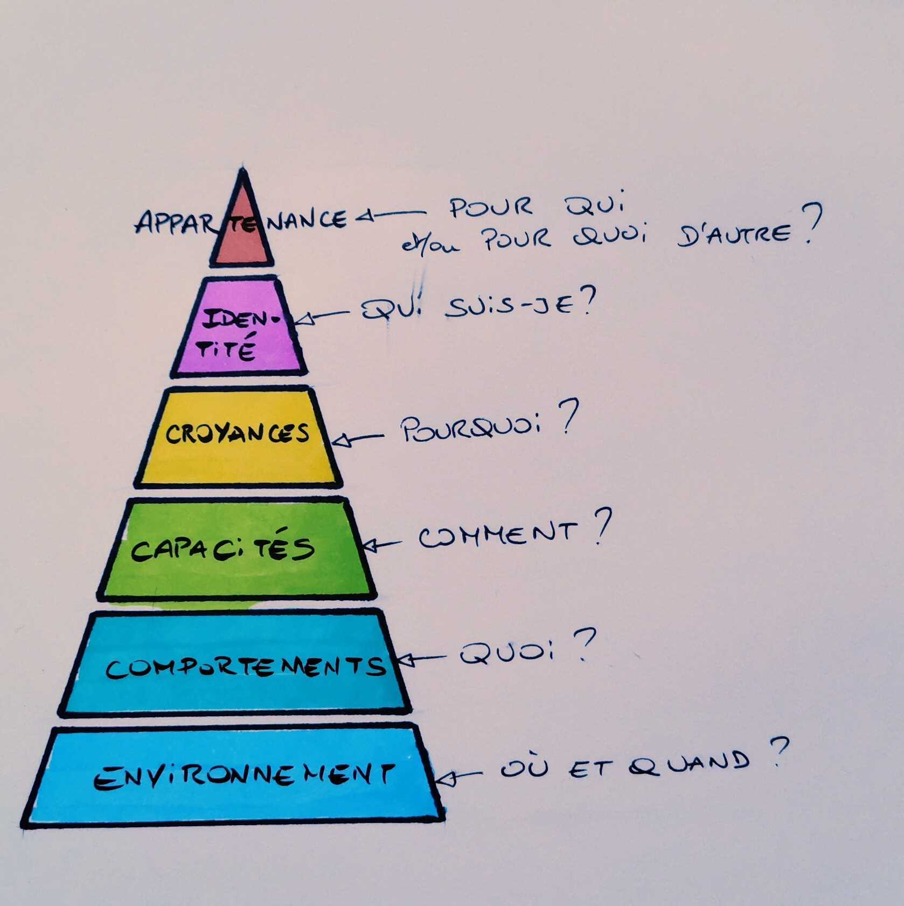
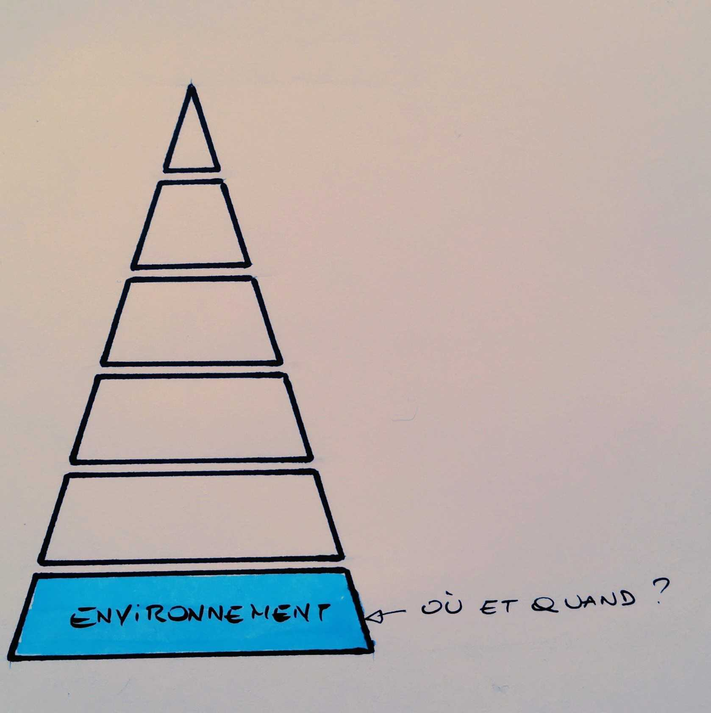
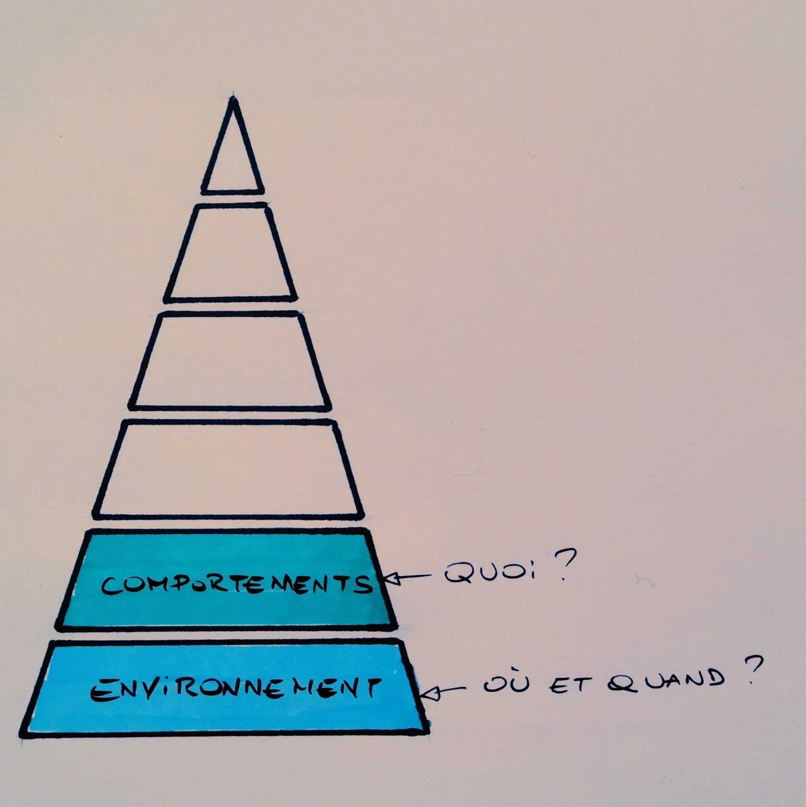
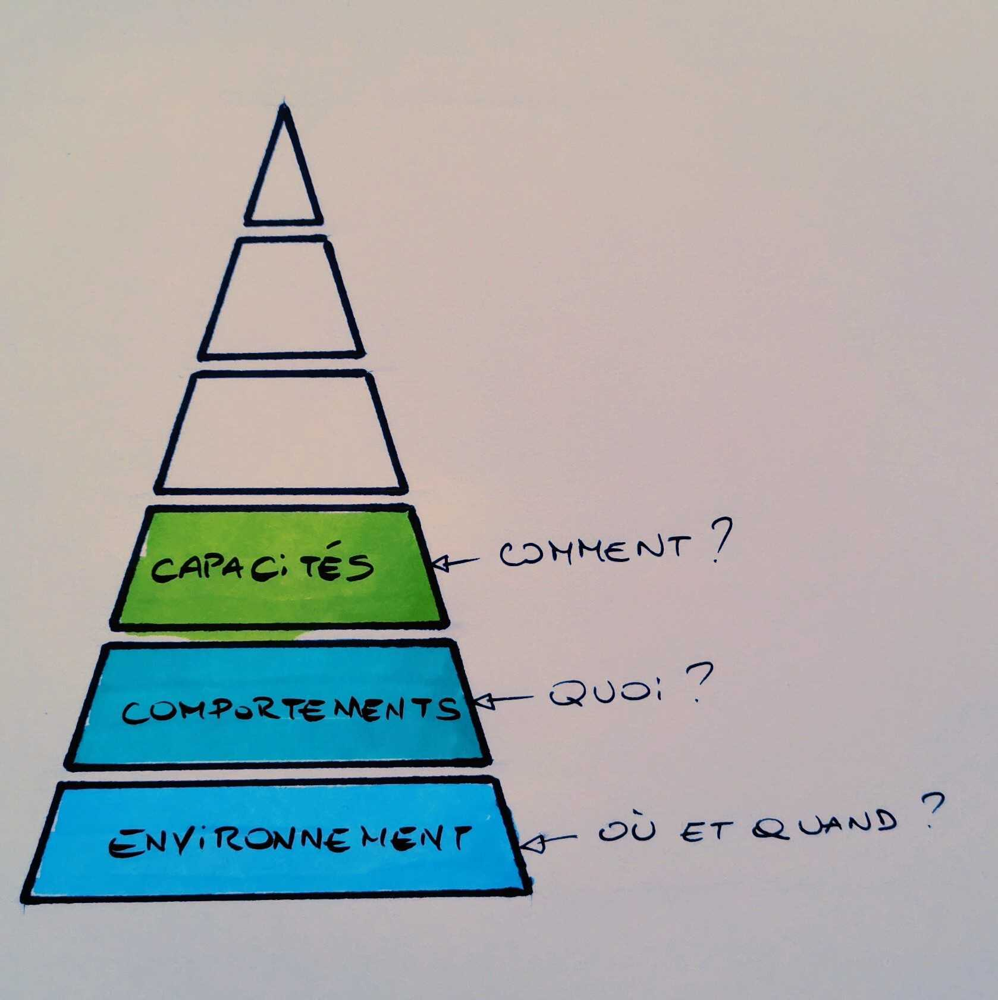
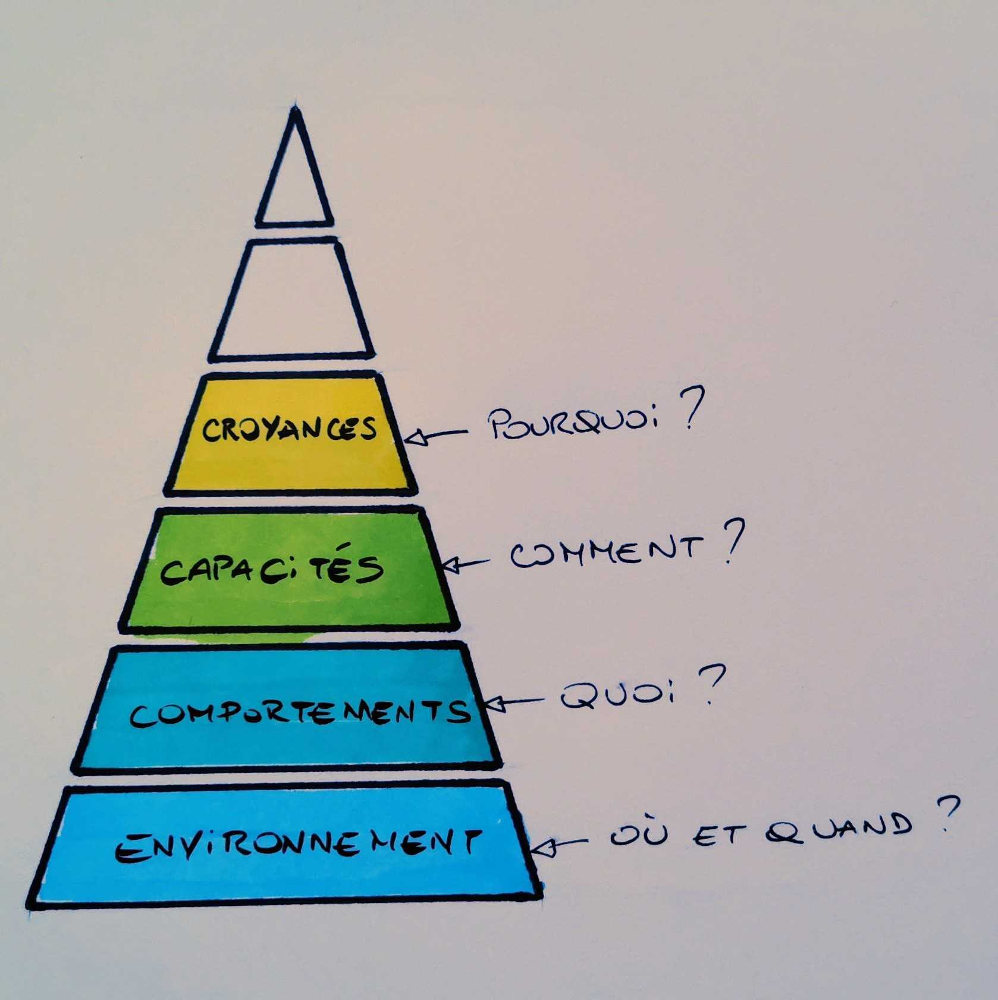
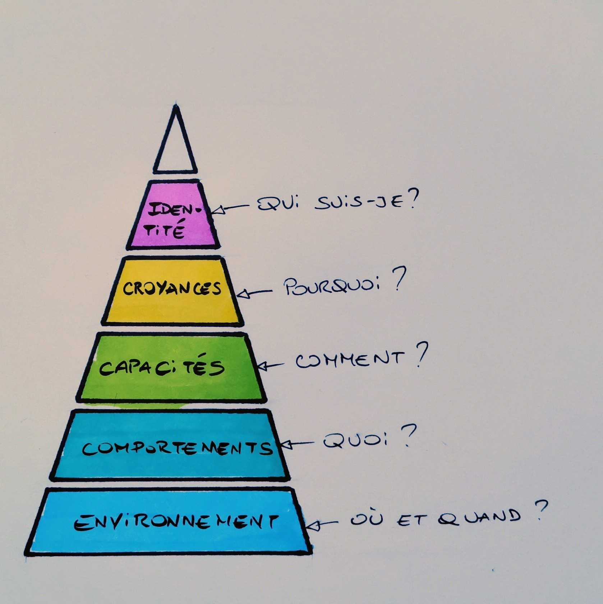

*Note : Cet article fait partie d'une série d'articles sur les grilles de lectures ou modèles. Vous pouvez retrouver l'article d'introduction de cette série [ici](../introduction-aux-grilles-de-lecture/).*

---

# Présentation de la pyramide de Dilts

Robert Dilts a créé ce modèle en s’appuyant et en reprenant les travaux sur les niveaux logiques de Gregory Bateson, un des fondateurs de l’école de Palo Alto.
La pyramide se divise en 6 niveaux logiques de pensée, hiérarchisés : en bas de la pyramide, il y a l’Environnement, puis au-dessus les Comportements, ensuite les Capacités, puis les Croyances (ou Valeurs ou Convictions), puis l’Identité et enfin l'appartenance, le sens.

Nous utilisons cette grille de lecture pour résoudre des problématiques, pour avoir une vue plus globale et systémique d’une situation et pour prendre du recul. Elle peut être utilisée pour un collectif (votre équipe, votre association, votre entreprise,...) ou à un niveau plus individuel (pour vous ou la personne que vous accompagnez).

*J’apprends en faisant ma recherche bibliographique que la pyramide de Dilts est un outil provenant de la Programmation Neuro Linguistique (PNL) : je me retrouve tel Monsieur Jourdain à utiliser des outils de PNL alors que je pensais ne pas savoir ce que c’était.*

Nous détaillons plus loin les 6 niveaux logiques, mais chacun d’entre eux peut rapidement être présenté par une question :  

- L'Appartenance : Pour qui et/ou pour quoi d'autre ?  
- L’Identité : Qui suis-je ?  
- Les Croyances (Valeurs, convictions) : Pourquoi ?  
- Les Capacités : Comment ?  
- Les Comportements : Quoi ?   
- L’Environnement : Où et quand ?  

   

**La clé principale à retenir par rapport à la pyramide de Dilts est la suivante : pour débloquer une problématique à un niveau, la solution se trouvera toujours dans les niveaux supérieurs.**

Une note qui nous paraît importante si vous utilisez cette grille de lecture : Roberts Dilts écrit dans *Sleight of Mouth - The magic of conversational belief change* ce passage (que nous avons traduit ci-dessous avec DeepL) :  

> “J'ai commencé à remarquer que certains types d'affirmations étaient généralement plus difficiles à gérer que d'autres, même si le type de jugement affirmé était essentiellement le même. Par exemple, comparez les affirmations suivantes :  

> - Cet objet dans votre environnement est dangereux.  
- Vos actions dans ce contexte particulier étaient dangereuses.  
- Votre incapacité à porter des jugements efficaces est dangereuse.  
- Ce que vous croyez et considérez comme important est dangereux.  
- Vous êtes une personne dangereuse.  

> Dans chaque cas, le jugement porté est que quelque chose est "dangereux". Intuitivement, cependant, la plupart des gens sentent que l'"espace" ou le "territoire" impliqué par chaque déclaration s'élargit progressivement, et ressentent un affect émotionnel croissant à chaque déclaration.” - Robert Dilts  

## Environnement

Comme écrit plus haut, la question liée à ce niveau est “**où et quand ?**”. Il s’agit de l’environnement réel :  

- Les lieux fréquentés (et comment ils sont, dont le matériel que l’on y trouve)  
- L’entourage, les personnes que l’on croise, avec qui l’on interagit  
- Les événements vécus  

Pour reformuler, c’est le contexte dans lequel évolue la personne, l’équipe, l’organisation.

Au sein de votre équipe, de votre entreprise, de celle de votre client, ce sont par exemple les locaux, les salles de réunion, les PCs,...
D’un point de vue individuel, ce serait par exemple la famille, les amis proches, les membres d’une association, son chez-soi,...
La question du “quand ?” permet la délimitation temporelle de ce qui est à prendre en compte : pour un employé de bureau travaillant en journée et en semaine, ce seront ces temps qui seront à prendre en considération pour l'exploration de son environnement professionnel (par opposition aux nuits et weekends).

## Comportements

Ce niveau logique répond aux questions relatives au “**Quoi ?**”. Qu’est-ce qu’il se passe concrètement ? Quelles sont les actions réalisées ? Mais aussi quelles postures peut-on observer ? Ou encore quelles sont les habitudes ? Qu’est-ce qui est fait ?

C’est souvent le niveau logique où sont visibles les problèmes liés aux niveaux logiques supérieurs (dans la pyramide) : bien souvent ce sont les comportements qui sont dénoncés, les actions faites ou pas faites, leur qualité ou absence de qualité,...

Au sein de votre équipe, de votre entreprise, de votre client, ce sont par exemple la ponctualité des personnes, la posture des managers, les pratiques de développement informatique, …

D’un point de vue individuel, cela pourrait être par exemple un enfant qui fait des fautes à l’écrit, qui écrit “comme ça se prononce”, ou encore les développeurs qui livreraient du code non testé. 

## Capacités

Ce niveau logique est le niveau du “**Comment ?**”. C’est le niveau du savoir-faire, des compétences - des compétences indispensables pour que les comportements attendus puissent être observés.  

Comment pourrais-je espérer voir chez moi tel ou tel comportement si, d’un point de vue individuel, je n’ai tout simplement pas la capacité de faire preuve de ce comportement (quelles qu’en soient les raisons) ? Ou dans un cadre plus collectif, comment pourrais-je espérer voir tel ou tel comportement si l’organisation que je regarde, que j’analyse, n’en est pas capable ?

Au sein de votre équipe, de votre entreprise, de celle de votre client, ce sont par exemple la capacité à demander des feedbacks : est-ce simplement possible ? Est-ce facile ? Ou pourraient encore être considérées : la capacité à livrer rapidement votre produit à vos utilisateurs, ou l’autonomie, ou encore la facilité à réserver une salle de réunion,...

D’un point de vue individuel, c’est encore cet enfant qui ne maîtrise pas les règles de conjugaison ni de grammaire et qui n’est donc pas capable d’écrire sans faute. Un autre exemple : l’équipe sait accueillir les nouveaux arrivants, sait faire monter les personnes en compétences sur tel ou tel sujet mais pas sur tel autre...

## Croyances

C’est le niveau logique des valeurs, des croyances, des convictions. C’est le niveau du “**Pourquoi ?**”, du “**Pour quoi ?**” - du pourquoi des comportements.
Pour revenir au passage de *Sleight of Mouth - The magic of conversational belief change* que nous avons mentionné plus haut, vous sentez peut-être que vouloir faire changer un comportement ou faire changer une croyance ne va pas demander le même effort, ni le même délai non plus. L’ancrage des croyances, des convictions est beaucoup plus fort et s’exprime de bien des façons. Par ailleurs, nous n’en avons pas forcément conscience : les croyances nous apparaissent souvent comme des vérités, et il est donc de ce fait d’autant plus difficile de les identifier et de les modifier.

Au sein de votre équipe, de votre entreprise, de votre client, vous croyez par exemple que “c’est comme ça que se passe” ou encore que “c’est comme ça qu’on a toujours fait”. Que serait-il possible si on croyait pouvoir faire autrement ? Ouvrir la perspective et se poser la question permet d’ouvrir la porte à la créativité - même si, au final, il s’avère peut-être finalement que c’est bel et bien “comme ça” que cela doit se passer...

D’un point de vue individuel, cela se traduit par exemple par des phrases qui nous semblent être vraies sur la manière dont on se perçoit : “les maths et moi ça fait deux” ou “je ne sais pas me vendre”. Reformuler avec la question “Pourquoi” cela pourrait être : Pourquoi ai-je cette difficulté ? A noter que ces exemples sont des croyances concernant l’identité, qui est le niveau suivant de la pyramide.
En rédigeant cette section nous vient une réflexion concernant les proverbes : sont-ils des croyances culturelles partagées ? “L’habit ne fait pas le moine”

Nous proposons ici un petit zoom sur les croyances aidantes/limitantes. Une même croyance peut être aidante ou limitante selon le contexte. Souvent une croyance qui nous limite aujourd’hui a été intégrée dans le passé - et elle était alors aidante et faisait partie d’une stratégie de survie.  
Exemple : “il ne faut pas parler aux inconnus” : cela peut être aidant dans l’enfance pour éviter des dangers, mais va potentiellement se révéler limitant si aujourd'hui je me trouve trop timide, si je n’arrive pas à rencontrer de nouvelles personnes ou à exprimer mon avis.

## Identité

Ce niveau logique répond à la question “**Qui suis-je ?**”.
L’identité est la représentation interne de qui nous sommes. Dans l’idée de l’identité, il y a une notion de mission associée : c’est ce que nous souhaitons accomplir.
Nous avons plusieurs identités cumulées en même temps, l’une étant plus prévalente que l’autre selon le contexte : une même personne peut être à la fois un fils, un mari, un père, un travailleur, un créatif,...

Au sein de votre équipe, de votre entreprise, de votre client, c’est par exemple ce qui est présenté comme la mission ou la raison d’être. Les rétrospectives peuvent ainsi permettre un travail sur l’identité si on y explore la mission et raison d’être de l’équipe. Pour un produit, on peut penser à l’elevator pitch qui pose l’identité d’un point de vue marché.

D’un point de vue individuel, notre identité est l’image que nous nous faisons de nous-même. Ce sont toutes les façons dont nous pouvons compléter la phrase “Je suis…”. Il est intéressant de s’interroger sur ce que nous sommes à un instant T sans que cela soit forcément pour toujours : notre identité d’aujourd’hui n’est pas forcément celle de demain. Par exemple, nous pouvons aujourd’hui dire “je suis introverti” (ou à l’inverse extraverti), mais à force de travail sur soi et d’entraînement, nous pouvons assouplir cette caractéristique pour devenir un peu plus extraverti (respectivement introverti). Il est donc intéressant de s’interroger sur ce que l’on pense être nos caractéristiques, et également dans quelle mesure nous pourrions avoir envie de les faire évoluer (ou non d’ailleurs !).

Travailler sur nos valeurs (au niveau précédent), c’est aussi possiblement travailler l’identité de manière indirecte, dans la mesure où nous voulons être un groupe/une personne qui a telle valeur/telle croyance (même si parfois nous ne sommes pas encore ce groupe ou cette personne). On peut ainsi utiliser cette notion pour proposer une projection au niveau de l’identité : “ça serait comment d’être un groupe/une personne qui [a cette valeur] ?”.

## Appartenance

Ce niveau logique répond aux questions “**Pour qui ou/et pour quoi d’autre ?**”
Il se rapporte à la notion d’appartenance et est également lié à la contribution à quelque chose de plus grand que soi. C’est à ce niveau que se jouent l’éthique, la responsabilité morale, voire le lien avec la planète.

Les manifestations sont, nous semble-t-il, une mobilisation, une action de ce niveau - souvent motivée par le fait que, dans notre identité, nous nous attachons à être une personne en accord avec certaines valeurs, et qui va ainsi agir pour une contribution plus large. On voit ainsi l’interaction des niveaux croyances, identité et appartenance.

Même idée avec les communautés de pratiques qui rassemblent des individus mobilisés autour d’une identité commune (par exemple “nous sommes des facilitateurs”) et qui se reconnaissent cette identité. La communauté de pratique est ainsi l’endroit où faire l’expérience de cette appartenance.

Au sein de votre équipe, de votre entreprise, de votre client, l’appartenance s’exprime par exemple par la connaissance de la mission de l’entreprise, ce qu’elle cherche à accomplir dans le monde, mais aussi ses utilisateurs et les publics qu’elle cherche à impacter. Pour l’équipe, il s’agit de quelque chose de plus grand qu’elle : au moins son entreprise… Pour l’entreprise, il s’agit de quelque chose de plus grand qu’elle : au moins ses cibles. Quelle contribution cette entreprise souhaite-t-elle faire ? C’est en général très visible pour les ONG.

D’un point de vue individuel, qu’est-ce qui est plus grand que soi et auquel on souhaite contribuer ? Pour l’individu, il s’agit donc de quelque chose de plus grand que lui : au moins son équipe, sa famille - plus largement sa communauté ou son pays… On peut penser à l’exemple de la personne qui fait des études dans le secteur de la santé, comme médecine ou infirmière : cette personne aura à cœur de contribuer au bien-être des autres par la posture de soignant.

# Utilisation et mise en pratique

De manière individuelle, comme aide à la mise en action, il est possible de parcourir la pyramide accompagné par un coach pour vivre un exercice de projection et de mise en lumière d’ajustements des différents étages pour engager l’action.
A nouveau, s’il ne fallait retenir qu’une seule chose de la pyramide, c’est que pour débloquer un niveau, la solution se trouvera toujours dans les niveaux supérieurs. Il ne sert à rien de vouloir changer son environnement (par exemple en se procurant plus de matériel) si on n’a déjà pas la compétence pour mettre en place un comportement souhaité.

## Utilisation explicite avec un ou des managers

J’utilise parfois la pyramide de Dilts dans le cadre d'accompagnement de managers, en individuel ou en co-développement.
Je commence par dessiner la pyramide et la décrire en commençant par les niveaux du bas. Je précise les questions présentes à chaque niveau, ainsi que les enjeux associés.
J’interviens dans du Coaching agile ou d’organisation, et ne souhaite pas intervenir au niveau de l’identité d’une personne ni sur son appartenance/spiritualité - ce qui relève pour moi soit du coach individuel soit d’un psychologue.

Je pose des questions du type “Quel est le problème ?”, "Raconte-le moi", “A ton/votre avis, où se situe-t-il sur la pyramide ?”.
J’explicite le message-clé en rapport avec la pyramide, à savoir que pour résoudre un problème, il faut regarder le niveau supérieur (la pyramide de Dilts est hiérarchisée).

Un exemple : pourquoi un tel comportement ? Regarder le niveau supérieur pourrait s’illustrer par la question “A-t-on la capacité de faire autrement, la capacité de faire le comportement que l’on souhaiterait, … ?” Si oui, on creuse. Sinon, on continue à remonter dans les niveaux. 

Ce travail avec la pyramide apporte généralement un regard nouveau, de nouvelles clés pour le manager, de nouvelles possibilités. Il peut l’aider à sortir d’un cercle vicieux où toujours plus de la même chose engendre (voir nourrit) les réactions.

## Utilisation personnelle du coach pour décrypter une situation
L’idée de repérer où la pyramide n’est pas alignée pour pointer où cela coince et ensuite essayer de trouver des pistes.

Deux exemples :

Un manager qui veut que ses équipes codent en TDD : c’est un contexte de groupe pour lequel il suffit peut-être de remonter d’un seul niveau dans la pyramide. Le comportement “n’est pas le bon”, pas l’attendu. Le niveau au-dessus est celui des capacités. Ces développeurs ont-ils la capacité de coder en TDD ? Non. Alors il suffit peut-être d’acquérir la compétence ; formations des équipes et accompagnement à la mise en place du nouveau comportement.
C’est un exemple volontairement simple. Il faudrait sans doute creuser du côté des croyances, des valeurs pour être sûrs que la nouvelle capacité soit alignée.

Dans un coaching individuel, je vais prendre l’exemple d’un enfant de 8 ans qui sait lire mais ne lit pas de livres autres que des bandes dessinées. Ce n’est pas forcément un problème mais peut-être a-t-on envie de comprendre. A priori il a la capacité à lire puisqu’il lit des bandes dessinées. On continue de remonter : croyances. Quelles sont les croyances de cet enfant ? “C’est trop long les romans”, “Je suis trop petit”, "C'est pour ma soeur les romans, c’est elle qui lit beaucoup de romans”, … On peut tenter un tour à la bibliothèque ou à la librairie et espérer déclencher une discussion entre lui et la bibliothécaire ou le libraire. Il feuillette, il constate qu’il y a des livres pour son âge, parfois même avec des dessins, il constate qu’il y a des livres sur des sujets qu’il aime bien et que ces sujets ne sont déjà pas présents chez lui. Il découvre qu’il y a un livre de l’autrice préférée de sa sœur, fait pour son âge et parlant d’un jeu vidéo qu’il affectionne. Quelques croyances sont en cours de déconstruction. Cet enfant a lu son roman en 3 jours. Il n’a pas pour autant continuer à lire beaucoup de romans mais il en lit.

# Conclusion

On commence cette conclusion pour rappeler que cette grille de lecture issue de la PNL est souvent utilisée comme un outil de résolution et pour répéter une dernière fois que la pyramide de Dilts est hiérarchisée et que la résolution d’une problématique nécessite de considérer le niveau supérieur.
Elle peut également être utilisée pour constater l’alignement des niveaux logiques de cette pyramide et aux désalignements éventuels qui peuvent expliquer un manque de fluidité.

Nous vous invitons à essayer de lire des situations sous le prisme de cette grille de lecture et à nous dire ce que vous en avez pensé !

# Bibliographie  

- https://www.penserchanger.com/les-niveaux-logiques-de-robert-dilts  
- Sleight of Mouth, The magic of conversational belief change - Roberts Dilts  

