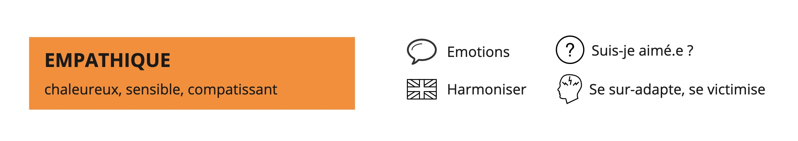
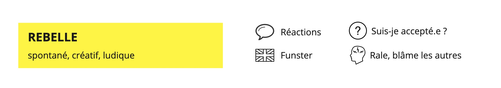
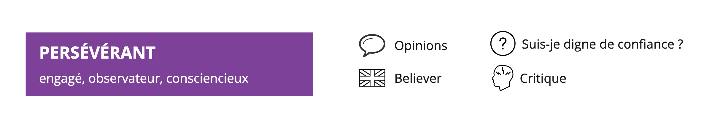
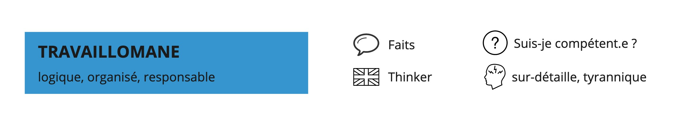
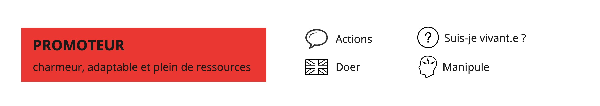
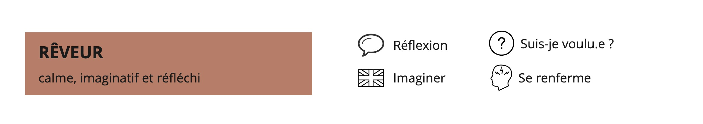

*Note : Cet article fait partie d'une série d'articles sur les grilles de lectures ou modèles. Vous pouvez retrouver l'article d'introduction de cette série [ici](../introduction-aux-grilles-de-lecture/).*

---

# Process communication Model

Le Process Communication Model est une grille de lecture des différentes personnalités qui permet de mieux se connaître, de mieux connaître ses motivations, ses masques de stress, et de mieux comprendre l’autre, ses motivations et ses masques de stress. 
Il a été développé par Taibi KAHLER, docteur en psychologie, dans les années 70. La NASA a financé ses recherches dans le cadre du recrutement des astronautes afin de constituer des équipes qui arrivent à communiquer et travailler ensemble.
Les travaux de Taibi KAHLER ont été couronnés par le prix scientifique Eric BERNE, inventeur de l’Analyse Transactionnelle, en 1977.

Beaucoup de modèles existent pour classer les différents types de personnalités. Un avantage que nous voyons à celui-ci : **il est à la fois simple (6 personnalités) et dynamique**. Son côté dynamique permet de nuancer : au cours de la vie on peut passer d’un type dominant depuis l’enfance (base) à d’autres types (phases) ou pas. On peut rester toute sa vie sans “phaser”.

Il existe de nombreuses ressources pour expliquer ce modèle. Nous n’avons pas l’ambition de décrire dans les moindres détails le modèle mais souhaitons montrer comment nous l’utilisons dans nos quotidiens de Product Owner ou Coach.

# Présentation du Process communication Model
## Les deux principes du modèle

**La façon de communiquer (la forme) a parfois plus d’impact que le contenu du discours (le fond)**. C’est bien souvent sur la forme que réagissent, en bien ou en mal, nos interlocuteurs. Un bon processus de communication permet d’optimiser la relation.
Nous pouvons dire quelque chose d’intéressant, d'important, de structurant, d’enrichissant... sans faire attention à la façon dont nous le disons. Dans ce cas, pas sûr que le message sera  entendu par notre auditoire. Ou à l’inverse, nous pouvons présenter des arguments sans intérêt avec une forme appropriée, il y a de fortes chances pour que nous touchions notre auditoire. 

Le modèle présente 6 types de personnalités : Empathique, Travaillomane, Persévérant, Rêveur, Rebelle et Promoteur. **Aucun n’est mieux ou pire qu’un autre, même si chacun d’entre nous pourra être plus à l’aise avec tel ou tel type de personnalité**. Chaque profil se dessine à travers :  

- des points forts et faibles,  
- une manière de s’exprimer, de communiquer,  
- des besoins psychologiques à satisfaire comme des tâches motivantes, un cadre à privilégier pour interagir,  
- un mécanisme de stress et donc des stratégies pour le gérer,  
- une somme de caractéristiques comme le style de leadership, un environnement préférentiel voire le choix d’une profession  
- un canal de communication à privilégier pour entrer en relation avec ce type de personnalité  

# Les 6 profils Type

Nous avons précisé dans cet [article](http://nilslesieur.fr/2022/01/les-grilles-de-lecture-1/7-intro/) “tous les modèles sont faux”. Dans cette section, **nous détaillons les 6 types de personnalité en les considérant comme “purs”**, comme si une personne n’était décrite que par un seul type, ce qui n’existe bien évidemment pas dans le réel.
Pour chaque type, nous préciserons le terme anglais, nous pensons qu’un second mot pourra vous aider à mieux cerner les types de profils et à moins tomber dans le piège des étiquettes.

## Empathique

Le type Empathique (en anglais, le modèle parle d’ “Harmonizer”) est chaleureux, sensible, compatissant, il prend soin de son entourage, des personnes, de l’ambiance. Il adore le côté chaleureux. Il a d'ailleurs une sensibilité kinesthésique, l'Empathique a le contact facile. Ce qui le drive, le met en mouvement c’est de faire plaisir. ll a besoin de se sentir aimé et reconnu en tant que personne. Suis-je aimé.e ?
Il est sensible aux émotions des autres et exprime les siennes. Son langage va mêler émotions, chaleur, soin de l’autre : “j’aime beaucoup ici, je m’y sens bien”, “excuse-moi, je peux te déranger, j’aimerais te demander un truc ?” 
Il lui est difficile de savoir dire non, la colère est difficile à exprimer pour lui, il préfère se réfugier dans la tristesse.

En stress, le profil fait des erreurs inhabituelles et ne se sent pas compétent (n’oubliez pas son besoin d’être reconnu, en tant que personne et pas pour son travail ce qui est différent d'autres types). Il se victimise. Il se sur-adapte pour le soin de l’autre, pour faire plaisir.

## Rebelle

Le type Rebelle (« funster » en anglais) est spontané, créatif, ludique. Il aime s’amuser partout, tout le temps, il trouve des surnoms, invente des mots. Il recherche des émotions instantanées, des contacts variés, amusants. Ce qui le motive, c’est de faire des efforts. Suis-je accepté.e ?
Il communique ses réactions par des onomatopées : “Rhooo, t’es troop belle”, “Allez go, je viens avec toi !”

Il a des difficultés à prendre des responsabilités (ce n’est pas fun les responsabilités).
En stress, le rebelle râle (en continuant à exprimer ses réactions), invite les autres à penser ou à faire à sa place. Sous stress plus intense, il blâme les autres et fait preuve de mauvaise foi.

## Persévérant

Le profil Persévérant (“believer” en anglais) est engagé, observateur, consciencieux, il a des convictions et les défend. Son langage s’appuie d'ailleurs sur des valeurs ou mots forts "je dois", “il faut”, "jamais", "toujours", il y a rarement de nuances : “C’est vraiment important qu’on résolve ce bug.” “Cette bataille, on ne peut pas la perdre”. Il communique des opinions.
Comptez sur ce profil pour mener un projet jusqu’au bout, coûte que coûte, s’il y croit !

En cas de stress négatif, il critique les autres, devient moralisateur et se focalise sur le négatif : "Écrire une User Story sans la présenter à son équipe, ça ne se fait pas”. 
Il adore donner son avis, ses opinions et il adore que (et les respecte quand) les autres en fassent de même. En rétrospective d’équipe, s’il n’est pas content et pas cadré, il peut partir dans un discours enflammé pour défendre ses croyances, il peut être compliqué de l'arrêter.

## Travaillomane

Le type Travaillomane (“thinker” en anglais) est logique, organisé, responsable, aime que les choses soient rigoureuses, organisées et que les réunions commencent à l’heure ! Il s’exprime par des faits.

Rien ne lui fait plus plaisir que lorsqu’ on le félicite sur son travail (“Bravo, c’est du bon travail”) car il a besoin d’être reconnu pour ses compétences. Pour le motiver, vous pouvez lui confier l’organisation et la planification. Il se fera un plaisir de dégainer checklists, rétroplanning et autres outils.

Au contraire, si vous lui demandez à la dernière minute d’improviser une réunion pour remplacer quelqu’un au pied levé ou si vous le mettez en retard, il risque d’être stressé. 
Soumis à un stress négatif, le Travaillomane (i.e. le profil pur) a tendance à être perfectionniste, à critiquer les autres pour leur incompétence et n’arrive pas à déléguer : “Je préfère le faire moi-même car untel n’est pas pro, il faut toujours repasser derrière lui.”

## Promoteur

Le type Promoteur (“doer” dans le modèle anglais) est charmeur, adaptable et plein de ressources. Il cherche le challenge, l’excitation et l’efficacité. Peu lui importe s'il sait comment il va relever le challenge, il fonce. Il recherche aussi les sensations fortes et à se sentir important. C’est son driver, “sois fort.e” pour lui-même et pour l’autre. “Suis-je vivant.e ?”
Il perçoit et exprime des actions : “Ce matin, j’ai pris mon petit déjeuner, j’ai pris rendez-vous avec Roman et envoyé un mail pour l’organisation de la soirée du 12 mars”.
Dans son langage, il vise l’efficacité, l’action, pas de place à l’affection, parle et entend l’impératif.
J’avais noté trop vite “pas de place à l’affection”, c’est faux car le Promoteur est adaptable et saura donc faire preuve d'affection ou autre si c'est pour atteindre son but.

Il a du mal à accepter l'authenticité et l’intimité.

En stress, il n’apporte aucun soutien et fixe des challenges négatifs pour arriver à ses fins. Dans un niveau encore plus intense de stress, il manipule et/ou humilie les personnes, il prend des risques (pour relever des challenges encore et toujours).

## Rêveur

Le type Rêveur (“imaginer” en anglais) est calme, imaginatif et réfléchi. Son truc à lui c’est l’imagination : “J’imagine que ça se passera comme ça…”. “Si je me projette, je vois beaucoup d’opportunités.” 
Vous avez l’impression qu’il est dans la lune ? C’est normal, le type Rêveur a besoin de solitude et d’un espace à lui pour imaginer, faire de l’introspection. 
Ne le bousculez pas ! Sous stress négatif le Rêveur se renferme sur lui-même, devient passif. Il risque de disparaître physiquement ! 
Comment l’identifier s’il est justement en retrait ? Son petit côté “Professeur Tournesol” pourra vous mettre la puce à l’oreille. Le Rêveur a tendance à prêter peu attention aux modes ou assortiments de couleurs. 

## Au-delà du comportement
Au-delà du comportement, de la façon de s’exprimer, l’habillement peut être révélateur. Quelques exemples : le profil empathique s’habille avec des matières agréables au toucher, des vêtements doux à regarder. Pour le profil travaillomane, c’est net, soigné, repassé. Le profil persévérant s’habille en fonction de la situation. Le profil rêveur s’habille pour le confort, et accorde peu d'importance à la dernière mode ou à l'assortiment des couleurs. Le profil rebelle vise à attirer l'attention, avec un style inhabituel, voire unique. Et enfin, le profil promoteur montre : vêtements de marque, chers, bijoux voyants. 
On pourrait également faire l’exercice pour les intérieurs de maison, d’appartements, de lieux de travail révélateurs... 

# Les nuances de la réalité

Un modèle plus dynamique que nous laisse penser les 6 types
Ce qui est écrit ci-dessus est globalement la première version de l’article, en tant qu’auteurs, nous avions besoin de mettre à plat les types du modèle. Verbaliser nous a aidé à clarifier notre discours, à ordonner notre pensée et à mieux comprendre ces six profils.

Nous avons demandé une relecture à [Sara Dufour](https://www.linkedin.com/in/saradufourintlmarcom/) et [Pauline Garric](https://www.linkedin.com/in/pauline-garric-29337238/). Nous les remercions pour tous leurs feedbacks et propositions d’amélioration. Pauline nous a notamment dit :  

> “j’apporterai plus de nuances pour montrer que cette grille peut être abordée facilement mais que les dessous demandent de la pratique et que toute la complexité réside dans le fait que nous sommes tous dans un ordre différent et à des niveaux différents”.

Ce que nous avons décrit ci-dessous ce sont les profils purs. **En réalité, la très grande majorité d’entre nous est une combinaison de ces niveaux. Certains nous sont très accessibles, d’autres, moins développés, nous demandent plus d’efforts voire beaucoup plus d’efforts.**
Ne rangez pas les personnes dans des cases.
Chez benext, toutes les nouvelles recrues participent à un test et à une formation PCM. Le fait que ce référentiel soit commun a des vertus : mieux se connaître individuellement, mieux comprendre comment s’adresser aux autres, mieux comprendre le stress des autres, comprendre que certaines personnes sont plus à l’aise dans des contextes particuliers.

Malgré ces points positifs, si l'on utilise ce modèle à outrance, on risque de ranger les personnes dans des cases. Se ranger soi-même dans une case, par exemple, peut avoir pour conséquence de se trouver des excuses pour justifier un comportement et ne pas en changer : “Je n’y peux rien si je suis comme ça, je suis travaillomane, je ne peux pas changer”. Réduire une personne à son type PCM peut nous aveugler et nous empêcher de prendre en compte d’autres dimensions qui peuvent expliquer son comportement, comme sa culture (propre à son pays, sa famille, son entreprise) et le système dont elle fait partie (son équipe, son organisation).

# Le PCM dans nos métiers

## Nils, coach
D’après le test, je (Nils) suis base Empathique et phase Persévérant. Cela signifie que si nous prenons ces résultats au pied de la lettre, j’aimerais que l’on me parle avec les émotions, avec chaleur... avec ce que l’on appelle le canal nourricier. Sous stress, l’Empathique ou le Persévérant peuvent s’exprimer. Si c’est mon Persévérant qui s’exprime, je peux partir en croisade et et donc pas du tout avec chaleur, sans partager d’émotions.

Il y a une part de vrai. Ce test m’a aidé à prendre conscience de la différence entre ce que j’aimerais entendre et ce que j’induis comme conversations en exprimant mes opinions sous stress. Qu'est-ce que je fais de manière plus délibérée suite à ce test et cette prise de conscience ? J’essaie davantage de livrer mes émotions, mes ressentis, de demander plus souvent aux autres comment ils se sentent, en formation ou dans la vie de tous les jours. J’essaie, quand j’exprime une croyance, une opinion, de préciser “c’est ma croyance” pour ne pas passer pour un bulldozer.
En tant que coach ou scrum master, j’ai un devoir de neutralité, j’ai le devoir de ne pas exposer n’importe comment mes croyances à mes clients, aux équipes.

## Alice, product owner 

Alice raconte : Chez benext, j’ai préparé un atelier avec mon collègue Amara et je me suis rendu compte que nos attentes, réflexes et façons de parler étaient très différentes. Lors de notre réunion, j’ai commencé une to do list et cherché à structurer notre plan d’attaque en grandes étapes. Amara a mis l’accent sur l’improvisation et le côté fun de l’événement. Nous avons identifié une situation dans l’atelier où nous ne savions pas du tout comment les participants allaient réagir, et nos réactions ont été opposées. Mon réflexe a été “Comment anticiper ce que les participants vont faire pour pouvoir mieux nous préparer ?” alors que celui d’Amara était : “Génial, on va avoir la surprise de comment ils vont réagir !”.  

J’ai identifié Amara comme rebelle, alors que je suis travaillomane. D’après mon test PCM, le langage des rebelles est le canal que je maîtrise le moins. Je lui ai partagé ce constat, et comme nous partageons ce référentiel commun, nous avons pu mettre des mots (“rebelle” et “travaillomane”) sur ces réactions opposées, ce qui nous permet de comprendre et d’accepter que l’autre a une perception différente d'une même réalité, pour mieux travailler ensemble.
Sans ce langage commun, notre collaboration aurait été plus difficile, j’aurais pu prendre ce côté spontané et joueur comme un manque de sérieux et de préparation. 

Savoir que je suis en phase travaillomane permet de mieux connaître mes points forts et faiblesses dans mon métier de Product Owner. Je suis organisée, j'aime planifier et prioriser ce qui est utile pour gérer mon backlog et ma roadmap. Cela peut avoir des effets pervers auxquels je dois être vigilante. A vouloir trop contrôler ce qui va se passer, je peux être victime de biais de confirmation : après une MEP d’une nouvelle fonctionnalité, j’ai tendance à chercher une confirmation de ce que j’attends (“le taux d’erreur va baisser”, “les utilisateurs vont aimer cette fonctionnalité”) plutôt que d’être ouverte à l’incertitude, qui fait partie de mon métier (“en fait les utilisateurs ont complètement détourné la fonctionnalité et l’utilisent à une autre fin”). Comme le type “rebelle” est celui que je maîtrise le mien, j’ai du mal à embrasser cette incertitude. Le savoir me permet d’y être vigilante.

# Ressources :  

- L'article sur le process communication model de [Bloculus](https://bloculus.com/process-communication-les-fondamentaux/)  
- Formation Apprendre à dire les choses par Pauline Garric  
- Le site [processcommunication.com](https://www.processcommunication.com/) et sa [version française](https://www.processcommunication.fr/)  
- l’explication du modèle reçue lors de nos tests PCM par [Boris Quinchon](https://www.linkedin.com/in/boris-quinchon/)
