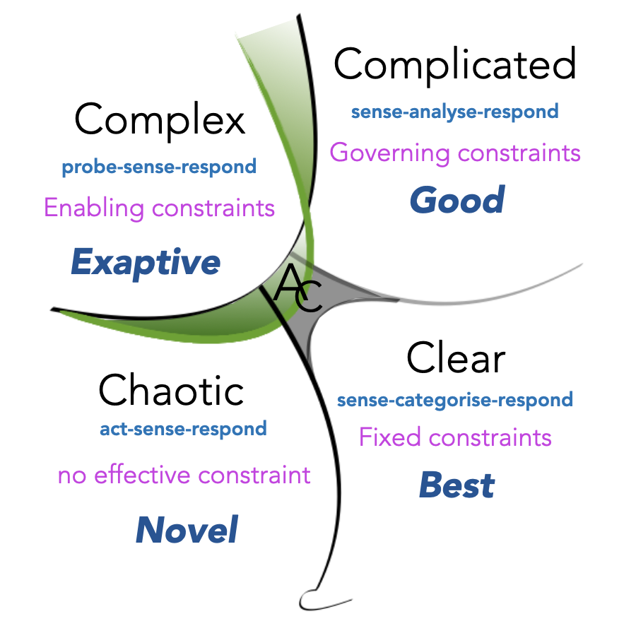
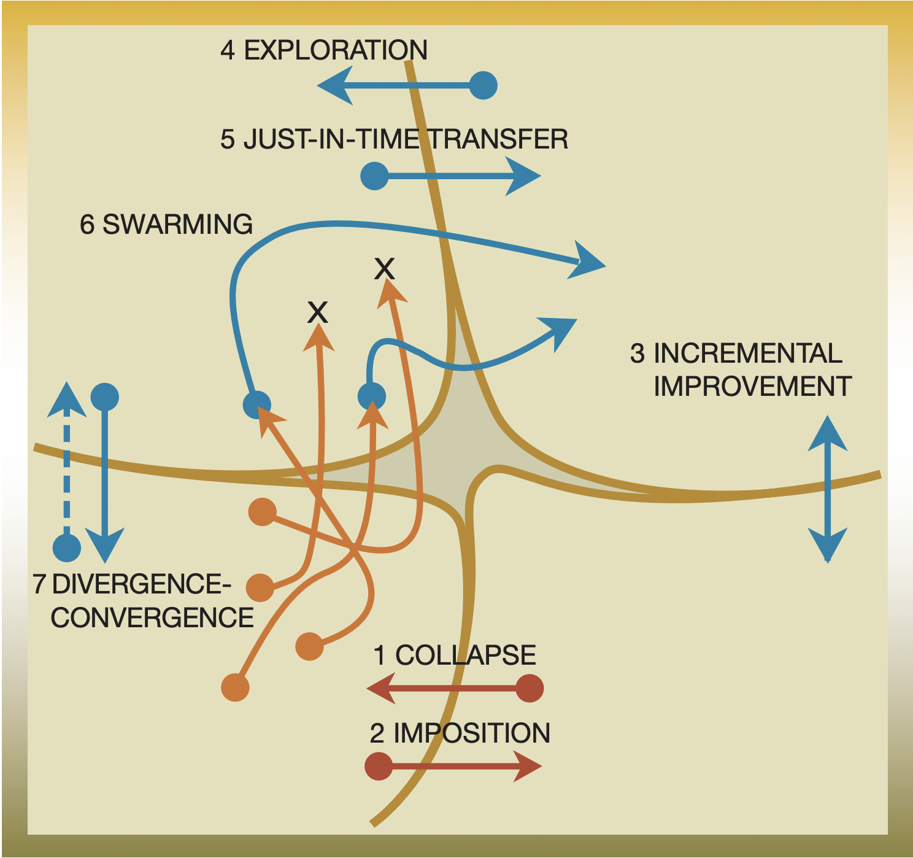
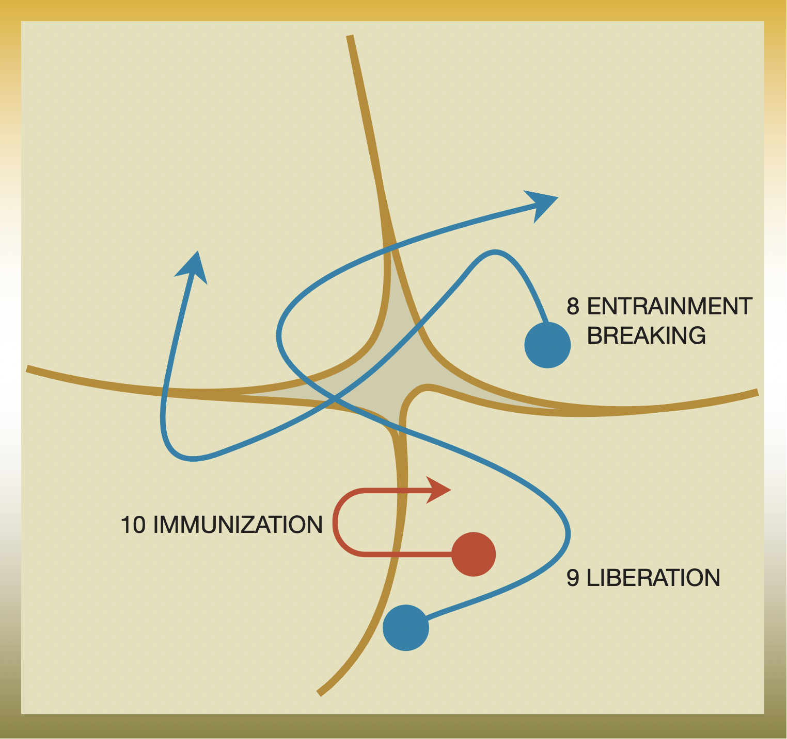
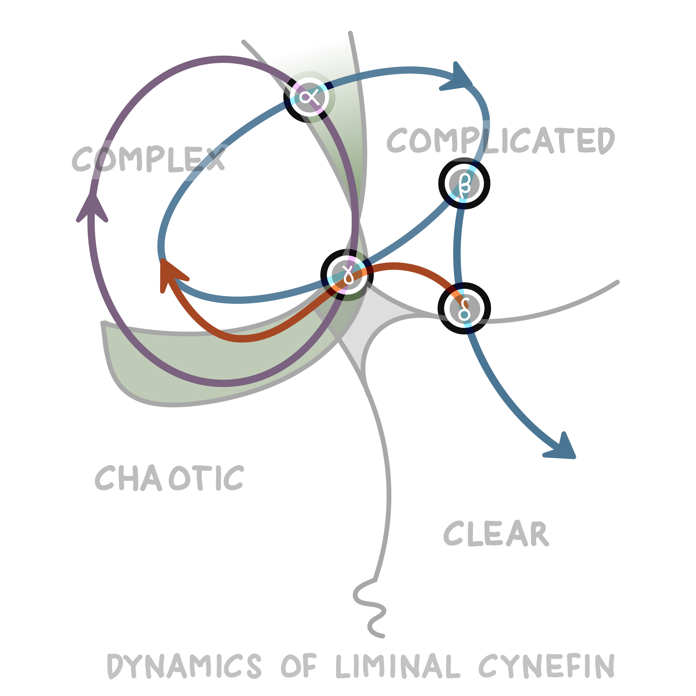
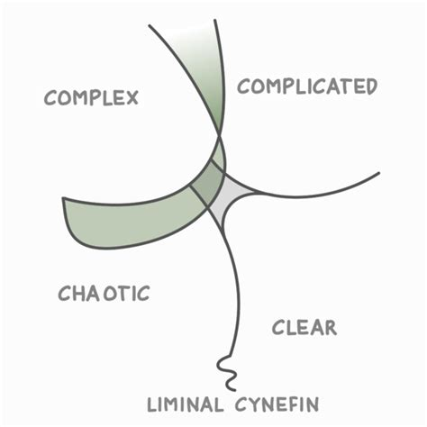
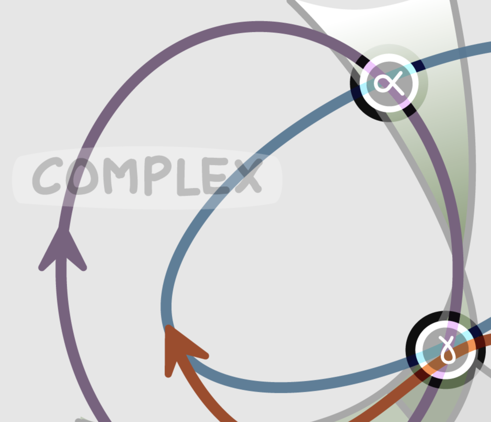
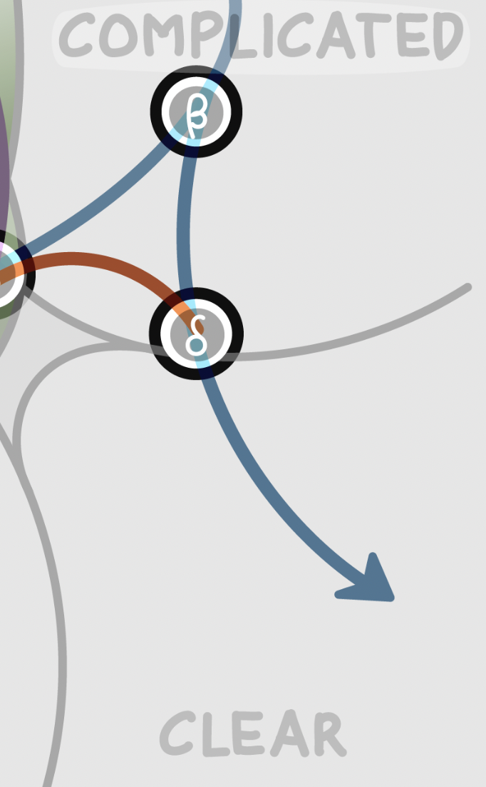
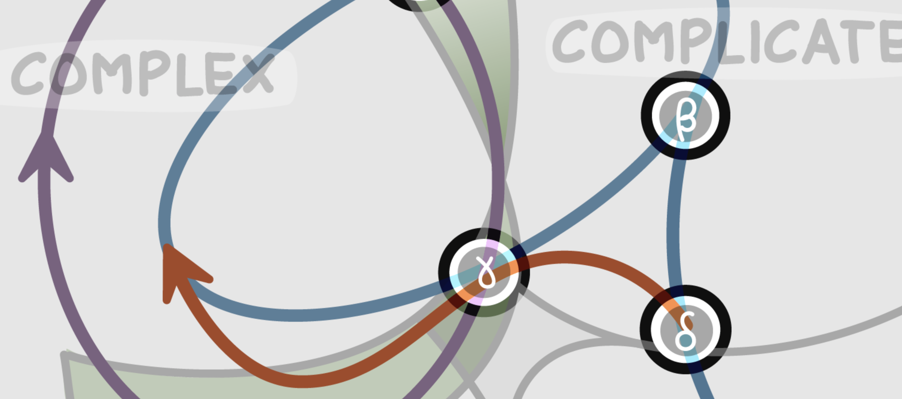
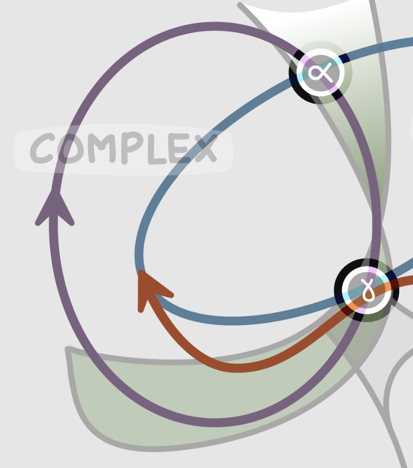

Ce nouveau post sur [Cynefin](https://www.nilslesieur.fr/tags/cynefin/) est une “traduction” des travaux de Dave Snowden, pas une traduction stricto sensu, nous nous sommes souvent détachés du texte original.  
Cet exercice était pour Emeline et moi l’occasion de se pencher sur la notion de dynamiques. Nous y voyons plein de résonances dans nos métiers, dans nos ateliers. Nous consacrerons, un jour peut-être, un nouvel article pour parler de ces résonances.  
Pour l’instant, nous publions ces quelques lignes finalement assez brutes.  

___

  
Dans [notre premier article sur Cynefin](https://www.nilslesieur.fr/2022/01/les-grilles-de-lecture-2/7-cynefin.-les-contextes./), nous avons présenté les contextes de cette grille de lecture : Simple, Compliqué, Complexe et Chaos (cf. figure ci-dessous).  
    

> Cynefin au 18 février 2021

Nous avons entraperçu la notion de dynamiques autrement dit le passage d’un contexte à un autre avec l’exemple de l’immunisation.  
C’est cette notion que nous souhaitons approfondir dans ce nouvel article.

# Les premières dynamiques
Dans cette première partie, vous découvrirez neuf dynamiques prises de façon isolée, comme des pièces de puzzle prises indépendamment les unes des autres. Ces dynamiques sont parues pour la première fois dans [une publication de 2003](https://alumni.media.mit.edu/~brooks/storybiz/kurtz.pdf).  
  
Elles sont représentées par les schémas ci-dessous :  

> Images issues de *The new dynamics of strategy: Sense-making in a complex and complicated world* par C. F. Kurtz & D. J. Snowden - IBM SYSTEMS JOURNAL, VOL 42, NO 3, 2003.

Cynefin ne juge pas les transitions en mal ou en bien, il met l’accent sur l’importance de les aligner aux besoins pour qu’elles apportent vraiment les bénéfices attendus.

## Dynamique 1 - “collapse, l’effondrement” 
C’est le passage non voulu de la zone de complaisance, “sous-partie” du contexte Simple, au Chaos.  
C’est souvent ce qui arrive dans une organisation qui ne se remet pas suffisamment en question et qui pense que ses succès du passé seront ses succès de demain. Elle ne prend pas suffisamment conscience du contexte dans lequel elle se situe, celui change et peut-être que ce changement appelle d’autres réponses, d’autres réponses que des réponses Simples.  
Quand ces organisations sont dans le Chaos, il est déjà trop tard pour elles.
Cette transition n’est pas volontaire, elle est subie. Dangereuse. Si elle est volontaire, consciente, on parle plutôt d'immunisation (cf. article mentionné en introduction)

Pour l’éviter, les organisations devraient passer un peu de temps dans le Compliqué et dans le Complexe. En 2022, dans un monde volatile, incertain, complexe, où les changement sont nombreux, fréquents, ce ne serait pas idiot d’explorer ces contextes.

## Dynamique 2 - “Imposition”
C’est le mouvement avec force du Chaos vers le Simple, le connu ; une imposition rigoureuse de l’ordre.  

Pourquoi ? La situation est si catastrophique que les gens acceptent ce qui aurait été auparavant inacceptable. Cette nouvelle stabilité devient rigide jusqu'à ce que ce nouvel ordre se brise à nouveau. 
Le premier confinement peut se classer dans ce cadre, tout comme les exemples d’un enseignant qui prend le contrôle d'une classe frénétique par l'autorité, ou d’un policier qui calme une foule paniquée. 

## Dynamique 3 - “incremental improvement, amélioration incrémentale”

Le passage répété et en boucle du Compliqué au Simple est synonyme d’apprentissage.  
  
On améliore le Simple par de l’expertise. Avec le temps et les aller-retours, l’expertise s’améliore et vient régulièrement améliorer les pratiques du Simple. C’est un mouvement choisi, volontaire. Il s’agit du mouvement le plus connu et accepté de tous les mouvements. 

Les 3 prochaines dynamiques “atomiques” (exploration, exploitation et swarming/fourmillement) sont des mouvements entre le domaine du Compliqué et du Complexe.  
Cette frontière est moins perméable que celle entre Simple et Compliqué ; passer du Compliqué au Complexe implique de passer d’un système ordonné, prédictible, où les liens de cause à effet existe à un tout autre système, désordonné, non-prédictible et où les liens de cause à effet n’existe plus.

## Dynamique 4 - “Exploration”

Dans la littérature sur la complexité, le mouvement du compliqué vers le complexe est appelé Exploration, en opposition à l’Exploitation, prochaine dynamique que nous verrons en détails.  
    
Dans l'Exploration, l'idée est d’obtenir une ouverture, une émergence sur une pratique, un savoir ou une expertise. Ceci n’étant possible qu’en supprimant une partie du “contrôle central”.
Le mouvement d’Exploration nécessite donc de la confiance.  
Pour l’organisation, il y a un risque : voir se renforcer des liens qui échappent à son contrôle.  
  
Nous pensons notamment à des communautés de pratiques, à des hackathons, aux fameux Google Days (une création de 3M qui allouait déjà en place du temps pour l’innovation, dans les années 1950. “La règle des 15%”).

## Dynamique 5 - “Just In time ou Exploitation” 

L’exploitation est le chemin inverse du mouvement décrit précédemment, mouvement du Complexe au Compliqué.  
  
Certains modèles, certaines pratiques du Complexe peuvent se révéler suffisamment stables pour évoluer dans un contexte ordonné.
De communautés informelles peuvent sortir des idées, des pratiques suffisamment stables pour être intégrées dans des communautés officielles.
Pourquoi “Just in time” ? Pour signifier que la livraison de ce qui se révèle stable doit se faire quand cela fait sens pour la plus grande structure.

## Dynamique 6 - “Swarming"
Du Chaos au Compliqué, en passant par le Complexe. D’abord de manière émergente, puis de manière sélective.  

Lorsqu’on est dans un contexte prédictible, que l’on connaît d’avance les effets qu’auront nos actions, que ces actions sont limitées au local et n’interviennent pas sur le système dans son ensemble, il est plus approprié, “plus simple”, de sortir du Chaos et d’aller dans le Simple comme la dynamique 2 d’imposition le propose.

En revanche, lorsqu'on a affaire à  un contexte imprédictible, qu’on ne sait comment cela va réagir en face suite à nos actions ou qu’il est nécessaire d'intervenir sur tout le système, il est préférable de sortir du Chaos et d'aller dans le Complexe, pas dans le Simple, et d'atterrir ensuite dans le Compliqué.

## Dynamique 7 - “Divergence - Convergence”

Cette dynamique pourrait être résumée par un aller-retour de manière répétée entre le Chaos et le Complexe. Ces va-et-vient sont moins coûteux que d’autres mouvements.  

En effet, forcer un système Complexe à le faire passer dans le Chaos est un changement moins important (qui nécessite moins d’effort, d’attention) car on reste dans le domaine du non-ordonné, on reste dans les mêmes logiques, mode de pensée. Alors que de le faire passer vers un domaine ordonné comme le Compliqué ou le Simple nécessite plus d’attention car plus éloigné.

## Dynamique 8 - “Entrainment breaking - entraînements à la rupture”
La dynamique 8 est appelée rupture d'entraînement : elle est le passage du Compliqué au Complexe en passant par le Chaos et comme c’est un entraînement, elle est périodique, répétée.

Le passage par le Chaos provoque un changement radical nécessaire pour perturber la pensée entraînée des experts et permet ainsi la création de nouveaux systèmes complexes. Le passage directement au Complexe n'est souvent pas assez radical pour perturber ces schémas ; aller dans le Chaos permet de remettre en question, à un niveau plus fondamental, les hypothèses établies.

## Dynamique 9 - “Libération”

Dave Snowden écrit : *“We have called this movement liberation because it breaks the entrainment of bureaucracy—but like all letting go, it is difficult.”* que nous traduisons (avec deepL) par “Nous avons appelé ce mouvement la libération, car il brise l'entraînement de la bureaucratie - mais comme tout lâcher prise, c'est difficile”. 
Ce mouvement, c’est le passage du Simple au Complexe puis au Compliqué, de façon périodique.

Quand les organisations se lancent dans un projet, elles peuvent penser qu’elles savent concevoir cette nouveauté et peuvent se baser sur leurs expertises, ce qui a été décrit par la dynamique “amélioration incrémentale”.
Mais dans une situation incertaine, il est préférable de passer dans le Complexe, de créer des échanges, de connecter les personnes, d’essayer, de tenter, d’avoir un management qui crée, maintient, entretient cet environnement. Ce ne sera pas chose aisée.
Une fois, l’expérimentation, l’émergence concluante, l’organisation pourra passer du Complexe au Compliqué.

# Un modèle des dynamiques plus orientées flux
Les dynamiques présentées ci-dessus sont des dynamiques isolées, présentées de façon indépendante. La suite est le fruit des dernières réflexions, des dernières avancées d’une grille de lecture qui est toujours en mouvement.
J’avais demandé à Dave Snowden quelles différences faisait-il entre les dynamiques “isolées” et ce que nous allons aborder. Sa réponse : *“Second one is more uptodate, more flow based , first one was early thinking”*.

## Notion de zone liminaire

Avant de détailler les dynamiques plus orientées flux, il faut aborder le concept de “liminal space”, en français le mot liminarité (ou liminalité) existe.
Il est utilisé dans le contexte des rites de passage et désigne la période du rituel pendant laquelle, l'individu n'a plus son ancien statut et pas encore son nouveau statut.

Cette liminarité est représentée dans le schéma Cynefin par la zone verte grise. Elle est ouverte au sommet, fermée en bas et croise tous les domaines sauf le simple. Elle crée notamment des états dans le Complexe encore incertains mais transitant vers le Compliqué.
Plus d’infos ici : https://cynefin.io/wiki/Cynefin_Domains#Liminality

## Bleu : Progression vers la stabilité
Il s’agit du cycle le plus stable. Il commence dans le Complexe.

### Un premier pas vers le Compliqué

Lorsque certaines des expérimentations faites dans le Complexe commencent à montrer un chemin à suivre, on va les réduire et itérer dessus dans l’espace liminal (alpha).

Ce passage par le point Alpha, un “point de décision”, va permettre de confirmer 2 choses :  
- que  les expérimentations réalisées dans le Complexe produisent des résultats cohérents et reproductibles  
- et que la stabilisation de ces expérimentations est possible et donc progression vers le domaine du Compliqué envisageable.  

Avec le temps la certitude sur ces expérimentations va augmenter, c’est ce qui déclenchera la décision de passer dans le domaine Compliqué. A contrario, si (et tant) que ces expérimentations produisent des résultats variables ou incohérents, elles ne peuvent pas progresser vers le domaine Compliqué et restent au stade d’expérimentations (dans le domaine Complexe).
  
La transition vers le domaine Compliqué conduira également à la formation de contraintes de gouvernance : comme expliqué lors de notre précédent article. 
On va sortir du domaine de l’innovation, de l’exploration pour aller domaine de l’exploitation, le domaine des experts.  
Une forte communication entre les parties prenantes sera nécessaire. Il faut s’assurer que les experts peuvent communiquer et leur mettre à dispo le cadre approprié. Il sera également préférable de mettre une limite de temps aux communications et aux échanges afin de prendre des décisions et d’éviter de tomber dans la paralysie de l’analyse. 

### Retour vers le Complexe ou poursuite dans le Simple?

Une fois dans le domaine du Compliqué, le point Bêta va nous aider à prendre une décision et savoir si on doit retourner dans le Complexe ou aller dans le Simple. 

Que faut-il observer pour le savoir ?  
Quelles questions faut-il se poser ?
Une fois arrivé dans le domaine Compliqué, la situation a-t-elle évolué ? Ce qui était précédemment établi est-il déstabilisé ?  

Oui ? Alors il faut prendre la décision de revenir dans le domaine Complexe, et recommencer à expérimenter jusqu’à cela produise des résultats cohérents, reproductibles ET que la stabilisation soit possible. 

A contrario, si une fois le passage du Complexe vers le Compliqué, la situation se stabilise avec succès et que cela peut être observé sur une période de temps conséquente, il serait envisageable de la faire ensuite basculer dans le domaine du Simple.

### Dernière étape du voyage : le passage du Compliqué vers le Simple. 

Cette étape implique un certain niveau de démocratisation, d’adoption des nouvelles pratiques. La mise en place de contraintes, de cadre sur ces nouvelles pratiques et/ou l'automatisation de celles-ci permettent leur démocratisation, leur adoption et leur appropriation par un public plus large que le cercle des experts qui les a conçus.

## Rouge : la voie du changement radical

La dynamique rouge démarre sur la zone entre le Compliqué et le Simple, elle est déclenchée un peu comme une dernière chance, lorsque l'on se rend compte que la situation n'est pas suffisamment stable pour passer au domaine Simple : lorsque la stabilité obtenue dans le contexte Compliqué semble factice, forcée, une stabilité faite de contraintes qui se basent sur des contournements et/ou des réseaux informels.

Pour que cette stabilité faussement obtenue n'atterrisse dans le Simple et ne devienne donc pas une nouvelle meilleure pratique, il faut s’arrêter !  
  
Il faut s’arrêter et entamer une nouvelle pensée, radicale.
  
Ce n’est pas anecdotique si la ligne Rouge passe par le désordre et plonge dans le Chaos avant de rejoindre la ligne Bleue (cf. ci-dessus) dans le Complexe : 
Le passage par le Chaos est là pour chahuter suffisamment pour sortir de cette stabilité. Le retour dans le Complexe permettra d’envisager de nouveaux tests à faire.
Passer par le Désordre et croiser les autres lignes (Bleue et Violette) offrent un état de suspension, de réflexion où les choses peuvent prendre plusieurs directions : se décomposer, se recomposer et s'adapter.

## Violet : un brassage sans fin d’idées

La ligne Violette est un cycle sans fin, un cycle que l’on peut observer avec des personnes qui ne sont que dans l’innovation ou dans de très jeunes entreprises.

Le mouvement démarre dans le domaine Complexe, zone où la réponse proposée par le modèle est “probe - observe - respond”. 
Des tests sont réalisés, des solutions émergent, des solutions candidates pour le domaine Compliqué sont identifiées, mais elles ne sont que temporaires, aucune ne dépassent la zone liminaire entre Complexe et Compliqué. 
Pour trouver de nouvelles solutions qui pourraient passer dans le Compliqué et donc passer en exploitation et ne plus seulement rester en exploration, on replonge dans le Désordre pour décomposer, recomposer et adapter.
Pour relancer le cycle, imaginer de nouvelles idées est indispensable, un passage dans le Chaos s’impose.

Ce flux nécessite un management très différent : la prise de décision est répartie entre le manager et l’équipe, les intentions sont fixées et la cohérence est assurée.

# Conclusion

Les contextes de Cynefin sont une carte pour se repérer, pour trouver des réponses adaptées à un contexte sans mouvement, figé dans l’instant. Les dynamiques proposent des cycles, des voyages possibles : des voyages courts (première partie) ou des voyages plus longs plus complexes (deuxième partie).
Ces voyages demanderont d’adapter les dispositifs, le management, les pratiques, … 
Ces voyages correspondent à un contexte vivant. Si les contextes de Cynefin sont vus comme des réponses à des moment figés, les dynamiques pourraient être perçues comme des réponses, des propositions à des contextes en mouvement.

Ces contextes, ces voyages ne sont que des cartes, elles ne sont pas le territoire, votre environnement réel. Ils vous offrent la possibilité de fréquemment se poser des questions sur le contexte dans lequel on se trouve.
Pour vous aider à réaliser cet exercice complexe, nous vous invitons à consulter notre 1er article sur le sujet.

Bon voyage ! 

# Ressources :
- [Publication](https://alumni.media.mit.edu/~brooks/storybiz/kurtz.pdf) sur Cynefin de 2003 citée au début de cet article   
- Sur le site Cynefin.io :  
	- https://cynefin.io/wiki/Cynefin  
	- https://cynefin.io/wiki/Cynefin_Dynamics  
	- https://cynefin.io/wiki/Cynefin_Domains  
- Liminarité : 
	- sur le [wiki Cynefin](https://cynefin.io/wiki/Cynefin_Domains#Three_primary_domains)  
	- sur [wikipedia](https://fr.wikipedia.org/wiki/Liminarit%C3%A9)  
- Vidéo [The Dynamics and Constraints of Cynefin](https://www.youtube.com/watch?v=Wme1U-VjH3g) - A Case Study at AgileIndiaLite  
- Un système avec des interractions humaines est plus complexes que n’importe quel système : https://cynefin.io/wiki/Anthro-complexity

