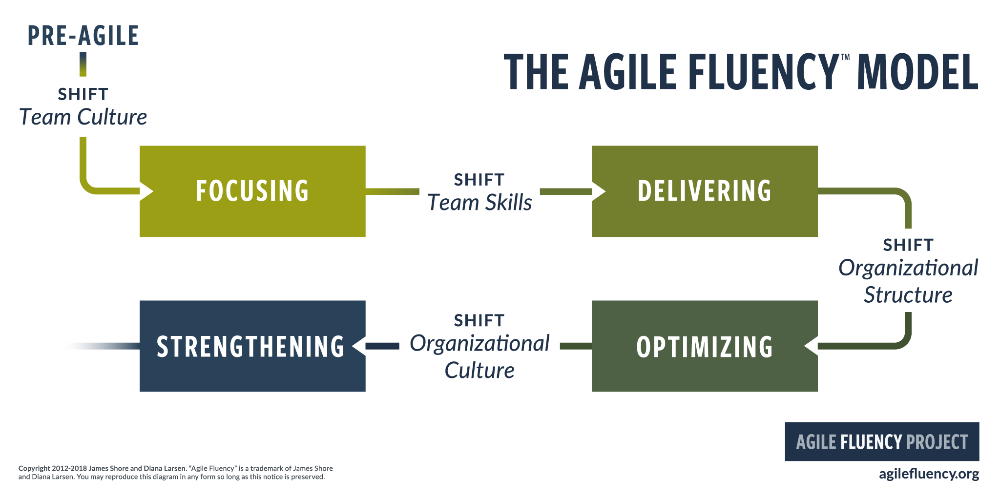
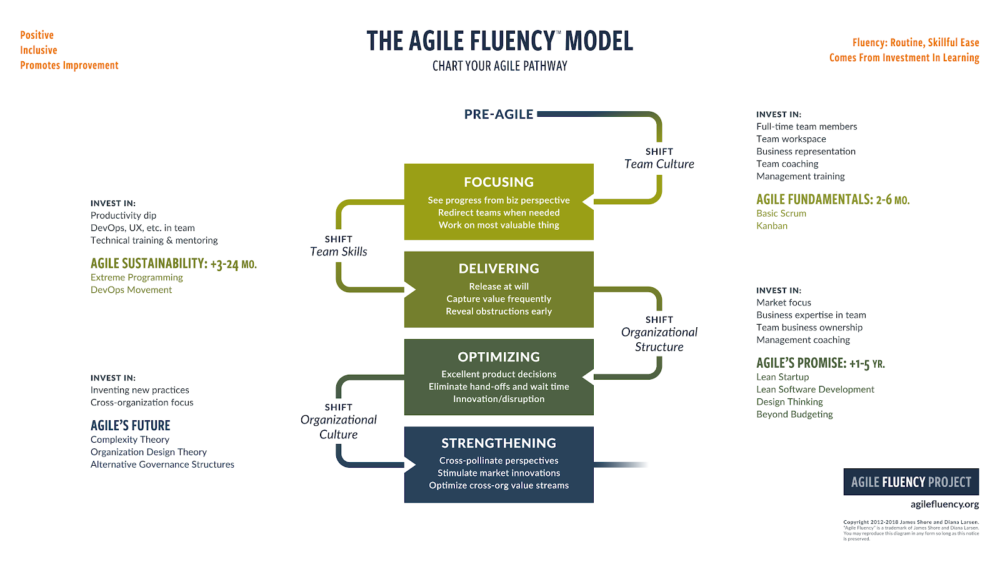

Ce post est le transcript du Podcast Good Morning Product sur le modèle Agile Fluency et la maturité Produit.  
- [Spotify](https://open.spotify.com/episode/3L2c3B0R0t5ibnBMECSN5E?si=8PWzAEvLQ326Z7wH0ZgPOA)  
- Autres plateformes à venir

Vous pouvez retourver les autres épisodes sur :  
- [SoundCloud](https://soundcloud.com/goodmorningproduct)  
- [Spotify](https://open.spotify.com/show/2TZwCljt7QDKIkfZEped2C)  
- [Deezer](https://deezer.page.link/d5XieqemLLvA7jM3A)  
- [Apple Podcast](https://podcasts.apple.com/gb/podcast/good-morning-design/id1565317487])  

# Un Podcast autour d'Agile Fluency et de la maturité Produit

Bonjour et bienvenue dans ce nouvel épisode de Good Morning Product consacré à Agile Fluency et la maturité produit. Je suis [Thomas Di Murro](https://www.linkedin.com/in/tdimurro/), Scrum Master et passionné par les problématiques liées à l’agilité et au Produit. Pour cette session, je suis accompagné de Marion et Nils, tous les deux coachs. Je vous connais bien mais pouvez-vous vous présenter en quelques mots pour le podcast ?

> Bonjour à tous, [Marion LECERF](https://www.linkedin.com/in/marionlecerf/), je suis Coach Produit & co-organisatrice de la [School of Product](https://schoolofpo.com/).  

> Bonjour à tous, Nils LESIEUR, coach agile avec un penchant orga plus que produit, fan de rugby et supporter du Stade Toulousain.

Pourquoi vous nous parlez du modèle Agile Fluency et de la maturité Produit ? Et c’est quoi ?

> Nils : Agile Fluency, c’est un modèle que j’aime beaucoup et j’avais envie d’explorer avec Marion une nouvelle façon de l’aborder, envie de le voir avec un nouvel angle.  
C’est un modèle empirique créé par Diana Larsen et James Shore d’après leurs observations de plusieurs années de coaching. Ils décrivent 5 lieux que nous allons détailler dans ce podcast : le premier lieu s’appelle non agile, le 2e se focaliser sur la valeur, le 3e la livrer, livrer la valeur, le 4e l’optimiser et enfin un 5e un lieu appelé renforcement.

Pourquoi tu l’utilises ?

> Ma réponse rapide : pour générer des conversations.
> Si je prends plus mon temps, je dirai :
> - pour comprendre les avantages que l’on peut attendre de la part d’une équipe.
> - pour comprendre quels investissements doivent être faits pour obtenir ces avantages
> - et en 3 pour savoir où regarder lorsque vos équipes n’offrent pas les avantages dont vous avez besoin.

Pourquoi associer “AGILE FLUENCY & LA MATURITÉ PRODUIT ?”

> Marion : J’ai découvert le modèle il y a quelques années et le parallèle avec la maturité produit des équipes a été une évidence !  
Pourquoi ? car tout est interconnecté. L’agilité, comme le pilotage produit par la valeur, sont des états d’esprit très liés.  
Par exemple, si on livre vite quelque chose en prod mais qu’il n’y a pas de stratégie ou de travail autour de la valeur produit, alors il n’y aura pas (ou très peu) d’impact sur les utilisateurs.  
A l’inverse, on peut avoir une super stratégie produit posée sur le papier, mais si les équipes ne sont pas en capacité de construire de manière itérative, de livrer au bon moment, de récupérer des feedbacks utilisateurs, alors le produit n’atteindra pas sa cible en terme d’impact, et/ou le time to market sera trop long.

Comment comptez-vous nous présenter ce modèle ?

> Nils : On voulait présenter les lieux du modèle, leurs avantages et aussi les corréler avec une approche Produit.
On l’a dit en introduction rapidement, il y en a 5 : le premier lieu est le lieu non agile, il ne fait pas à proprement parler partie du modèle, il est la porte d’entrée.

Ok, donc on commence par là ?

# Non agile

> Nils : Avec plaisir ! Les équipes qui commencent tout juste leur parcours agile ont tendance à raisonner autour de pures considérations techniques, telles que les couches logicielles, et elles travaillent souvent comme contributeurs individuels, par exemple les tâches sont souvent assignées individuellement.  
Il n’y a pas forcément d’équipes dédiées, ni d’alignement, les personnes peuvent travailler sur des périmètres larges et peuvent travailler sur des temps longs sans visibilité aussi bien sur l’output que sur l’outcome.
Je te laisse compléter, Marion ?  
  
> Marion : yes ! côté maturité produit, pour moi on est sur le niveau avant l’approche produit. C’est à dire que le switch vers le mindset produit n’est pas encore là. On est dans une vision projet avec des Chefs de projet, qui souvent naviguent à vue, avec des plans au doigt mouillé, conditionné souvent à une date… Je vous la fais de façon ironique : vous savez cette fameuse date de MEP lointaine et posée de manière arbitraire par le management.  
Donc on construit des choses, sans réelle vision de l’impact que l’on va générer auprès des utilisateurs, et sans avoir en tête que pour en avoir, il faut aller tester ses hypothèses sur le terrain le plus rapidement possible. 

Ca, donc c’était la porte d’entrée, l’avant Agile. Il y a quoi après cette porte d’entrée ?

# Se focaliser sur la valeur

> Nils : Il y a donc 4 lieux. Ils sont souvent présentés dans un ordre, l’ordre dans lequel James et Diana l’ont observé. C’est un ordre empirique pas un chemin à suivre absolument.  
Bref, pour faire simple : pour passer du non agile à ce lieu où l’on se focalise sur la valeur, il y a un changement de culture à effectuer. Les équipes en maîtrise de ce lieu (le mot “maîtrise” est important) forment une équipe solidaire avec des objectifs communs : elles pensent, elles planifient en fonction des bénéfices que leurs sponsors, clients et utilisateurs verront dans leur logiciel.  
C’est ici que se mettent en place le backlog priorisé par la valeur, les rétrospectives, le management visuel, la notion de timebox, les chartes et les règles d’équipe, le feedback entre pairs, …  
  
> Marion : Côté produit, ça y est on commence à rentrer dans le mindset, grâce aux fondamentaux agile et le rôle de Product owner apparaît - parfois c’est encore des CDP car on est dans une évolution de rôle qui se fait petit à petit dans les organisations, et cela demande de la formation & de l'acculturation agile. 
Ce lieu est un premier pas du passage du mode projet vers le Product management.  
Ce passage est conditionné par l’adoption de nouvelles pratiques Agile. On va commencer à découper pour avoir des petites stories, pour itérer et livrer petit et rapidement.  
On est dans un changement dans la façon de travailler, de collaborer, de penser & de concevoir ses produits même si on tâtonne encore un peu… Les petites stories sont un bon exemple, car elles viennent remplacer le bon gros cahier des charges, ou “les specs” du mode projet, et c’est un vrai changement dans la façon de faire le produit. 

Ok. Tout à l’heure si je me rappelle bien vous aviez dit : livrer de la valeur ? 

# Livrer de la valeur

> Nils : Oui ! Le sous-titre du premier lieu c’est agile fondamental, comme s' il constituait les fondations à la suite. Ici, le sous-titre c’est agile durable.  
Les équipes qui maîtrisent ce lieu ne se concentrent plus seulement sur la valeur métier, elles la livrent. Ces équipes sont capables de livrer ET de livrer quand elles le désirent.  
Pour livrer quand l’équipe le désire, cela suppose peu de défauts et une gestion autonome de la livraison. C’est le lieu “technique” du modèle, ici on va retrouver des pratiques issues de l’Xtrem Programming, du mouvement DevOps par exemple.  
Je pense à des pratiques comme la livraison et le déploiement continus, le refactoring continu, le TDD, le BDD, le pair-programming, le mob-programming, …  
  
> Marion : Là, on est au début de l’émergence de la culture produit. 
Dans ce lieu, les équipes se questionnent plus ce qu’elles font, sur le pourquoi, donc sur le sens… même si elles sont encore très focus sur le “Comment” (donc le delivery).  
Sortir du “comment” pour se questionner sur le “Pourquoi on fait ça”, “quelles sont les hypothèses et problématiques auxquelles on veut répondre, ET qui font sens avec la stratégie produit & business, ET qui répondent à un vrai besoin utilisateur” est loin d’être une évidence.  
Pour autant, j’observe l’envie de gagner en maturité produit :  c’est souvent dans ce lieu qu’on débute une implémentation simplifiée du framework OKR. Ici je parlerai plutôt de notion d’ambition & d’impact.
Cette démarche, ce framework même simplifié, va mettre les équipes en réflexion autour de la stratégie produit ET de la tactique à mettre en œuvre.  
Elle va permettre un alignement et une meilleure communication entre les équipes sur la trajectoire à suivre pour avoir de l’impact (et avoir de l’impact ce n’est pas avoir JUSTE une bonne vélocité dans le cycle de dév).
Cette démarche va aussi permettre de se questionner sur les KPIs à suivre de manière régulière pour monitorer la performance du produit, et comment mieux exploiter/faire parler la data pour comprendre ses utilisateurs. 
La discovery commence aussi à prendre sa place : car se questionner, c’est aussi aller explorer et donc prendre conscience qu’il ne faut pas faire que du delivery : c’est un équilibre difficile à trouver, mais nécessaire pour progresser.  
Dans le même temps, les équipes renforcent leur boite à outils : on commence à adopter des nouvelles pratiques comme le USM, on se familiarise avec l’AB testing, les tests utilisateurs.. etc.  
  
C’est pas mal tout ça, on s’est focalisé sur la valeur, maintenant, on est capable de la livrer quand on veut. C’est bon, c’est fini ? On a tout, non ? 

# Optimiser la valeur

> Nils : Non non non et tu le sais très bien ;-)  
On s’est focalisé sur la valeur, on livre quand on le désire et après ? Après, dans le 3e lieu qui s’appelle Optimiser la valeur, les équipes en maîtrise livrent ce qui fait sens pour le marché et quand cela fait sens. Il y a une réelle différence entre quand elles le veulent et quand cela fait sens pour le marché.  
C’est ici que l’on retrouve souvent les leaders d’un secteur. Le sous-titre de ce lieu c’est les promesses de l’agile. Quand on pense à ce qu’est l’agile, on pense time to market rapide, livraison fréquente, impact utilisateur, innovation, … eh ben c’est ici, dans le 3e lieu.  
Tout à l’heure, nous parlions d’excellence technique, là c’est l’excellence Produit : on cherche à toujours mieux comprendre le marché, on n’hésite pas à tester, à pivoter, … On observe des pratiques comme le lean startup, le design thinking, le user story mapping, l’impact mapping, côté tech on va parler de DDD, domain driven design.  
  
> Marion : Là, en général, la culture produit est bien ancrée. 
Les équipes sont passées au niveau supérieur dans leur mindset, et dans leur façon de construire leur stratégie et leur produit.  
Si je reprends l’exemple du framework OKR, il est ici implémenté au niveau stratégique d’un département. Au niveau équipe tous les réflexes & rituels liés à ce framework sont ancrés…tout converge vers les OKRs… le suivi hebdo, la communication autour des avancées strat et tactiques, tout est relié.  
Evidemment, les équipes sont data-driven : tout est drivé par la data, la notion de north star metric De John Cutler est maîtrisée.  
Les équipes produit sont en permanence connectées avec le service client, les experts métier afin de créer une unité. ET s’assurer qu’on partage les mêmes objectifs, et qu’on se donne tous les moyens de les atteindre collectivement.  
Encore une fois, dis comme ça, ça parait évident mais cela ne l’est pas du tout, je vois encore bcp d’équipes qui travaillent sans se poser profondément la question de la mesure & de l’utilisation de la data qu’elles ont à dispo.  
En terme de pratique : je dirai que l’approche de Continuous Discovery de Teresa Torres est quelque chose d'adopté. C’est essentiel pour les équipes produit afin d’atteindre les ambitions & impacts qu’elles se sont fixées. Cela leur permet de répondre au bon moment au bon besoin utilisateur, voire même d’anticiper ces besoins ou d’en créer…  
  
Il reste donc un lieu. Curieux de découvrir ce dernier.

# Renforcer

> Nils : Le lieu que nous présentons en dernier n’est pas un objectif ou une quête à atteindre. Ici, les équipes en maîtrise aident la structure à s’organiser, à se renforcer… à devenir plus efficace.  
Diana et James appellent ce lieu le futur de l’agile, les exemples sont peu nombreux. On peut penser à des structures type entreprises libérées (Zappos, FAVI, Gore, Chronoflex…). Des structures où la compréhension du rôle de chacun, du rôle de chaque équipe au sein de l’entreprise est claire, où la diffusion des compétences est délibérée, où la différence de types de fonctionnement  au sein de l’entreprise est choisi, conscient.
Je pense à des concepts ou à des pratiques comme Cynefin, des réunions en mode forum ouvert, à la sociocratie, aux équipes auto-organisées évidemment mais également auto-constituées…  
  
> Marion : Je conclurai en disant que côté produit on est sur le modèle des empowered teams de Marty Cagan. 
Dans ce lieu les équipes sont autonomes et responsabilisées. C’est le graal en terme de culture produit, mais cela implique aussi d’avoir adopté toutes les bonnes pratiques citées auparavant (sinon ça ne marchera pas). 
C’est rare encore aujourd’hui d’avoir des organisations qui ont totalement adopté ce modèle. Car cela sous-entend aussi que toute l’organisation pense product first.  
Autre exemple, et si je reprends les OKRs, cela veut dire que le framework est adopté et maitrisé par l’ensemble de l’organisation (y compris au niveau COMEX !).  

Merci pour cette présentation. Qu'avez-vous envie de dire pour conclure ?

# En conclusion

> Nils : Retenez que c’est un modèle empirique (blanc), qu’on vous a présenté le modèle dans l’ordre du cheminement que l’on observe le plus souvent, mais il se peut très bien que vous soyez par exemple très matures dans le lieu de Livraison (craft, CI, CD, …) et beaucoup moins dans le lieu focalisation sur la valeur.  
  
> Marion : Vous l’avez compris, pour moi, le niveau d’agilité et la maturité produit sont interconnectés. 
J’aime bien la métaphore de la construction d’une maison, on travaille d’abord les fondations (ici les fondamentaux), quand elles sont solides on monte ensuite les étages les uns après les autres, puis on finit par la déco… Là c’est pareil, c’est en prenant le temps d’apprendre et de grandir dans les pratiques, de se les approprier et de les utiliser quotidiennement qu’on va tendre vers toujours plus d’impact dans la construction des produits.  
Un dernier conseil : N’allez pas trop vite, prenez le temps, appropriez-vous ces bonnes pratiques, ancrez-les dans vos équipes puis votre organisation, rendez-les pérennes et comprises de tous afin de vous assurer que votre cheminement produit est le bon.  
Alors oui, il sera certes long, vous ferez des erreurs, mais les bénéfices que vous en tirerez seront au final incroyables.  

Merci beaucoup à tous les deux. On se retrouve très bientôt pour un nouvel épisode de Good Morning Product.

# Quelques liens pour aller plus loin

- Le site officiel : https://www.agilefluency.org/
- Le blog officiel : https://www.agilefluency.org/blog/
- Traduction en français du modèle : https://www.agilefluency.org/blog/2020-06-01-guest-post-lebook-agile-fluency-en-francais
- Un [article FR](https://medium.com/@nils.lesieur/quelques-notes-sur-agile-fluency-1af822cc3ab7) qui présente le modèle plus rapidement que la traduction
- Un [article](https://medium.com/benextcompany/agile-fluency-en-mode-workshop-c36a37b52f92) sur une idée d’atelier.
