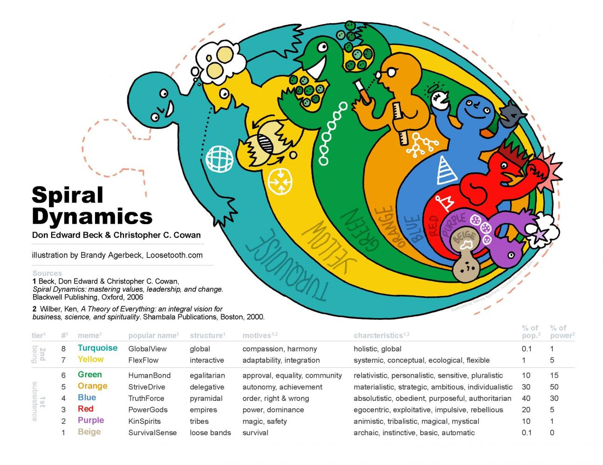
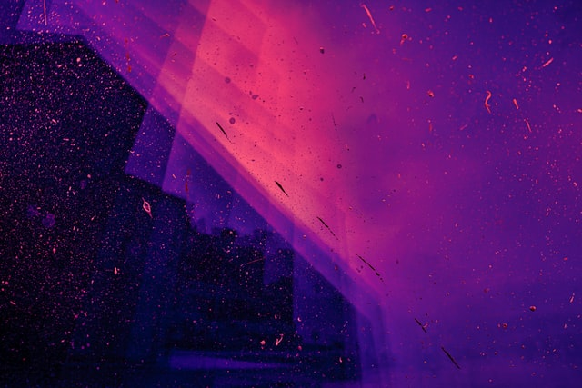
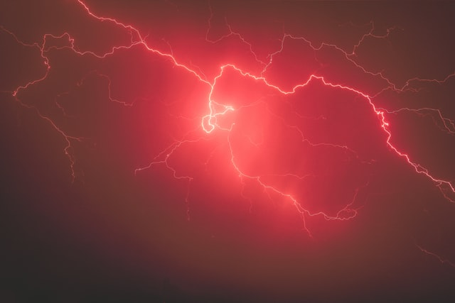
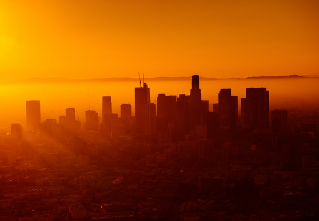

# La spirale dynamique
## C'est quoi ? Ca sert à quoi ?

La spirale dynamique s’intéresse à comment on pense, à ce que nous prenons en considération pour penser, elle ne s'intéresse pas à ce que l’on pense. Elle s’intéresse à des niveaux de pensée, à des niveaux d’existence qui ne sont ni bons ni mauvais que je détaillerai par la suite.
Elle peut être utilisée pour un individu (psychogénèse) ou pour aux environnements (sociogénèse) : l'humanité, le monde entier, une équipe de sport, une association non gouvernementale, une entreprise du CAC40, une guilde de jeu vidéo, …

Il existe de nombreuses représentations de la spirale dynamique, en voici une que je trouve à la fois simple et complète :

> Une représentation de la spirale dynamique 

## Notions de niveaux
L’agencement de ces niveaux est modélisé par une spirale, on dit qu’un niveau transcende et inclut les précédents dans le sens. Par exemple, le mode de pensée dominant d’un individu sera son niveau du moment mais il aura vécu tous les niveaux antérieurs de la spirale et ceux-ci se seront toujours présents et continueront à s’exprimer par moment.
L’emploi de l’adjectif “dominant” est important, les personnes, les organisations ne sont pas Bleu, Vert ou Violet, elles sont plus complexes que cela, elles incluent les niveaux précédents.

La spirale dynamique est une grille de lecture ouverte, le dernier niveau actuel sera peut-être un jour transcendé par un autre, inconnu aujourd’hui. On dit aussi que les niveaux sont nés et naissent en réaction des précédents.  

## Clare W. Graves, le créateur
Nous devons le modèle de la spirale dynamique aux travaux de recherche de Clare W. Graves, il a publié plusieurs publications universitaires mais jamais de récapitulatif de sa pensée, jamais de livre. Les publications ultérieures sont le travail de Don Edward Beck et Christopher C. Cowan qui ont collaboré avec Clare W. Graves pendant sa retraite.

Clare W. Graves avait tout de même écrit en 1981 *“As a theory it proposes that the biopsychological development of the mature human is an unfolding, emergent, oscillating, spiraling process marked, normally, by the progressive subordination of older, lower order, less complex, biopsychosocial systems to newer, higher order, more complex biopsychosocial systems.”*

Nous pourrions traduire (via DeepL) par “En tant que théorie, elle propose que le développement biopsychologique de l'Homme mature soit un processus en spirale, un processus continu, émergent, fait d’oscillations. Il est marqué normalement, par la subordination progressive de systèmes bio-psychosociaux plus anciens, d'ordre inférieur et moins complexes, à des systèmes bio-psychosociaux plus récents, d'ordre supérieur et plus complexes.”

## L’origine des couleurs
Au tout début, les niveaux étaient numérotés de 1 à 7, mais cela pouvait être interprété comme 6 c’est mieux que 3, etc. Ce qui n’est pas le cas.
Les niveaux ont ensuite été décrits par un couple de lettres, la première lettre pour les conditions de vie (A, B, C, D, ...) et la deuxième (N, O, P, Q, ...) pour les capacités cérébrales (ce qui est différent de l’intelligence). Le niveau 1 est ainsi devenu AN, le 2e BO, le 3e CP, le 4e DQ, le 5e ER, le 6e FS, le 7e GT et le 8e HU.  

Il y a adéquation si une personne a des capacités cérébrales Q et se trouve dans un environnement aux conditions de vie D, autrement dit la personne a les réponses adéquates aux questions posées par l’environnement. A contrario une personne R aura des difficultés à évoluer dans un environnement D.

Clare W. Graves avait remarqué des similitudes entre AN et GT, entre BO et HU. Comme si les Hommes répondaient à des mêmes problèmes avec des solutions différentes tous les 6 niveaux. AN est alors devenu A’N’, HU est devenu B’O’.
Nous devons les couleurs à Christopher Cowan : Beige (la savane), Violet (la royauté), Rouge (le sang), Bleu (le ciel, le paradis), Orange (la fonte en fusion), Vert (plantes, écologie), Jaune (énergie du soleil), Turquoise (la Terre vue de l’espace). 
Le système des couleurs permet des représentations plus faciles, plus pratiques mais perd la notion de spirale, de “recommencement” tous les 6 niveaux.

La première boucle est nommée la Survie, la deuxième est l’Existence.

## Alternance de “locus”
Dans une [vidéo](https://www.youtube.com/watch?v=fpVF4UxLgYs), Max Meulemans explique une notion importante dans la spirale dynamique : l’alternance de “locus”.
On doit la notion de “locus” à Julian B Rotter (1966). Il s'est concentré sur la façon dont les gens attribuent les raisons de leur propre comportement et il a conclu que les gens ont tendance à avoir :
soit locus de contrôle interne - c'est-à-dire qu'ils décident de ce qu'ils vont faire - l'origine de leur comportement est dispositionnelle. Je vous mets plusieurs idées associée : affirmation de soi, compétition, que le meilleur gagne.
soit locus de contrôle externe - c'est-à-dire que leur comportement est façonné par des facteurs externes, situationnels. Déterminisme. Ce mode de pensée est plutôt orientée vers le collectivisme, collaboratif. Contribuer ensemble.
Les niveaux de la spirale dynamique vont alterner les ces deux locus : l’un puis l’autre puis l’un et ainsi de suite.

# Subister
## Beige

La spirale commence par le niveau Beige, un niveau dit individuel, où les considérations sont tournées vers l’individu et non vers un groupe. Nous verrons comme préciser ci-dessus que la spirale alterne les niveaux individuels et les niveaux collectifs.
Ici, il faut trouver de quoi se nourrir, s’abriter, il faut subsister, survivre. Pour chacun d’entre nous, c’est la naissance, pour l’Humanité, ce sont les premiers hommes. On peut considérer que les sans domicile fixe sont également dans ce niveau de pensée.

On pense aujourd’hui que plus aucune civilisation dans le monde n’évolue dans ce niveau de la spirale.

Survivre seul est compliqué, Beige n’est pas très sécurisant. L’individu va chercher un groupe pour se sentir plus en sécurité : Violet.

## Violet

Beige est dur. La sécurité est inexistante. L’enfant, les premiers hommes vont se rapprocher et constituer des tribus, pour se protéger de l’extérieur. L’extérieur est dangereux pour Violet. Ceux qui ne sont pas dans la tribu sont dangereux, les phénomènes inconnus sont dangereux. Pour entrer dans la tribu, il y a des rites de passage, pour rester dans la tribu aussi. La magie intervient souvent pour contrer ou expliquer l’extérieur.

On pense aux sectes, aux gurus de tous temps, pour l’enfant c’est quand il prend connaissance de la présence de ses proches.

Chez benext, on voit souvent les personnes qui vont passer un entretien client faire un check avec le poing en disant “check RT” (RT pour rencontre technique). L’extérieur est dangereux ;-) Un rituel magique pour le contrer, une marque Violet.

# Acquérir une identité
## Rouge

Violet protège mais enferme. La connexion avec l’extérieur est impossible puisqu’il est dangereux. Des goûts et des désirs qui ne sont pas ceux du groupe vont naître. L’individu va vouloir découvrir autre chose, quitter la tribu, s’affranchir de tous ces rites et acquérir une identité propre à lui. On revient sur un niveau individuel : Beige (individuel) puis Violet (tribu -> collectif) puis rouge (individuel).
Rouge a quitté Violet pour s’affirmer, il est puissant et veut montrer sa puissance, il est prêt à défendre son identité, son territoire même s'il faut tuer pour ça. C’est la loi du plus fort. Egocentrisme et immédiateté. Les faibles servent les plus forts, sinon…

Montrer sa faiblesse est inenvisageable pour Rouge, la honte aussi. Rouge va devenir impulsif pour ne pas montrer ces signes. Ça vous fait penser à quelqu’un ? Un proche ? Un manager ?

D’un point de vue des organisations, Rouge ne signifie pas rustre, arriéré ou barbare, il existe des organisations Rouge très puissantes et élaborées. Le Machiavélisme peut être vu comme Rouge. Aujourd’hui, dans notre monde, les grandes organisations ont quitté Rouge pour Bleu ou Orange.

Dans Rouge, on pense naturellement aux gangs, aux mafias, il y aussi les enfants d'à peu près 2 ans que les anglophones appellent les *terrible two*.

## Bleu

Rouge est dangereux, violent (le choix de la couleur sang n’est pas aléatoire, cf. intro et est un bon moyen mnémotechnique). La vie sociale y est inconfortable, chaotique. En quittant Rouge, Bleu souhaite retrouver une vie sociale, Bleu va amener de l’ordre pour structurer les vies personnelles et collectives, pour cela il considère qu’il existe une “Vérité Ultime” (expression empruntée à F. Chabreuil) qui donne un sens à sa vie.
Cette Vérité Ultime régit tout, dicte toutes les règles ; lui désobéir est impensable. L’impulsivité de Rouge disparaît et les notions de conformité et de culpabilité apparaissent.

Rouge semble loin, à l’opposé de Bleu. Pas tout à fait. Cette Vérité Ultime sépare le monde en deux : ceux qui y adhèrent et acceptent les règles érigées et ceux qui la rejettent. Pour les premiers, Bleu fournit une appartenance sociale forte qui complète l’identité individuelle forte de Rouge. Pour rallier les seconds à la cause, toutes les méthodes sont envisagées, F. Chabreuil écrit “Bleu implique le prosélytisme sous une forme qui peut aller de convertir de force à convaincre par l'exemple".

Les règles sont par exemple des codes à respecter, des échelons à gravir. C’est ordonné, rangé, il y a des fiches de poste et Bleu les respecte à la lettre “c’est pas à moi de faire ça”, “il ne fait pas son job”. Bleu est prêt à des sacrifices individuels pour servir la Verité Ultime, il sait qu’il y aura des récompenses. Le management “bâton / carotte” est très présent.

Au niveau des organisations, Bleu permet une taille de systèmes plus grande. Rouge implique que les décisions passent par UNE personne, la chaîne de commandement peut être longue et prendre du temps (vous pensez encore à ce manager qui veut être au courant de tout et décider de tout ? Décidément). Avec l’ordre installé par Bleu, les systèmes peuvent se démultiplier.
Dans Bleu, la prise d’initiative est compliquée, elle est sans doute différente de l’ordre établi, peut-être contraire aux codes et aux règles en vigueur. Elle vaudrait des reproches et un sentiment de culpabilité.
Par contre, Bleu peut déplacer des montagnes pour servir la Vérité Ultime.

On pense à l’Armée, à l’Eglise mais aussi à des organisations de notre monde occidental. On parle de 30% à l’échelle mondiale (autant que Orange).  

# Assurer la satisfaction matérielle et émotionnelle
Après Rouge et Bleu, les individus, les organisations ressortent avec un “Je” affirmé, une puissance personnelle et collective et en ayant eu un impact sur sa vie et sur les autres.
Mais l'agressivité à outrance et la peur d’être faible de Rouge, la peur du “bâton”, de la punition, de la culpabilité, le diktat de la Vérité Ultime font naître d’autres besoins. Orange naît d’une recherche de sens : comprendre pourquoi, associer ceci à quelque chose de plus rationnel qu’une Vérité Ultime ou absolue.

Le besoin de profiter de la vie, d’abord d’un point de vue individuel avec Orange puis collectif avec Vert.

## Orange

Orange va accumuler les biens matériels : la Rolex avant 50 ans, le plus beau siège social, la plus haute tour d’affaires… C’est un nouveau niveau de pensée individuel, toujours cette alternance de niveau de pensée collectif / individuel.
Si Orange n’est pas prêt à tuer comme Rouge, il est tout aussi égocentrique : il n’y a pas de prédateurs mais des concurrents. Egocentrique mais plus stratégique : il cherche un maximum de bénéfices pour un investissement minimum. Le concept de “gagnant-gagnant” est très présent.
Orange s’intéresse à la science… si elle est appliquée ; la recherche fondamentale n’étant pas directement applicable n’a aucun intérêt. L’application de la science permet le progrès de Orange et nourrit sa quête de satisfaction, sa course aux biens matériels.

Comme Bleu, il est très facile d’en parler et de le décrire, les exemples sont nombreux, il est très présent à l’échelle mondiale, environ 30% (surtout dans le monde occidental.)

Orange, comme tous les autres niveaux d’existence, n’est ni bon ni mauvais. Il a comme les autres des avantages et des inconvénients : cette course aux biens matériels a un impact négatif sur le monde extérieur, Orange consomme énormément de ressources et dégrade le monde environnant.

## Vert 

On constate qu’à l’échelle de l’humanité la durée des niveaux de la spirale se réduit. Il est fort probable que Vert ait connu Bleu et Orange : un individu centré Vert, une organisation centrée Vert ont sans doute vécu Bleu et Orange.
En passant en Vert, l’individu, l’organisation veut quitter la Vérité absolue et le dogme de Bleu (dernier niveau de pensée centré sur le collectif) ainsi que les côtés superficiels et individualistes de Orange

Bleu avait une Vérité Ultime. Dans Vert, LA vérité n’existe plus, la notion de vérité n’existe plus, ou on pourrait dire plusieurs vérités sont possibles. Chacun est invité à dire ce qu’il ressent, ce qu’il pense, personne ne peut imposer un point de vue, la conversation prend place, le choix par consensus aussi. Quand j’écris “chacun est invité…” il faut comprendre le monde entier, c’est le premier niveau de pensée à réfléchir d’un point de vue mondial. En ça il transcende Orange qui lui a montré les limites de son mode de pensée avec notamment les impacts négatifs sur l’environnement.

L’expression et la prise en compte des émotions, absentes dans les les niveaux précédents, prennent une grande place ici. Cette importance pour les émotions est illustrée par l’incompréhension du rejet des autres que génèrent Bleu et Orange ; Bleu rejette pour celles et ceux qui ne partagent pas la Vérité Ultime et la course matérielle imposée par Orange est perçue comme injuste. Si Orange était dans la rapidité (voir l'immédiateté), Vert pas du tout et préfère la qualité à la quantité.

Vert fait exploser les niveaux d’existence précédents ; la magie du cocon familial de Violet, la loi du plus fort de Rouge, le diktat de la Vérité Absolue, la réussite matérielle de Orange explose devant le fait que l’humain et ses émotions sont plus importantes.
Mais Vert est un tendre pour les niveaux précédents, la non agressivité prônée par Vert le rend vulnérable vis-à-vis des autres. Pablo Pernot, dans sa relecture, rajoute : *“surtout le vert veut inclure tout le monde et devient ingérable avec le nombre ou peut être très violent avec celui qui n'est pas dans le groupe”.*

# Reconstruire l’Homme et le monde - A venir ;-)
...

# Conclusion

Je conclus cet article sans avoir abordé de la 2e boucle de la spirale (intitulée Existence) et ses niveaux Jaune et Turquoise. Il y aurait également plein de choses à dire sur le passage d'un niveau à un autre.

Je souhaitais, dans ce post, vous donner un premier aperçu de ce qu'est la spirale dynamique, qu'elle peut avoir beaucoup d'utilisations : mieux vous connaître, comprendre une situation, les réactions de votre entourage, prendre en compte la complexité de votre environnement en vue d'actions futures...  
La spirale dynamique est une grille de lecture très riche : aussi bien applicable à l'individu que pour un groupe de personnes, voir un pays, applicable aussi à l'évolution de l'Humanité.

Et n'oubliez qu'une personne ou une organisation que l'on identifierait comme Bleue a, en elle, les niveaux précédents : Beige, Violet et Rouge et que ceux-ci peuvent s'exprimer dans certaines circonstances.

# Bibliographie
- Le [site](https://www.clarewgraves.com/articles.html) sur Clare W. Graves  
- [Une des dernières publications](https://www.clarewgraves.com/articles_content/1981_handout/1981_summary.pdf) de son vivant 
- Un article sur le commandement militaire [ou comment Orange et Vert arrivent dans un environnement Rouge / Bleu](https://journals.openedition.org/communicationorganisation/645)  
- Le livre [La spirale dynamique](https://www.dunod.com/sciences-humaines-et-sociales/spirale-dynamique-comprendre-comment-hommes-organisent-et-pourquoi-ils) de F et P Chabreuil. Ed. Interéditions. 4e édition  
- Un [article](https://www.geraldinegeoffroy.fr/blog/2022/1/7/spirale-dynamique) de Géraldine Geoffroy sur la spirale dynamique dans le coaching  
- Une [représentation graphique](https://www.kublermdk.com/wp-content/uploads/2018/09/SD-turtle.jpeg)   
- Notion de [locus](https://www.integratedsociopsychology.net/theory/meta-states-and-the-cognitive-triad/attribution-theory/#locus_of_control) 

*Crédits photo : Couverture par [Li Zhang](https://unsplash.com/@sunx)*, [Guillaume de Germain](https://unsplash.com/@guillaumedegermain), [Jr Korpa](https://unsplash.com/@jrkorpa), [Josh Rose](https://unsplash.com/@joshsrose), [Johannes Plenio](https://unsplash.com/@jplenio), [Wolfgang Hasselmann](https://unsplash.com/@wolfgang_hasselmann), [Sharon McCutcheon](https://unsplash.com/@sharonmccutcheon), 
