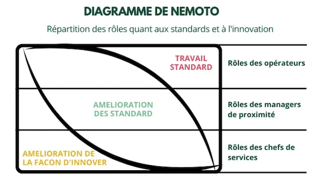

*Note : Cet article fait partie d'une série d'articles sur les grilles de lectures ou modèles. Vous pouvez retrouver l'article d'introduction de cette série [ici](../introduction-aux-grilles-de-lecture/).*

---

J'avais entrepris il y a presqu'un an une série d'articles sur les grilles de lecture, sur des modèles. J'ai écrit parfois en solo parfois en duo sur des modèles que je connaissais, que j'utilise ou essaie d'utiliser. Mon degré d'appropriation varie selon les modèles présentés.

J'ai mis du temps à trouver le sujet du dernier "chapitre" de cette série, j'ai pensé en premier lieu au modèle de Tuckman, je n'étais pas inspiré pour écrire dessus, j'ai essayé, je n'étais pas satisfait, j'ai jeté... Et puis je me suis dit que j'allais attendre de croiser un modèle, une grille de lecture de je ne connais pas. Attendre une découverte. 

Diagramme de Nemoto. Du nom de son créateur Masao Nemoto (considéré, au même titre que Taiichi Ōno, comme l’une des personnes emblématiques ayant fortement contribué à la performance du système Toyota).
L'impression que Toyota c'est comme Palo Alto : une mine sans fin.

# Découverte du diagramme de Nemoto

## Une adaptation par OCTO

Depuis quelques mois, je découvre OCTO, c'est plus grand que les dernières structures dans lesquelles j'ai évolué, la découverte prend plus de temps. Cette curiosité m'a amené il y a quelques mois a participé à une formation intitulée "Devenir manager agile". 

Lors de cette formation, j'ai découvert et appris des astuces, des concepts, mais l'instant wahou s'est fait sur ce diagramme : 

  

> *Adaptation du Diagramme de Nemoto par OCTO*

Instant wahou, parce que révélation, parce que matérialisation, structuration de concepts que j'essaie de véhiculer, de discours que j'essaie d'avoir lors de mes accompagnements.
Révélation également due sans doute au contexte dans lequel je suis aujourd'hui où la vision n'est pas clairement explicitée, n'est pas suffisamment partagée, connue des équipes.

## Que nous dit ce modèle

Il me semble que la lecture est assez simple : le niveau hiérarchie définit le temps passé, l'énergie accordée à différentes natures d'activités.

- Pour le **dirigeant d'entreprise**, une très grosse partie de son temps et de son énergie doit être accordée à la stratégie : Définir la vision, la partager, l'incarner, la revoir régulièrement, ...
- Pour le **directeur de service**, de département, ... Le volet Stratégie est toujours très présent : appropriation de la stratégie d'entreprise, partage, déclinaison de cette stratégie dans son service. Une seconde typologie d'activité occupe une part importante de son temps : les méthodes, les processus ou comment met-on en place d'un point de vue organisationnel, humain, technique, ... pour adresser cette stratégie ?
- Le directeur de service occupe peut-être le rôle de manager des managers, ce qui n'est pas forcément réciproque : **le manager de managers** ne dirige pas forcément une entité et a une répartition différente : moins de stratégie et plus de comment on met en place. La part d'opérationnel est également plus importante.
- Pour le **manager**, moins de stratégie, la part de Comment est toujours importante, l'autre grande partie ce sont les opérations.
- La tendance se poursuit pour le rôle de **collaborateur**.

# Au-delà de l'adaptation

Je l'ai écrit au-dessus, ce qui est au-dessus est une adaptation. Avec une rapide recherche Internet, je trouve ces images (attention dans le dernier l'ordre de rôles est inversé) : 

   

  

  

Dans ces images, un mot absent de l'adaptation d'OCTO revient : "**Standards**". Le [Larousse](https://www.larousse.fr/dictionnaires/francais/standard/74452) définit un standard comme une "*règle fixe à l'intérieur d'une entreprise pour caractériser un produit, une méthode de travail, une quantité à produire, le montant d'un budget.*"

Je le trouve important. Important car le mot "Standard" apporte un côté concret. Le fait qu'il apparaisse un peu partout relie les "couches" entre elles. Cela apporte plus de consistance et de simplicité au diagramme.  
  
Au final, je retiens :  
- **Imaginer** les standards de demain,  
- **Améliorer** en continu les standards,  
- **Respecter et maintenir** les standards.  

# Une représentation simple et efficace

Rien de fondamental nouveau, ce diagramme représente simplement et efficacement la répartition de l'énergie en fonction des rôles dans l'entreprise et m'a permis de mettre une visualisation sur mon discours, d'illustrer mes propos lors de conversations avec mon client actuel.  
  

---
  

*Comme je le disais en introduction de cet article, il vient conclure une série d'articles sur les grilles de lecture. Ca fait un peu plaisir de boucler la boucle.*

# Bibliographie
- Support de la formation ["Devenir manager agile"](https://www.octo.academy/catalogue/formation/mop01-devenir-manager-agile/) proposée par OCTO
- Sources des images :  
 	- https://www.humanperf.com/fr/blog/lexique-cplusclair/articles/diagramme-nemoto  
 	- http://www.efkin.eu/lean-berte-cie/diagramme-de-nemoto/  
 	- https://blog-gestion-de-projet.com/accompagnement-au-changement/  

 

