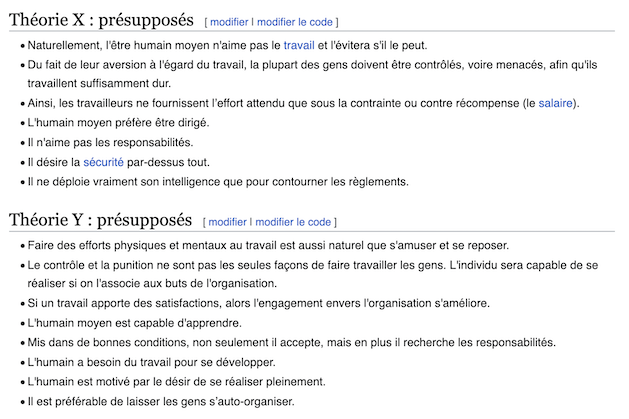

J'ai été élevé en France et vis donc avec des réflexes, des clichés qui m'ont été inculqués tout au long de ma scolarité puis en entreprise. Grandir en France c'est aussi grandir en découvrant l'administration française. Peut-être que certain·e·s d'entre vous en partageront avec moi.

Cet article n'est pas un rejet de tout ce que j'ai appris, de ce que l'on m'a enseigné, il y a plein de très bonnes choses à conserver. Mais, il y a d'autres voies que j'ai découvert bien plus tard, que je n'ai pas assez croisées et que j'aimerais voir, même apercevoir plus souvent.

**Il existe autre chose...**

# Que les process
**Il existe autre chose** que les process. Les process ne sont pas à jeter, ce n'est pas le mal en soi, le mal c'est s'y reférer tout le temps. Partout. Pour tout.

Le process pour partager les bonnes pratiques. Les meilleures pratiques. Documenter. Capitaliser. Sans doute.

Comment aborder à une situation dont on ne peut affirmer que nous allons réussir ? Des exemples : Allons-nous réussir à faire un produit qui plaît au public ? Réussir à bâtir une équipe qui déchire ? A traverser cette crise ?  
Sans certitude, pas de bonnes pratiques, ni de meilleures mais des pratiques émergentes. Cela demande de tester, avec des équipes libres de tester, autonomes, dont le but est connu, clair et partagé.

Une publicité pour [la sécurité sociale de 1991](https://www.youtube.com/watch?v=PzkpG0bv-V4) disait : *"La sécu c'est bien, en abuser ça craint"*, je crois que ça marche avec les process.

# Que de viser d'avoir bon du premier coup
**Il existe autre chose** que d'avoir bon du premier coup. Dans [une vidéo](https://www.ted.com/talks/tom_wujec_build_a_tower_build_a_team) qui résume ses observations sur le marshmallow challenge, Tom Wujec parle du *single right plan* que les ingénieurs suivent pour construire la tour la plus haute (la consigne du challenge). Ils imaginent un plan, une solution et s'y attellent. Les observations montrent qu'ils s'entêtent dans cette solution imaginée, envisagée en début d'exercice et qu'ils suivent le plan jusqu'au bout du temps imparti. Pour vivre, en général, ce que Tom appelle un *"oh-oh moment"* et où l'on observe la chute de l'édifice. Tout ça pour ça. Situation familière ?  
La question est qui réussit le mieux ce challenge, après les architectes ? Les enfants de maternelle... Pourquoi ? Parce qu'ils essaient, ratent, réessaient, réussissent, apprennent, échouent, ... encore et encore.

J'ai appris pendant ma scolarité à suivre des *single right plans*, j'ai également eu l'opportunité de les suivre en entreprise.

Les certitudes. L'amour de la solution imaginée. Nos cerveaux exercés et prêts disposés à suivre et fonctionner de cette façon...

Un des préceptes du discours de la Méthode de Descartes est *"d’arriver à résoudre son problème en le décomposant en petits problèmes"*. 200 ans après ce précepte est encore bien ancré dans nos têtes. Ne parle-t-on pas d'esprit cartésien ? Découper en plus petits problèmes cela marche avec une fusée, une ferrari, mais avec une mayonnaise ? Car oui, il existe des problèmes qui ressemblent à une mayonnaise.

Bref. Ce serait oublier l'émergence, l'émergence si familière aux enfants de maternelle, moins perclus de certitudes, de convictions. L'émergence, les petits pas chers aux agilistes, le complexe du cadre Cynefin, le design sprint du monde UX, ...

# Que le management bâton-carotte

**Il existe autre chose** que la figure du chef avec laquelle j'ai grandie : celle du chef qui sait, qui attribue les tâches, qui contrôle, qui réprimande, qui demande des justifications, qui souligne les manques, les échecs, celle du chef qui a un bureau personnel et des d'autres attributs de chef.

Comment en 2023, dans un monde complexe, en perpétuel mouvement, le chef pourrait contrôler, attribuer, savoir... ? Savoir tous les jours ? Savoir affronter toutes les situations même les nouvelles ?

Ma première rencontre avec un autre monde, un autre possible c'était en découvrant la théorie de Mc Gregor : les théories X et Y.

Ca c'est 1960...

Ensuite, j'ai découvert, des essais (et des réussites) avec des propositions de modèles comme le *servant leadership* (1970) puis le *host leadership* (2015 ?).

J'ai parfois l'impression que beaucoup de managers de 2023 n'ont pas vu ces propositions, ni lu un livre comme *Drive* de Daniel Pink et sont restés avec la théorie X dans la tête, celle que l'on véhicule dans les histoires.

Daniel Pink dans son livre écrit par exemple : *"Les incitations conditionnelles qu'on a l'habitude de pratiquer dans la plupart des entreprises et des organisations étouffent souvent la pensée créative plus qu'elle ne la stimulent"*. La bâton carotte a ses limites.

**Il existe autre chose...**

# Biliographie
- Page [Wikipedia](https://fr.wikipedia.org/wiki/Th%C3%A9orie_X_et_th%C3%A9orie_Y) sur la théorie X et Y de Mc Gregor 
- Article du journal [Libération](https://www.liberation.fr/medias/1996/10/11/la-pub-ministerielle-fait-mal-passer-ses-messages-a-la-tele-details-d-une-etude-sur-onze-grandes-cam_184340/) mentionannt la publicité de la sécurité sociale
- Le livre *Drive* de Daniel Pink traduit en français par [la vérité sur ce qui nous motive](https://www.recyclivre.com/products/1276654-la-verite-sur-ce-qui-nous-motive)

