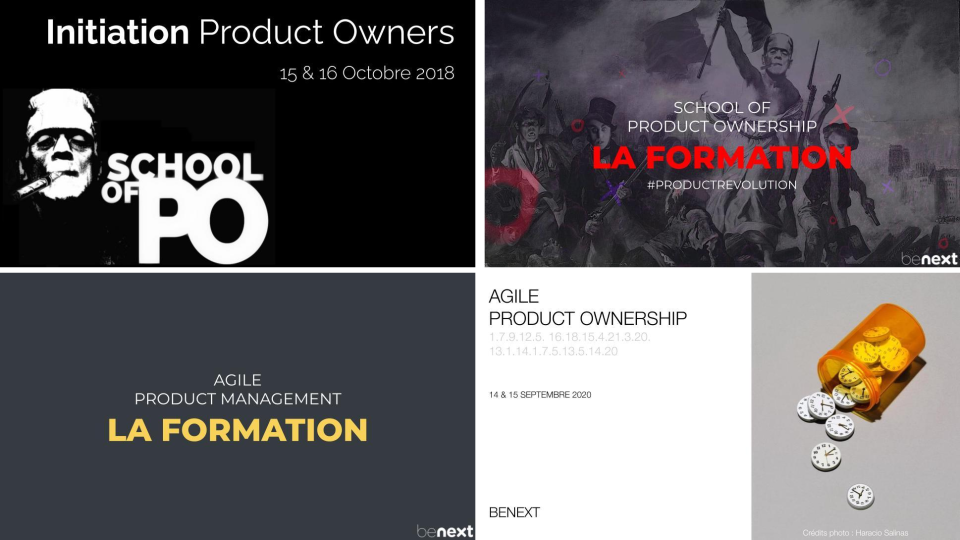
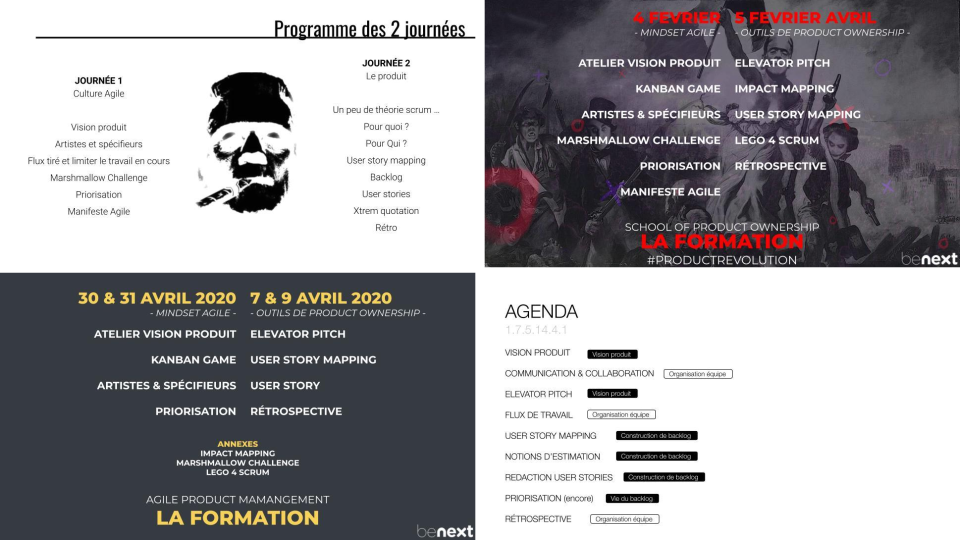
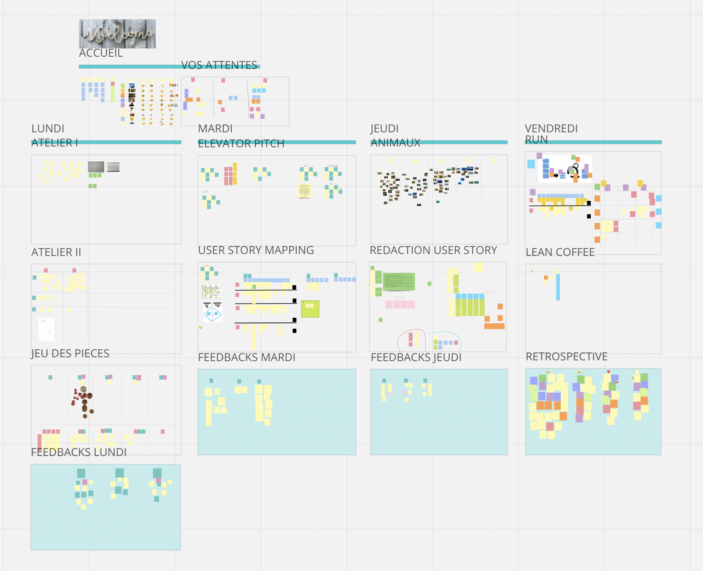
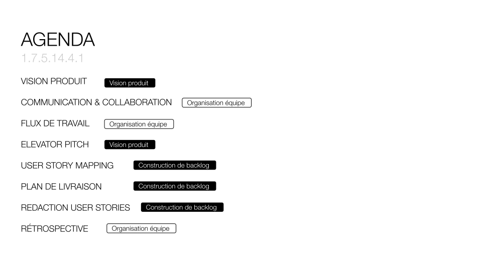
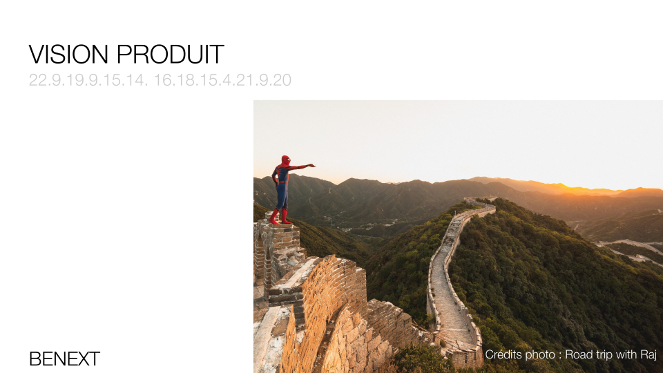
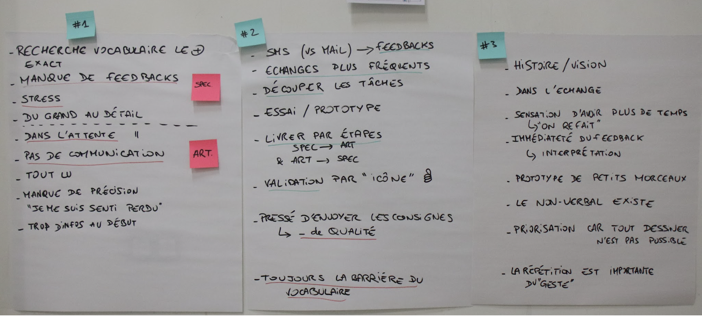
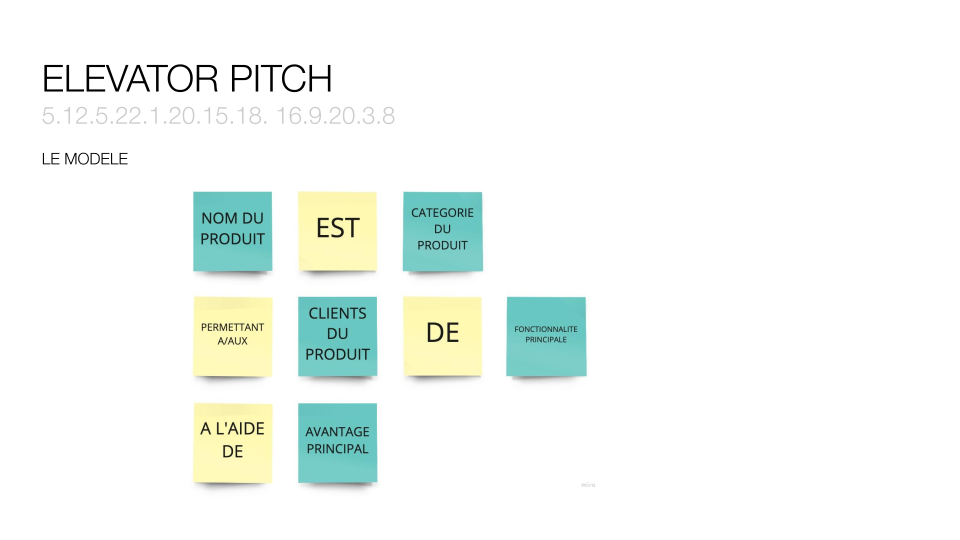

Je me rappelle que la première fois que Dragos est venu vers moi en me disant *"tu voulais monter une formation Produit ? Bah j'ai 2 clients. Tu peux y aller."* J'étais à la fois excité, stressé, fier de pouvoir animer une formation estampillée School of Product. Une sorte d'Olympe pour moi qui venais d'arriver chez benext et étais admiratif de la conf' du même nom.

J'ai donc eu la chance, pendant 4 ans, d'animer la formation School of Product.

Prêt·e à embarquer pour un retour sur ces 4 ans ?  
PNC aux portes, armement des toboggans, vérification de la porte opposée.

Au programme du voyage :  
- cette formation était elle même un produit et n'a donc cessé d'évoluer
- retour sur le contenu de la dernière version.

# En mouvement

## La charte graphique

Tous les ans, la conférence choisissait une nouvelle identité visuelle, j'ai toujours eu envie de l'utiliser pour apporter une cohérence à l'expérience utilisateur et puis ça s'amusait beaucoup.

Ci-dessous, un aperçu de l'évolution de la charte graphique du support de formation :  

## La philosophie et contenu

Refaire, repenser la partie graphique du support était à chaque fois une occasion de repenser le contenu : supprimer des ateliers, en ajouter, revoir l'ordre d'enchaînement, repenser l'animation, et parfois revoir entièrement ce que je voulais faire vivre aux participant·e·s.  
Les nombreux feedbacks recueillis à la fin de chaque formation m'ont beaucoup aidé. Il y avaient des incompréhensions sur des ateliers, sur de la théorie ou il y avaient, au contraire, des validations, des coups de coeur sur des ateliers, des idées, des thèmes.

## Plusieurs étapes

**La première version ?** Clairement un MVP. L'ambition de cette version était de valider le côté "tout atelier", autrement dit : tous les sujets abordés devaient pouvoir être abordés sous forme d'ateliers, par de la pratique, par de l'expérimentation.
Je voulais, via cette formation, véhiculer une part de la culture benext. On expérimente, on essaie, on échoue, on réussit, on discute avec l'autre, on l'écoute, il nous écoute, nous nous enrichissons, on essaie autrement...

Quelque part dans ma veille, j'avais lu que plus il y avait de sens stimulés, plus l'apprentissage était assimilé. Une présentation au format Slide, en mode conférence, sollicite l'ouïe et la vue. En expérimentant je rajoutais le toucher, le côté kinesthésie.  
Les échanges engendraient forcément la parole, ce n'est pas un sens, mais cela participait aussi à l'appropriation des choses, à la verbalisation de pensées, à la construction d'un discours. Il faudrait peut-être regardé du côté des neuro-sciences pour avoir une validation scientifique de ce que je ressens, je ne l'ai jamais fait.  

> Un proverbe chinois dit 
> 
> *“Dis-moi et j’oublierai. Montre-moi et je me souviendrai. Implique-moi et je comprendrai.”*

**Dans la deuxième version**, j'ai enlevé des ateliers qui apportaient de la confusion, du bruit à l'apprentissage. Je pense notamment à l'impact mapping qui demande plus de temps que je pouvais lui accorder, un survol brouillait les idées plus qu'il ne les éclairait.
Le lego 4 scrum a lui aussi disparu peu à peu des radars surtout au profit du story mapping dont le temps d'animation a augmenté ; avec la croyance que tout PO devrait savoir animé cet atelier.

Les **confinements** ont également apporté leur lot d'apprentissages. Le premier, et non des moindres, a été  : cette formation est compatible avec le distanciel. Il m'a fallu casser la croyance que cette formation qui faisait la part belle aux interactions, à la pratique, aux expérimentations. Mon premier réflexe avait été d'annuler une formation prévue dans cette période avant de la maintenir.  
Il y a eu la réelle découverte d'outils comme Draft.io, Miro, Sococo, avant pour moi c'était plus de l'ordre du jouet, du gadget voire peut-être de l'inutile. Une plus grande utilisation m'a permis de mieux m'approprier ces outils, ça a beaucoup aidé à casser la croyance dont je parlais juste avant. Vous trouverez ci-dessous un exemple de Miro pour une des sessions à distance.  
Un dernier apprentissage a été de découper la formation en 4 demi-journées plutôt qu'en 2 journées, ça a permis l'éclosion de la dernière version. Avant, dans mon cerveau, il fallait un fil conducteur par journée. Je détaille la dernière version dans la seconde partie de l'article.

Avant **la dernière version**, j'avais déjà mis en place le concept de créer un produit de la définition de la vision à la rédaction de la première user story.  
Dans la dernière version, j'ai voulu aller plus loin, je voulais par exemple rajouter de l'incertitude dans le déroulé des sprints. J'ai donc ajouté un atelier autour du plan de livraison ou plan de release, il était pimenté par quelques évènements piochés dans la vie réelle des benexters. Vous pouvez retrouver les cartes utilisées [ici](/supports/CartesEvenements.pdf).

# Programme de la dernière formation

Cette formation était donc composée en deux temps :  
- une première demi-journée où nous abordions divers facettes du produit, comme des ingrédients de cuisine, sans liens entre eux. Comme si, côté cuisine, nous parlions des condiments, des légumes et de céréales.
- et une journée et demie où nous mêlions ensemble ces facettes pour aboutir à un produit, pour concocter un repas complet. 

## La première matinée : des ingrédients

### Début de la formation

Une des volontés de la formation a toujours été de faire participer les personnes. Le début de la première journée devait donc générer la participation de toutes et de tous.

L'ice breaker allait dans ce sens : la consigne était de trouver un point commun avec deux participant·e·s différent·e·s et de se présenter ensuite en abordant ces points.
Cet ice breaker permettait à chacun·e de prendre très tôt la parole avec deux inconnu·e·s puis de prendre la parole devant tout le groupe.

### Premier atelier : La vision Produit

Il était logique de commencer par le début : la vision. Aborder ce sujet en premier me paraissait non seulement évident mais indispensable.

J'ai abordé ce sujet avec l'atelier de la prairie. Pour sensibiliser à la présence ou non de vision, pour montrer l’intérêt de la définition, du partage de la vision et l’importance du storytelling.

> *“Si tu veux construire un bateau, ne rassemble pas tes hommes et femmes pour leur donner des ordres, pour expliquer chaque détail, pour leur dire où trouver chaque chose... Si tu veux construire un bateau, fais naître dans le cœur de tes hommes et femmes le désir de la mer.”* 
>   
> Antoine de Saint-Exupéry

##### Quelques liens sur la notion de vision

- La vidéo [“Start with WHY”](https://www.youtube.com/watch?v=IPYeCltXpxw) de Simon Sinek (5’)
- Un article de Marty Cagan sur la [Vision Produit](https://svpg.com/product-vision-vs-mission/)

### Communication & collaboration

Un atelier rodé et bien connu des agilistes : artistes et spécifieurs. Atelier que je faisais en 3 itérations

Pourquoi aborder ces notions ?  
Jeff Patton dit *“Shared documents are not shared understanding”*. La discussion en face à face est à privilégier pour transmettre l’information et s’assurer que les choses soient bien comprises et partagées. Elle permet de rater, de reformuler, de vérifier la bonne transmission des propos. (Et l'atelier Artistes et Spécifieurs est magique pour créer ce déclic).  
Les itérations, le feedback et l’adaptabilité (favorisés par l’échange en face à face) permettent de garantir que le produit est conforme aux attentes, aux besoins et à la vision produit.  

Et comme l'écrivait Albert Camus :  
> “Mal nommer les choses c’est ajouter au malheur du monde”

### Flux de travail

A l'issue des deux premiers ateliers, tout le monde avait parlé avec tout le monde, la notion de groupe commençait à apparaître, nous n'étions plus dans l'addition de participant·e·s. Ce qui constituait un point de passage important pour moi.

> *“Stop starting, start finishing”*

La notion de flux de travail était abordé avec l'atelier du jeu des pièces (parfois appelé kanban game). 

Il permet d'illustrer et de montrer l'exitence de plusieurs types de flux de travail : cycle en V, flux poussé se rapprochant d’un contexte agile, flux tiré se rapprochant d’un modèle Kanban.
Lors de ces expérimentations, les participant·e·s constataient que certains flux avaient tendance à favoriser l’ennui, le stress ou la démotivation. D’autres à l’inverse ont tendance à diminuer ces aspects négatifs pour tendre vers un rythme soutenable et laissant à la place au droit à l’erreur.  

Tout ça sans changer les gestes métiers, sans changer les rôles, les places, sans ajouter ou supprimer du monde.

Pour moi, cet atelier est un formidable bécher de laboratoire pour tester des flux, constater les effets. Que celles et ceux qui ne l'ont pas fait s'empressent de le faire.

##### Quelques liens sur le flux de travail

- Le déroulé du [jeu des pièces](https://pablopernot.fr/2016/02/jeu-des-pi%C3%A8ces/) par Pablo Pernot
- Un [Article](https://medium.com/benextcompany/le-probl%C3%A8me-cest-l-organisation-pas-les-personnes-b403de8f5e5) sur les organisations sur mon ancien Medium
- La [vidéo](https://amplitude.com/blog/creating-flow-value-in-product-development) *Creating Flow and Value in Product Development* (7’)

## Dernière journée et demie : de la cuisine

Maintenant, on quitte le monde des ingrédients, pour parler cuisine : autrement dit, on va mêler, pendant une journée et demie ces ingrédients et d'autres pour construire un produit.

### Elevator Pitch

On repart du début : la vision. Même si l'elevator pitch est plus un exercice pour définir un positionnement marché qu'une vision, il est bien utile pour démarrer, déffricher.
Mon pitch très vague était de créer un produit pour livrer à manger à une certaine population.

Lancées avec ce pitch vague et permitif à la fois, les personnes prenaient un temps en individuel pour poser une première idée. La suite de cet atelier était animé en [1-2-4-all](https://www.liberatingstructures.com/1-1-2-4-all/) pour arriver une seule vision Produit pour le groupe

> *“La vision sans l’action est un rêve éveillé. L’action sans la vision est un cauchemar.”*
> 
> Proverbe japonais

##### Quelques liens pour aller plus loin

- Un [template de storytelling](https://medium.com/kima-ventures/the-pitch-deck-template-ba83d61fae66) pour votre pitch par Jean de la Rochebrochard (EN)
- Des astuces pour des [Great One-Pagers](https://medium.com/@johnpcutler/great-one-pagers-592ebbaf80ec) by John Cutler (EN)

### Un user story mapping pour générer des idées et prioriser

Cet atelier était animé comme avec une équipe Produit (*i.e.* comme dans la vraie vie) avec une attention particulière pour expliquer chaque phase, les dangers, les astuces, ...
Je le commençais en fin de première journée et le terminais le lendemain matin, il servait de charnière entre les 2 journées.

> “Il n’y a rien de plus inutile que de faire avec efficacité quelque chose qui ne doit pas du tout être fait.”
> 
> Peter Drucker

L’atelier de story mapping apporte, au gré des échanges et des conversations, un alignement des participants sur la valeur de chaque fonctionnalité, “tranche” du produit et sur la complexité qui peut en découler. Les conversations sur les user stories crée une compréhension partagée.  

Au-delà de la valeur apportée au produit, ces partages et discussions soudaient les groupes de formation, les embarquaient, les engagaient. Certains groupe étaient déçus de ne pouvoir implémenter ces produits, des moments très sympas à vivre.
La priorisation était au centre. Des conversations autour de la valeur et avec une pondération par la complexité émergeaint et alimentaient l’implémentation de la vision.

##### Quelques liens sur le user story mapping

- L’article [sur le User Story Mapping](https://pablopernot.fr/2017/01/cartographie-plan-action/) de Pablo Pernot
- Le livre [User Story Mapping](https://www.parislibrairies.fr/livre/9782100810284-le-story-mapping-visualisez-vos-user-stories-pour-developper-le-bon-produit-jeff-patton/) de Jeff Patton
- Un [fichier .pdf](https://www.jpattonassociates.com/wp-content/uploads/2015/03/story_mapping.pdf) par Jeff Patton

### Le plan de release pour planifier les livraisons

> “La vie c’est ce qui se passe quand tout ce que l’on avait prévu n’a pas eu lieu” 
> 
> Edouard Baer

Une autre citation possible pour cet atelier aurait pu être *“aucun plan de bataille ne survit au contact de l’ennemi”* d'Helmuth Karl Bernhard von Moltke.

Ca sert à quoi ?  
Le plan de *releases*, *release plan* ou plan de livraison, offre de la transparence sur ce qui a été livré, sur ce qui est amené à être livré :  
- Avec finesse, précision dans les sprints qui arrivent (à ~2 ou 3 mois) mais sans certitude, aucune équipe n’est à l’abri d’un nouveau besoin qui arriverait de façon inopinée, imprévue.
- Après ces 2 ou 3 mois, c’est plus flou, la maille est moins fine.

Le backlog c'est vivant, quotidiennement mis à jour avec des avancées, des blocages, des découvertes, des nouvelles contraintes internes, réglementaires, …

Pour simuler l'incertitude de la vie, du quotidien d'une équipe, je perturbais le déroulement du plan avec ces [cartes](/supports/CartesEvenements.pdf) dont j'ai parlées.

##### Quelques liens pour aller plus loin

- Un [article](https://pablopernot.fr/2020/01/plan-de-livraison/) sur le plan de livraison par Pablo Pernot
- Une vidéo sur la [Go Product Roadmap](https://youtu.be/NBNsnKPbah0)

### Rédaction d'une user story

> “Pour que l’événement le plus banal devienne une aventure il faut et il suffit qu’on se mette à le raconter”
> 
> Jean-Paul Sartre

Le dernier atelier Produit de la formation : la rédaction d'une user story parmi tout le backlog établi dans les ateliers précédents.
Je constituais des groupes de 3 à 4 personnes, leur demandait de choisir une user story sur laquelle ils avaient envie de travailler et idéalement pas la même que celle des autres groupes. Globalement il y a 5 temps : 
- 20 minutes pour rédiger la première mouture et se préparer à la **raconter**
- ensuite présentation aux autres groupes
- ces présentations généraient plein de questions.
- 20 minutes pour corriger, trouver des réponses aux questions ou pas.
- enfin présentation de la nouvelle version.

L'écart entre la version 1 et 2 était souvent très grand en choix de périmètre, en clarté, en storytelling, en précision.

##### Quelques liens pour aller plus loin

- Un article [sur le cadre INVEST](https://www.aubryconseil.com/post/2015/investir-dans-des-stories-pr%C3%AAtes/) par Claude Aubry (FR)
- Un article sur le [découpage des US](https://agileforall.com/patterns-for-splitting-user-stories/) par Richard Lawrence (EN)
- Un [exercice](https://medium.com/@nils.lesieur/ciel-mon-backlog-est-d%C3%A9coup%C3%A9-430f3465596a) sur le découpage des US sur mon ancien Medium
- La page wikipedia du [*Behaviour Driven Development*](https://en.wikipedia.org/wiki/Behavior-driven_development) (EN)
- Le [livre](https://www.parislibrairies.fr/livre/9782212568097-user-stories-50-cles-pour-raconter-les-besoins-utilisateurs-gojko-adzic-david-evans/) avec 50 clés pour vos US de Gojko Adzic (FR)

### Clôture la formation par une rétrospective

> “Il n’est pas important d’être meilleur que quelqu’un d’autre, il est important d’être meilleur qu’hier”
> 
> Jigoro Kano.

Pour conclure cette deuxième journée, nous faisions une rétrospective que je qualifierai d'express :   
- 4 thèmes : ce qui t'a plu, ce qui t'a moins plu, ton coup de coeur et un merci à UNE personne mais pas le formateur.
- 1 post-it pour chaque participant·e dans chaque thème.

Ces rétrospectives m'ont servi à faire évoluer ma posture, le programme, l'animation de certains ateliers et à valider le côté très atelier de la formation, la sécurité psychologique instaurée, ...

Et pourquoi une rétrospective me direz vous ?
Parce que, pour moi, c’est **LE** rituel d’équipe à conserver : celui qui garantit l’amélioration continue, la recherche d’excellence (et pas seulement l’excellence qui elle est éphémère, figée dans le temps). C’est un espace propice pour échanger sur des moments, pour débloquer des situations, pour identifier des conflits ou des non-dits au sein de l'équipe.

##### Quelques liens sur les rétros
- Le [livre](https://livre.fnac.com/a8486418/Derby-Agile-Retrospective#omnsearchpos=2) Agile Retrospectives de Diana Larsen
- Une [liste de formats](http://retrospectivewiki.org/index.php?title=Retrospective_Plans) de rétrospectives très complète
- Le site [Retromat](https://retromat.org) pour générer, créer vos rétrospectives

# Merci !
Merci à Fleur, à Laurence, à Loïc, co-animateur ou animatrice parfois, relecteur ou relectrice à d'autres moments et toujours présent·e·s pour échanger, tester une idée, en proposer d'autres.

Merci à tou·te·s les participant·e·s pour leur générosité, leurs partages, leurs feedbacks. **Ce fut un beau voyage**.

P.S. : Le support de la dernière session de formation est [ici](/supports/FormationAgileProductOwnership_20220328.pdf).

