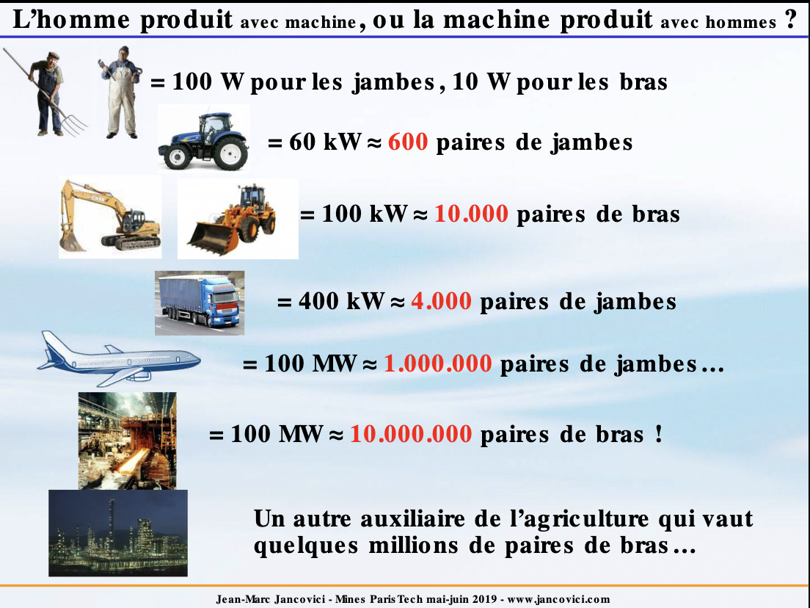
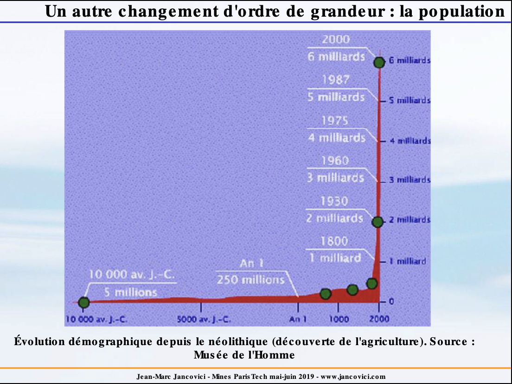
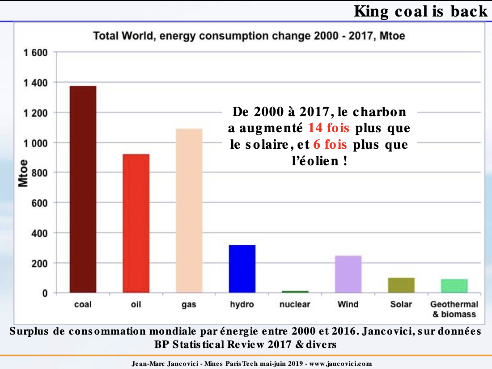
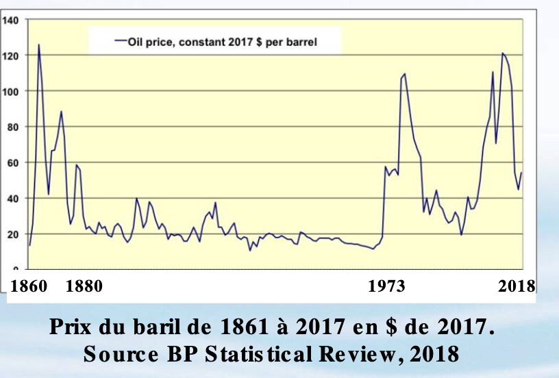
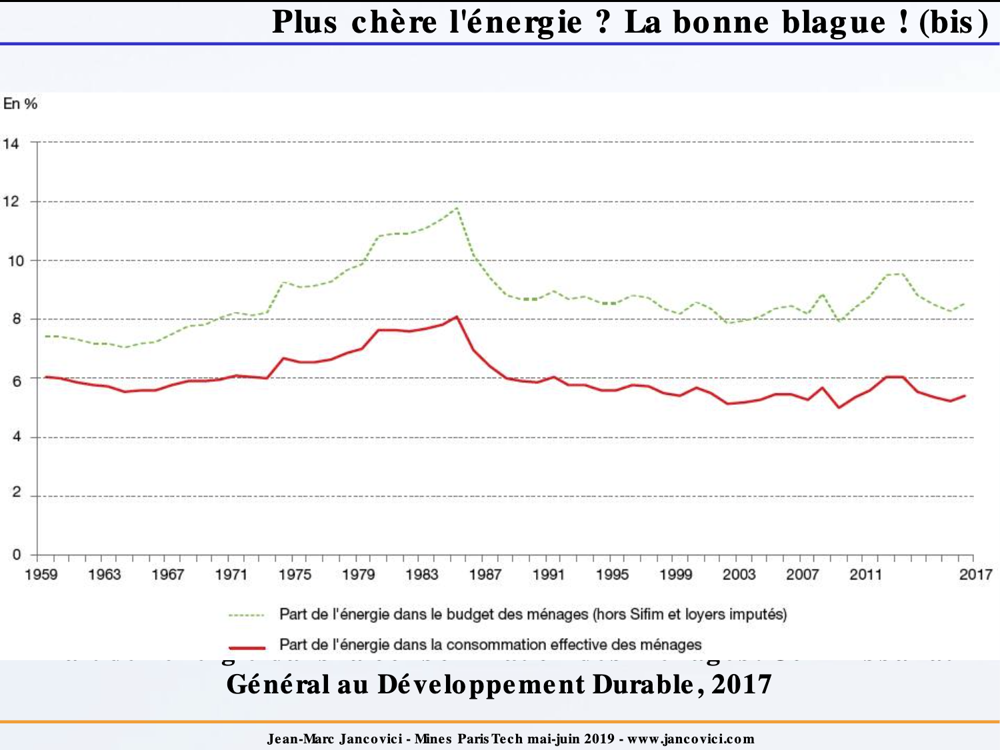
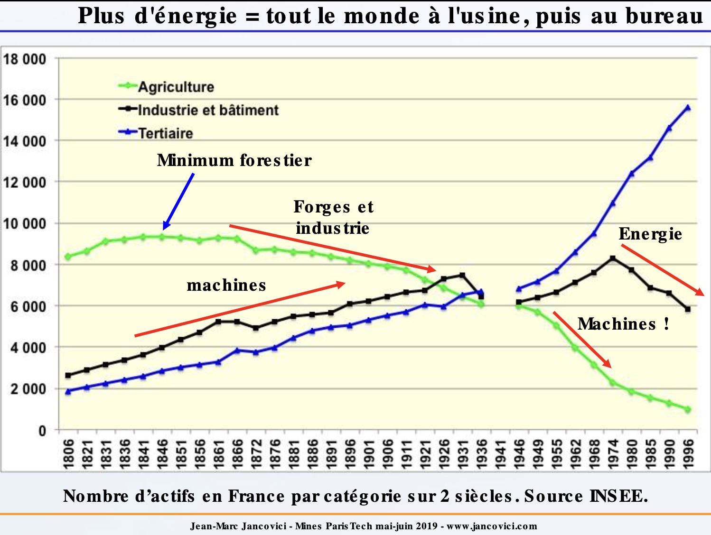
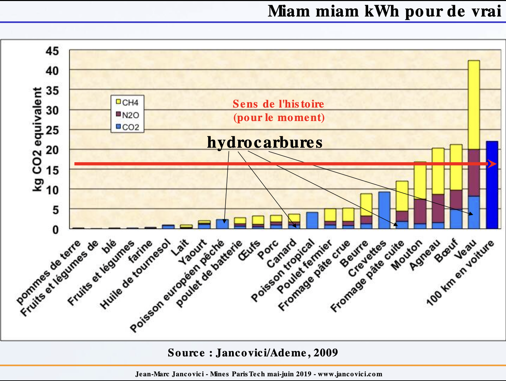
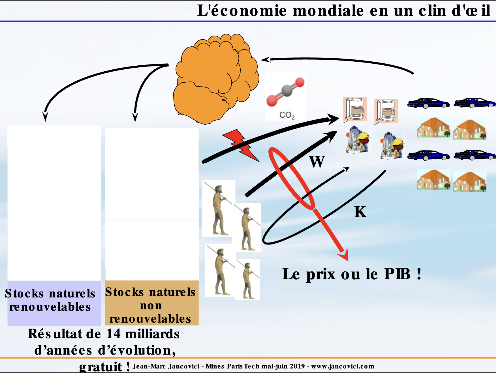
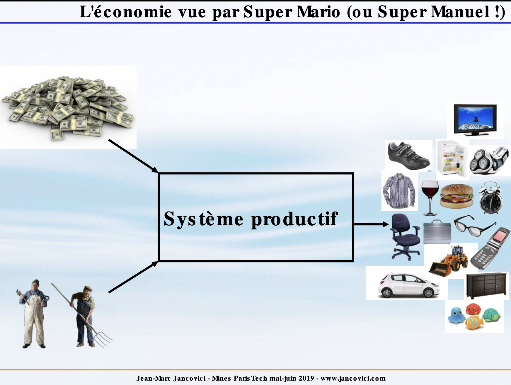
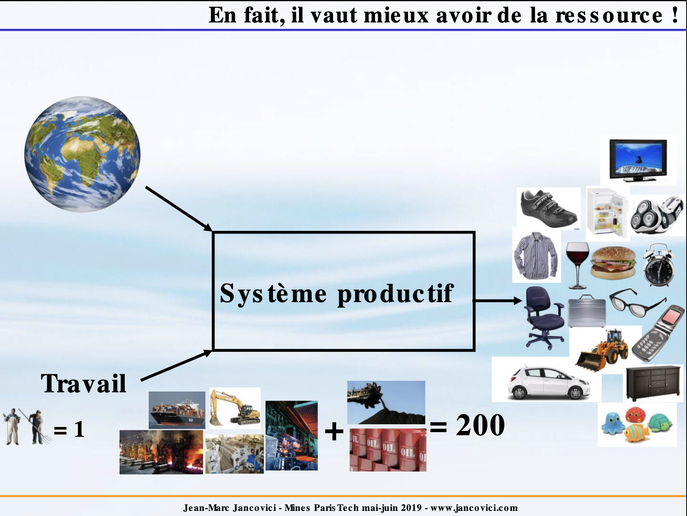

*Je me lance dans le suivi d'un module de cours de Jean-Marc Jancovici à l'école Mines Pont Paris Tech.*

*Tous les cours de ce module sont disponibles sur ce [lien](https://jancovici.com/publications-et-co/cours-mines-paristech-2019/cours-mines-paris-tech-juin-2019/). 
Pour chaque cours, vous avez le choix entre la **vidéo**, le **support + voix** ou la **transcription** de la voix du texte en version .pdf*

*Ce post est ma prise de notes du premier de ces cours, ma perception.*

# Intro

Je prends des notes suite à un premier conseil de JM Jancovi aux élèves de Mines Ponts.

Ca commence fort, il leur dit que les élèves de Mines Ponts ont des aptitudes à résoudre des problèmes compliqués posés de manière exacte (c'est-à-dire dans lesquels l'énoncé contient toutes les informations) et que c'est problème n'ont qu'une seule solution.

La vie, ce sont des problèmes mal posés où vous n'avez pas toutes les infos et qui peuvent avoir plusieurs solutions, il faudra donc raisonner par ordre de grandeur et par règle de trois.

# Qu'est-ce que l'énergie ?

## Une facture ?
Si vous prenez le problème sous cet angle, on passe à côté de l'essentiel ; en effet, si on mesure le rapport "coût de l'énergie par rapport au produit économique de l'année pour le monde dans son ensemble", ce rapport est autour de 5%.

A partir du moment où quelque chose ne vaut que quelques %, dans une société de consommation, on va lui accorter quelques pourcentage du temps (au moment des élections par exemple).

Ce n'est pas pertinent. Les raisonnements en pourcentage, en part de camembert, ne font pas apparaître les interdépendances entre les parts de camembert.

## Ce que l'on ressent un matin où l'on est en forme ?

Cette manière est la bonne façon de la concevoir car elle sous-entend la capacité à maîtriser son avenir, son destin, son environnement.

Pourquoi ?
Parce que l'énergie est la grandeur physique qui permet de caractériser un changement d'état dans un système ; autrement dit plus le monde change, plus il y a de l'énergie mise en jeu et inversement, plus il y a d'énergie mise en jeu, plus le monde qui vous entoure va changer.

Des exemples de changement d'état : température, vitesse, forme, composition chimique ou atomique, ...

L'homme est en transition énergétique depuis 500.000 années : domestication du feu, des énergies renouvelables (vent, eau), le pétrole avec les Sumériesn, le Charbon en Chine, ... 

# Loi de conversation de l'énergie

L'énergie est une grandeur physique qui a des lois que nous ne pouvons changer.

A cause de la **loi de conservation de l'énergie** (premier principe de la thermodynamique), les hommes ne peuvent rien faire d'autre que d'extraire de l'énergie de l'environnement (où elle se trouve déjà) puis la transformer avec un "convertisseur".

On appelle *énergie primaire* une énergie telle qu'on la trouve dans l'environnement.

Les premières énergies primaires : nourriture et soleil, avec comme convertisseur les hommes eux-mêmes.
Après, il y a eu l'herbe avec les animaux de traits comme convertisseurs, le vent et l'eau avec des moulins. C'était plus puissant que l'homme.
Puis, il y a eu les combustibles fossiles avec des machines faites de métal.

L'expression *"consommer de l'énergie"* est impropre, nous ne consommons pas de l'énergie (à part les aliments), nous domestiquons cette énergie, nous utilisons des machines.

Nous avons créé *"un énorme exo-squelette"* pour nous assister. Des gestes comme enfiler un sous-vêtement, se brosser les dents devant une glace nécessitent "une armée de machines" : des plateformes, des usines, des transformations, du transport, ...  
Que dire d'un geste comme utiliser un smartphone ? Cables, supports d'antenne, ...

**On voit que le raisonnement des 5% ne fonctionne pas, la totalité de notre économie a besoin d'énergie, si il n'y en a plus, notre économie s'effondre.**

# Energie

## Un peu d'ordre de grandeur

Avec quelques exemples (une ascension de 2000m, des travaux avec les bras), Jean-Marc Jancovi nous montre que la puissance du corps humain fournit 10 à 100 fois moins d'énergie que l'énergie mécanique récupérée en brûlant 1L d'essence. En euros, le rapport c'est 500 à 5000.
Ce qui explique que la volonté de toujours automatiser, de toujours remplacer le travail humain par des machines.

## Quelques idées reçues

Une énergie n'est ni propre, ni sale dans l'abolu. Choisir une énergie, c'est choisir des contreparties. Utiliser une énergie massivement va créer des inconvénients, choisir de l'utiliser c'est choisir ces contreparties.

Toutes les énergies primaires sont gratuites, y compris le pétrole.

Le coût de l'énergie représente le travail des hommes qu'il a fallu payer pour extraire l'énergie de son environnement.

## Des ENR au pétrole

1000 m^3 d'air à 80 km/h (un bon mistral) dans une éolienne fournit la même énergie (électrique dans son exemple) que 3 millimitres de pétrole. MILLILITRES !

En coût, le rapport entre l'énergie issue de l'éolienne et celle issue du pétrole est de l'ordre de 100 (stockage inclus).

On est donc passé à une marine tout à voile aux porte conteneurs, des boeufs ou du travail à la main aux tracteurs, des charrettes au camion, ...

Faire le chemin inverse, sans toucher au niveau de vie des personnes, paraît compliqué. Il y a 200 ans, tout était renouvelable. 

# Historique de l'utilisation de l'énergie

## Les différents types d'énergie

Le **bois** est la seule énergie qui a baissé depuis 1860, le début de l'ère industrielle.

Le **charbon** est en partie remplacé le bois, la consommation de charbon n'a jamais baissé. Les 2 tiers du charbon sont utilisés pour alimenter des centrales électriques.

Le **pétrole** n'a jamais remplacé le charbon, il ne sert pas à la même chose, il sert surtout à la mobilité, il se stocke et se transporte facilement. Au début des années 70, les chocs pétroliers ont mis fin à une expansion rapide de son utilisation.

Le **gaz**, l'**hydroélecticité** et le **nucléaire** viennent s'ajouter et n'ont pas remplacé les autres énergies. 

Le parc de machines fournit, à chaque personne sur Terre, **la même force mécanique que 200 personnes**.

Ces énergies, fortement fossiles, nous permettent d'être des *Iron man*, nous avons des aspirateurs, des voitures, des tracteurs, des fusées, ... Sans cette maîtrise de l'énergie, nous vivrions comme il y a 200 ans.

Ces énergies sont souterraines et n'occupent pas de surface au sol, contrairement aux énergies renouvelables qui mobilisent du sol. Le passage au renouvelable nécessite des discussions sur l'utilisation des sols.

## La population

Il y a 10.000 ans, c'est le début de la sédentarisation des hommes, c'est la sortie de l'ère glacière.
Au début de l'ère industrielle, il y a 500.000.000 de personnes sur Terre. En 2 siècles, la population est passée de 0,5 à 7 milliards et en même temps la quantité de ressources de toutes sortes par individu a cru.

Cette évolution démographique aura-t-elle pu arriver sans l'énergie abondante de la révolution industrielle ? Rien de sûr, les machines ont apporté beaucoup (rendement des soles, transports, conservation des aliments, ...)
Si on rentre en décrue énergétique forte, reste-ton à 8 milliards ?

## Depuis 2000

Depuis l'an 2000, en gros depuis que l'on parle du Climat, l'utilisation des 3 énergies fossiles ont augmenté considérablement ! 10 fois plus que le solaire par exemple.

## Prix de l'énergie

Le prix d'une énergie doit s'élever si elle devient rare ? En fait, le prix est très corrélée à celui du pétrole.

En monnaie constante, voici le  prix du pétrole : 

En France, dans une période récente, le prix de l'énergie rapportée à ce que les Français gagnent : 

## Evolution des salariés

Il y a 2 siècles, 2 tiers des Français travaillait dans l'agriculture, ce qui signfie le rendement d'un paysan suffisait à se nourrir lui plus une autre demi-personne.

Les effectifs dans l'agriculture augmentent jusqu'en 1850, mais la population augmente, on a donc coupé des forêts. En 1859, on atteint un minimum forestier (15% de la France, aujourd'hui 25%). L'industrie contribue d'amener des machines dans les champs, ça libère des bras pour que les personnes aillent faire autre chose.

Après la WW2, les américains amènent les tracteurs et les engrais. Le rendement céréalier en Beauce est multiplié par 6 à 8 entre 1945 et 1975.
Les bras libérés peuvent aller dans d'autres secteurs. On va construire des machines, on a besoin de bras pour s'en occuper.

Après les chocs pétroliers, la baisse dans l'industrie ne s'explique pas par une désindustrialisation mais par l'augmentation de la taille des machines qui offrent toujours plus de services, on a donc besoin de moins de personnes pour s'en occuper. 

Les emplois de services n'existe pas sans flux physiques (flux de personnes, de matériaux pour construire des bâtiments, des livres, d'ordinateurs, ...). **Un monde riche en emplois de service n'est pas un monde dématérialisé, au contraire.**

## Dans l'alimentation

Historiquement, on mangeait des céréales et des oignons, puis des oeufs, des petits animaux puis des cochons, des vaches.
Elever des vaches pour les manger est le symbole d'un pays sous perfusion énergétique.

## Dans les transports

Plus un transport est moderne, plus il est énergivore, plus il consomme au kilomètre : train < bus < voiture < avion.

La voiture, un moyen de transport ? C'est aussi un salon sur roulettes, un statut social. 

Avec de l'énergie abondante, on facilite le mouvement des populations vers les villes et l'étalage de ces villes. Une ville faite pour les voitures : Los Angeles.

L'énergie a restructuré les pays : les campagnes se sont vidées, les villes se sont densifiées et étalées (sauf si des contraintes physiques type montagne étaient présentes, on pense à la Suisse).

## Des vacances ?

Les populations ont gagné du temps libre, ce temps libre s'explique par l'afflux d'énergie abondante qui a permis une efficacité dans le travail jamais rencontrée auparavant. Si l'énergie vient à manquer, il est très probable que le temps libre diminue.

> *"On doit le fait de pouvoir bénéficier de cette offre de loisirs au fait que nous sommes sous perfusion énergétique"*

Il se développe en Suède un début de diminution de "prendre l'avion".

## Les objets qui nous entourent

Le pétrole n'est pas seulement une énergie qui alimente des machines mais c'est aussi la source de toute la chimie organique qui contribue à fabriquer tous nos objets du quotidien : vernis des parquets, fil nylon pour le textile, stylos, chaussures, ... TOUT.

# Un peu d'économie

Du point de vue des hommes, la planète Terre est un stock de ressources, 2 catégories : les renouvelables et les non renouvelables (sur des échelles de temps court).

Ces ressources sont gratuites. C'est le résultat de 14 milliards d'évolution.

L'homme transforme (donc énergie) ces ressources existantes en autre chose plus utile que les ressources fournies par la nature.

A chaque fois que l'on pioche dans le stock de non-renouvelable, le stock diminue. Il existe une part de capital qui permet d'accélérer la production future.

En accélérant la production, l'homme a également attaqué les stocks de renouvelables (les espèces, les poissons, ...)

La transformation produit des sous-produits indésirables : la pollution. Cette pollution contribue, par ses effets très souvent indésirables, à diminuer les stocks de ressources renouvelables et non-renouvelables.

Le seul flux qui importe dans notre économie est le flux annuel de transformation : le PIB.

**Rien dans le système économique actuel n'instaure de limite** ("c'est pour ça qu'il est aussi séduisant").

## 2 façons de voir l'économie aujourd'hui :

### La classique 

L'énergie et les ressources ne sont pas des inputs dans ce modèle.

### Une autre 

Dans cette dernière, on voit bien que si on vient à manquer d'énergie, nous ne pourrons jouir de tous les objets de notre quotidien.
Si en plus, il n'y a plus de ressources, la production sera nulle.

On a bâti un système économique entièrement basé sur l'abondance énergétique. Il n'est pas prévu pour fonctionner avec des ressources limitées.
Aujourd'hui, on voit des signes de balbutiement : chute de Lehman Brothers, dette de tous les pays de l'OCDE, ...

# Conclusion

Le monde dans les années à venir ne sera pas un monde en expansion mais en un monde en contraction. Le problème sera de **conserver le système dans un état stable**.

# Bibliographie

*Tous les cours de ce module sont disponibles sur ce [lien](https://jancovici.com/publications-et-co/cours-mines-paristech-2019/cours-mines-paris-tech-juin-2019/). 
Pour chaque cours, vous avez le choix entre la **vidéo**, le **support + voix** ou la **transcription** de la voix du texte en version .pdf*

