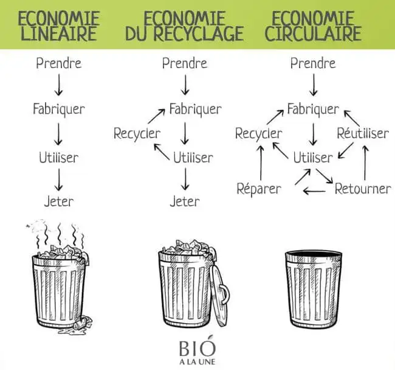

Cela fait un an que je me documente réellement sur le sujet de l'habitabilité de monde, puisque c'est bien de ça qu'il s'agit et pas de sauver la planète. Rassurez-vous la planète survivra, l'humain c'est probable, sans doute pas à 8 ou 10 milliards. Mais à quel niveau de confort ? Dans quelles conditions de justice ? De médecine ? D'accès à l'éducation ? ...

Avant, je n'étais pas complètement ignorant mais je n'avais pas saisi la gravité et l'urgence de la situation. Je faisais mon compost, essayais de limiter mes déchets, d'acheter local et/ou bio, de favoriser le recyclage, ...

En parlant de recyclage, j'ai découvert, chez un de mes clients ,les 3 ou 4 R, c'est selon.

# Les 4 R

**Réduire** : Si il ne fallait en garder qu'un, ce serait celui-là, il résume toute la démarche derrière : réduire ce qui arrive dans les incinérateurs, dans la nature... Derrière ce terme de réduire, on pense au mouvement Zéro déchet : acheter du vrac, des cosmétiques solides. Bref, réduire ce qui se retrouve dans vos poubelles quelle que soit leur couleur. Du côté des entreprises qui mettent sur le marché des emballages, c'est réduire le poids, le nombre de ces emballages, c'est également réduire les emballages non réutilsables et non recyclables au profit d'emballages réutilisables ou recyclables.

**Réemployer** : réemployer et réutiliser. Il y a une subtilité, nous dit Emilie Hergott dans le podcast des Numériques essentiels : la réutilisation c'est dans le même contexte, pour la même vocation (je pense à la consigne où les bouteilles vont être réutilisées sans transformations pour la même utilité). Le réemploi, Emilie Hergott donne un exemple : ça peut être réemployer une porte en table.

**Recycler** : recycler c'est sans doute le plus présent dans nos vies, via nos poubelles de toutes les couleurs, mais c'est aussi une étape de la gestion des déchets qui demande beaucoup, beaucoup d'énergie. En somme, recycler c'est bien, mieux que de brûler, mais si on peut réduire et réemployer c'est mieux.

Ces 3 points, c'est ce que l'on appelle les 3 R. Un dernier vient s'ajouter pour composer les 4R.

**Réparer** : réparer un vieux plutôt que d'en acheter un neuf, changer l'écran de son smartphone plutôt que d'en acheter un nouveau (d'occasion ou pas) , réparer pour faire durer la durée de vie des objets.

L'idée de chacun de ces 4 points est la même : diminuer le tonnage de déchets. En image, ça donne ceci :

Au cours de mes écoutes de podcasts ([L'Octet vert](https://www.standblog.org/blog/category/podcast) par Tristan Nitot, [les numériques essentiels](https://www.frugarilla.fr/contenu/)), de mes lectures (Cyril Dion, Frédéric Bordage, Serge Latouche, Timothée Parrique, Jeam-Marc Jancovici, Philippe Squarzoni, ...), de mes visionnages (de films comme Demain ou Digger, de conférences comme celle d'[Aurore Stéphant](https://www.youtube.com/watch?v=i8RMX8ODWQs) à l'USI, de la [série](https://www.arte.tv/fr/videos/RC-022084/toxic-tour/) *Toxic tour* sur Arte), j'ai découvert la différence entre climat et météo, les fresques du Climat et du Numérique, la notion de limites planétaires et [l'économie du donut](https://www.oxfamfrance.org/actualite/la-theorie-du-donut-une-nouvelle-economie-est-possible/), les bilans carbone (souvent désastreux de nos pays "développés"), le sujet des mines si importantes à nos appareils électroniques et *de facto* le sujet de la croissance infinie dans un monde aux ressources finies, ... C'est infini, passionnant et **angoissant**.

Angoissant. C'est d'ailleurs clairement dit partout et ça se nomme **éco-anxiété**, ben oui à force de lire, de voir, d'entendre des rapports aux conclusions catastrophiques mais bien réelles, on ne finit pas toujours avec un moral au beau fixe.

Il semble important, pour plein de personnes et à moi, d'imaginer un futur probable et pas seulement de décrire, d'expliquer, de dénoncer ce qui s'est passé ou ce qui se passe. Imaginer un futur probable, des futurs devrais-je dire, une matrice de possibles, car la réponse n'est clairement pas unique.  
[Serge Latouche](https://fr.wikipedia.org/wiki/Serge_Latouche) propose une *"utopie concrète"* sous la forme de 8 R.

# Les 8 R

Pourquoi imaginer des futurs probables, sous-entendu des futurs différents ce que nous vivons aujourd'hui ? Parce que produire toujours plus, à l'infini, dans un monde aux ressources finies n'est tout simplement pas possible. Parce qu'il est prouvé, et 100% des scientifiques en 2023 sont d'accord, que le réchauffement climatique existe et  est la faute de l'Homme (et ce depuis la création de la machine à vapeur)

Quels sont ces 8 R ? **Réévaluer, reconceptualiser, restructurer, relocaliser, redistribuer, réduire, réutiliser, recycler**.

Ici, il ne s'agit plus uniquement de déchets même si l'on retrouve nos 3 R (réduire, réutiliser, recycler), il s'agit d'une *"conception de rupture avec la société de croissance"*, du productivisme. Vers plus de sobriété.

## Réévaluer

Réévaluer. Revoir les valeurs. Revoir les valeurs de nos sociétés de consommation, de croissance qui nous emmène dans un mur. Produire toujours plus, c'est appuyer encore et encore sur la pédale d'accélération. Le mur se rapproche.
De quelles valeurs parle-t-on ? De l'individualisme, de la compétition... pour aller vers *"un peu plus d'altruisme, un peu plus de coopération* entre nous, humains, et avec la Nature que nous détruisons allègrement . Ne plus penser comme un individu isolé mais comme un être faisant partie d'un tout (cela me rappelle Vert de la spirale dynamique). 

> *"Il conviendrait de se comporter en jardinier plutôt qu'en prédateur"*
> 
> Serge Latouche - La décroissance

## Reconceptualiser

Remettre en cause ces valeurs oblige à revoir certains concepts, en premier lieu, celui de la richesse.
Aujourd'hui, la richesse est associée à l'argent, au patrimoine. Or, il faudra sans doute aller vers plus de frugalité volontaire, que pourrait alors signifier "être riche" ? Quelques idées : avoir un *"tissu relationnel qui fonctionne [...], respirer un air pur, manger des choses saines et savoureuses"*.
Aborder le sujet de richesse, c'est forcément parler de la misère (différent de la frugalité volontaire), de la *"confiscation des biens"*. 

## Restructurer

Cette reconptualisation amène à revoir les manières de produire, à revoir les habitudes, les institutions qui légifèrent, qui jugent... 

## Redistribuer

Une restructuration entraîne à réfléchir à la redistribution : redistribuer des pays du Nord vers ceux du Sud, redistribuer vers la Nature. Dans un dessin animé que j'ai regardé récemment en famille, *Pachamama*, les habitants d'un village péruvien redistribuaient une partie des récoltes à la Terre dans un trou qu'il rebouchaient ensuite. (Une référence qui vaut ce qu'elle vaut mais qui témoigne, selon moi, de gestes que nous avons oubliés dans nos sociétés de pays dits "développés").

## Relocaliser

Relocaliser ou *"démondialiser"* pour dans un premier temps, sortir du tout mondialisé, sortir du fait que pour un jean, par exemple, le coton est récolté dans un pays, il est filé et tissé dans un autre, il est teinté encore ailleurs, ... Si vous voulez tout savoir sur l'itinéraire d'un jean, cette [vidéo de Jamy](https://www.youtube.com/watch?v=U9xoi7RSOwo) est succincte, claire et sourcée. Du Jamy quoi. C'est un exemple. Qu'un exemple. Un exemple parmi beaucoup. Serge Latouche en cite pleins d'autres dans son livre, encore une fois, c'est sans fin.

Ce *"déménagement planétaire"* quotidien est le résultat de la recherche de toujours plus de profit au mépris et aux dépens de la biodiversité terrestre et sous-marine, aux dépens de la condition humaine. 

Démondialiser pour redonner du sens au tissu local, du sens *"culturel, social et politique."*

## Réduire

Réduire. Réduire tout. Notre empreinte écologique. Notre surconsommation.  
Mais aussi, notre temps de travail, pour ne plus alimenter à l'excès la mécanique de production à  l'infini. Pour, non pas, *"travailler plus pour gagner plus"* mais pour *"travailler moins pour vivre mieux"*. Cette réduction sera compliquée : le travail est souvent vu comme un statut social, beaucoup de personnes sont des drogué·e·s du travail, de la consommation. Il faudra se désintoxiquer, détricoter un imaginaire fortement enraciné. 

> *"Décoloniser l'imaginaire"*.
> 
> Serge Latouche - La décroissance

## Réutiliser
J'en ai déjà parlé plus haut, réutiliser, réemployer, sans doute aussi réparer. Pourquoi ? Pour faire face à l'obsolescence technique, programmée. Un indicateur de réparabilité est, par exemple, en vigueur depuis le 10 février 2020 pour les produits électriques et électroniques. Plus d'infos sur cet indice [ici](https://www.ecologie.gouv.fr/indice-reparabilite).
J'ai l'impression d'entendre mon grand-père qui ne jetait rien, réutilisait des trucs bons à jeter pour un tout autre usage, qui réparait tout à coup de bidouille.

## Recycler
En dernier recours, le recyclage. En dernier, parce que consommateur d'énergie. Réinjecter des matières recyclées dans la conception des produits, de notre économie, de nos façons de faire pour se rapprocher de ce que fait la Nature qui elle ne produit pas de déchets.

# Le mot de la fin

La décroissance, ce n'est pas une croissance négative, ce n'est pas non plus un déclin ou un effrondrement, ce n'est pas une société de croissance sans croissance. Non. 
La décroissance est une matrice d'autres possibles, les 8 R essaient de donner un cadre concret à cette *"utopie"*.

---

### Bibliographie 

- Le [décret](https://www.citeo.com/le-mag/decret-3r-quels-objectifs-de-reduction-reemploi-recyclage-dici-2025) des 3R vu par CITEO
- Le [lien](https://www.3d-skult.com/economie-circulaire-on-tourne-en-rond/) où j'ai trouvé l'image de l'économie circulaire
- Le [livre](https://www.recyclivre.com/products/1522596-la-decroissance) de Serge Latouche  : La décroissance aux éditions Que sais-je (dans lequel j'ai pioché bon nombre de citations de cet article)
