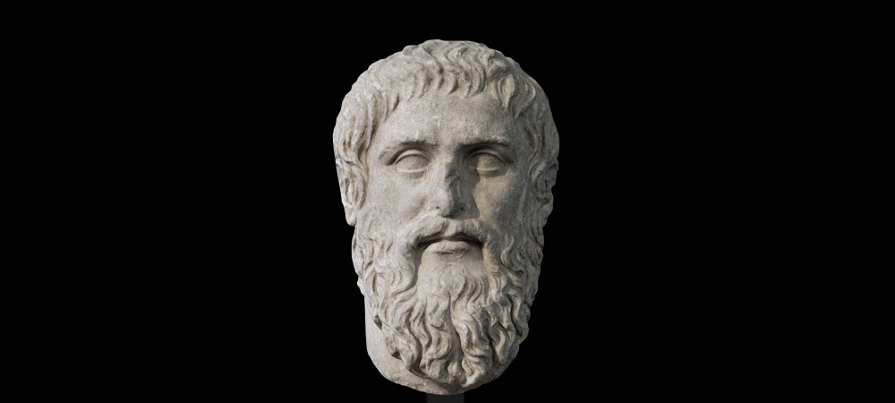

J'ai 44 ans et, il y a quelques mois, je suis allé à un salon sur l'habitabilité du monde. J'y suis allé parce que le sujet m'intéresse, parce que j'ai envie d'assister à des conférences autres que celles sur l'agilité.

Dans ce salon, il y avait plusieurs espaces dont un pour des conférences. Je me dirige vers cet espace, prends ma place. Au premier rang. Pour les photos. Un homme, la trentaine, est sur scène, il branche les micros, un pc, vérifie le son. Il est presque l'heure de commencer. Il ne descend pas de scène et je me dis "il n'est pas bien vieux pour être le keynoter".

Il s'avère que le keynoter c'est bien lui. Il commence, il est intéressant, j'aime son ton... Il prononce cette expression de *"mentoring inversé"*, elle capte toute mon attention, je ne l'ai jamais entendue. Il explique que notamment dans le vaste panorama qu'est l'habitabilité du monde, les jeunes peuvent être plus sensibles que les plus vieux, que les plus vieux devraient plus écouter les plus jeunes, que ces dernier·ère·s peuvent être très inspirant.e.s, plus inspirant.e.s...

Je ne me rappelle de rien d'autre dans cette session. Je me revois en train de me dire *"il est bien jeune pour un keynoter"*.

Depuis, ça trotte dans ma tête, ça fait son chemin comme on dit, ça se connecte à d'autres trucs.

# Mon image du mentor
Une des premières questions que j'ai formalisée concrètement c'est "pourquoi j'ai pensé cette phrase ?" (ndlr. : *"Il est bien jeune pour un keynoter"*).  
Un début de réponse est que mon image du mentor est une personne plus vieille que moi. La sagesse. Si je devais le dessiner, sans doute serait il un homme, blanc, vieux, avec une barbe. Platon ? Socrate ? Un professeur d'université ?

> *Platon né en 428 / 427 av. J.-C. et mort en 348 / 347 av. J.-C.*

Je me rends compte de mon biais, de ce que ce biais génère : accorder une écoute, du crédit à une personne avec plus d'expérience, plus vieille, en accorder moins à une personne plus jeune, comme j'ai pu le faire à ce salon. J'ai fait ça combien de fois de manière inconsciente ?

Il faut que je fasse évoluer mon image du mentor, d'autant plus que je vieillis, que le nombre de personnes plus jeunes que moi grandit.

# Mes enfants, des mentors ?

Pendant les jours où je cogite, deux discussions émergent avec mes enfants :

La première c'est de mon petit garçon (10 ans) qui un soir, avant de se coucher, sur le balcon de sa chambre, en regardant le Grand Paris côté Nord et Est, me dit : *"J'aime bien être ici, j'aime bien cette vue, c'est grand, et ça me rappelle que mes gros problèmes ils sont tout petits."*

La deuxième, c'est celle de ma grande (13 ans). Extrait :  
*- Y'en a* [des élèves de sa classe]*, ils sont vus, ils ont des bonnes notes mais ils servent à rien dans la vie de classe.*  
*- C'est-à-dire ?*  
*- Bah, tu les enlèves, la classe elle n'a pas changé. Y'en a qui mettent une ambiance dans la classe ou qui posent des questions qui font avancer la classe mais y'en a ils ont juste des bonnes notes.*  

L'inspiration (la sagesse ?) est parfois là où je ne l'attends pas.

Ces deux discussions alimentent mes réflexions et en relancent d'autres. Pour prendre l'exemple de la discussion avec ma fille.  
Je me rappelle que chez benext, un des axes de réflexion pour embaucher une personne était "Est-ce que benext + cette personne = benext+ ?". Je réalise par ailleurs que nous aurions pu penser à "est-ce que benext + cette personne = cette personne+ ?" Je réfléchis aussi à la façon dont on évalue les élèves...  
Bref, ça cogite. Merci ma fille. (pour celles et ceux qui se demandent, je lui ai dit merci de vive voix).

# Premier partage de ces réflexions
Tous les mercredis, j'ai un moment "hors du temps", avec des collègues que j'aime beaucoup. On y ralentit. Pas d'agenda défini, aucun ordre planifié. L'agenda et les sujets sont définis en début de réunion.  
Un de ces mercredis, je fais part au groupe de mes réflexions sur le sujet. Il y a des personnes de mon âge, parfois un peu plus vieilles, des plus jeunes parfois 10+ ans de moins.
Si les plus vieux, les plus vieilles acquiescent, partagent ces réflexions, les plus jeunes sont surpris.e.s et s'interrogent :  
*"- Ca veut dire que vous écoutez moins les jeunes ?"*  
*"- Oui"* lui répond du tac-o-tac l'une des personnes présentes.  

Bon, je ne suis pas le seul à avoir ce biais, ouf. Ca me rassure d'un point de vue personnel mais pas du tout d'un point sociétal... 

Samedi dernier, clin d'oeil du destin, en passant dans une librairie, je croise la couverture du livre de Salomé Saqué, née en 95. Le titre "Sois jeune et tais-toi".

