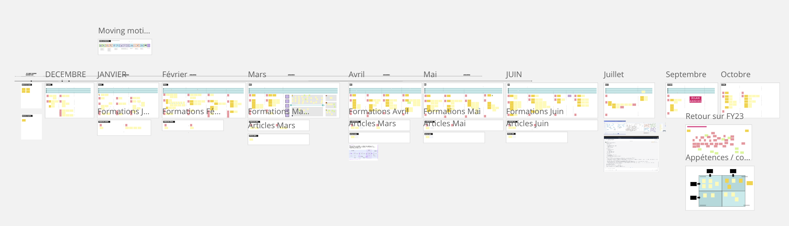
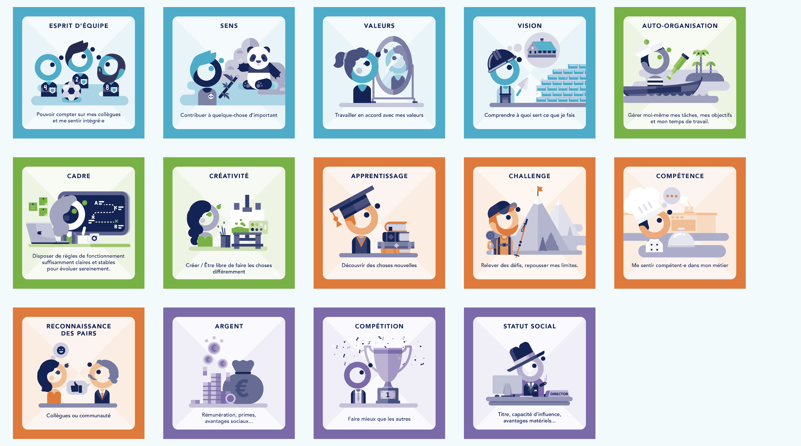
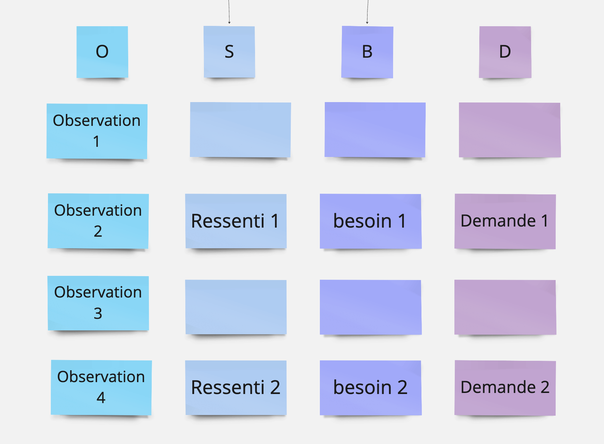
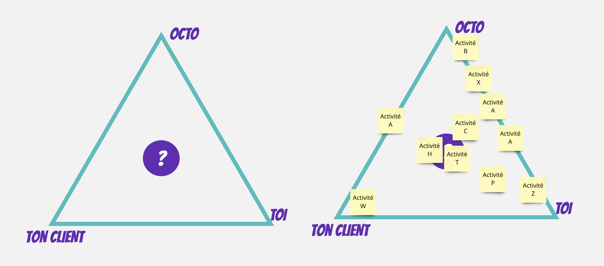
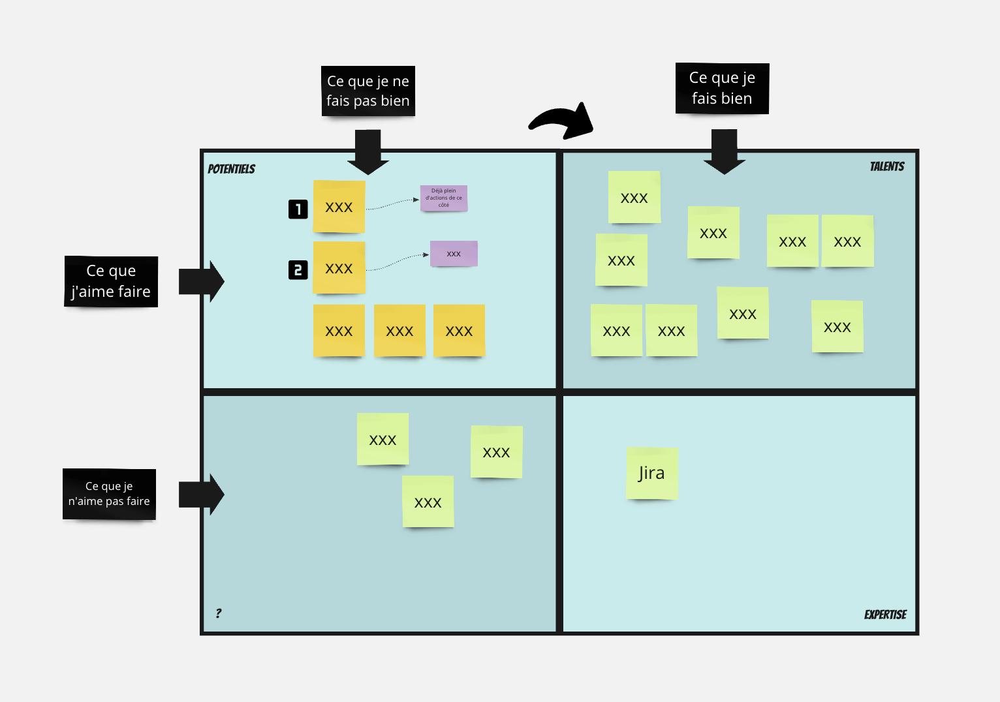
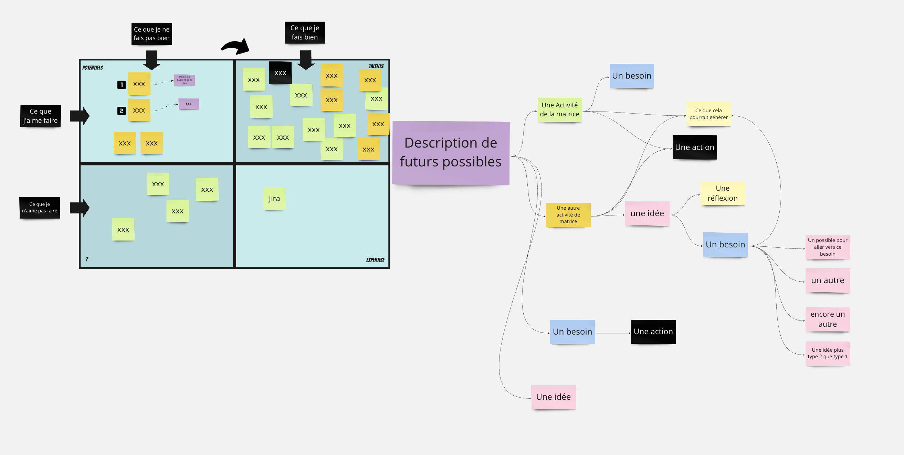
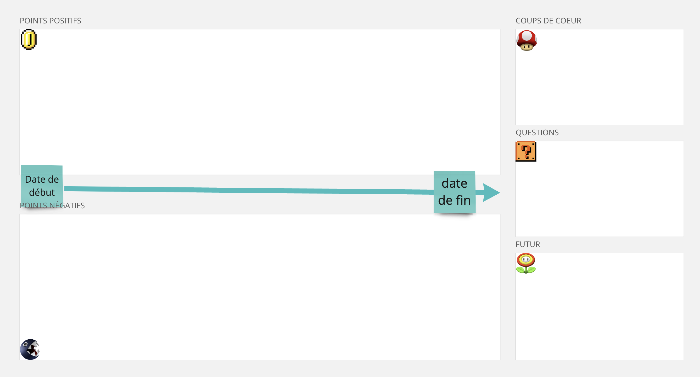

Après quelques années sans être officiellement manager, j'ai repris du service l'année dernière.

Tous les mercredis matins depuis 5 ans, je participe à des séances de partages, d'apprentissages, de supervision avec des collègues. 
Une discussion mercredi dernier m'a donné l'idée de cet article, la discussion est partie d'une question de [Laura Krispin](https://fr.linkedin.com/in/laurakrispindesigner) : *"Je suis en train de me constituer une toolbox sous Miro pour mon management. Faut-il que je l'ouvre à tous les managers de la structure ? Vous avez envie de contribuer ? Il manque des choses d'après vous ?"*

Les avis ont été assez unanimes pour ouvrir et partager cette toolbox à l'ensemble des managers, le groupe hésitait entre des droits en lecture seule ou en écriture, une réflexion autour de la maintenance en quelque sorte, du bazar que pouvait générer un partage avec tous les droits.

Chacun de nous a pu donner son avis sur ce qu'il apporterait, sur ses envies, j'ai répondu assez rapidement mercredi dernier, voici ma version longue. Je n’aborderai ici que le sujet des outils, des formats, et je n’aborderai pas le pourquoi du management, les attentes des personnes, les postures que j’ai pu incarner, le format de questions…

# Ce que j'ai fait

Comme Laura, je fais mon suivi dans Miro, j'y mets toutes les notes des sujets abordés lors des différents rendez-vous que j'ai avec les personnes que j'accompagne : en vrac, mood, sujets à aborder, actions à prendre, des idées à creuser parfois un ROTI. La plupart du temps c’est moi qui scribe.
Ca peut ressembler à ceci : 

Ce n’est pas parce que tout est saisi dans un outil, ici Miro, que cela signifie que tous les points étaient face à un écran, il y a eu des visios, des face à face dans une salle de réunion avec nos ordis, des points en face à face avec un tableau, des balades au jardin du palais royal, à la bibliothèque, des petits déjeuners, des cafés/thés en journée, …

## Accueil
Chez OCTO, la politique c’est *Choose your boss*, donc tout le monde se cherche un manager. En tant que manager, j’ai toujours demandé aux personnes qui frappaient à ma porte quelles avaient été les motivations pour me contacter, ce qu’elles attendaient d’un manager, …

Pour le début de l’accompagnement, du suivi, j’avais commencé par un atelier de moving motivators (un des ateliers du [management 3.0](https://management30.com/)), j’avais utilisé ce [set de cartes](https://octo-technology.gitlab.io/octo-craft/moving-motivators/)

Vous connaissez sans doute. L’idée était de placer ces cartes par ordre d’importance, aux managers de placer le contexte, de poser une question, …
Je ne détaille pas plus l’animation, vous trouverez plein d'articles la détaillant.

## Exemples d’ateliers utilisés lors du suivi hebdo

Mon suivi a été la plupart du temps hebdomadaire, à raison de 30 minutes par semaine. Avec une personne, c’était 1h toutes les 2 semaines. L’idée est la même : récurrence, proximité.
La majorité du temps, le format était humeur du jour, les sujets à aborder de chaque côté, les actions à mettre en place.
Parfois, une discussion fait émerger des formats plus spécifiques.

### Feedback

Durant l’année, il a parfois fallu se préparer à donner des feedbacks compliqués, j’ai proposé le format OSBD illustré sous cette forme :  
- O pour Observations : *Lorsque je vois, entends, observe…*
- S pour Sentiment : *Je me sens…*
- B pour Besoins : *... parce que j’ai besoin de …*
- D pour Demande : *Du coup, est-ce que tu serais d’accord pour …*

Vous comprenez aisément que les vraies prises de notes aient été effacées et remplacées par du *lorem ipsum*.
Pour aider dans l’identification des ressentis, j'utilise cette [carte des émotions](https://conscience-quantique.com/boutique/les-gratuits/16-carte-emotions-a-imprimer.html). Idem pour l’identification [des besoins](https://conscience-quantique.com/boutique/les-gratuits/33-liste-besoins-a-imprimer.html).

### Triangle Client / Toi / OCTO

Pour sortir du quotidien, de l’opérationnel, j’ai parfois utilisé ce triangle (piqué à Jonathan Litty), où j’ai laissé les personnes interagir avec. Parfois, la personne se positionne à un endroit, parfois elle positionne ses activités (comme ici), …

### Matrice appétence / compétence

Pour sortir de l’opérationnel et pour aider les personnes à identifier les futurs possibles pour elles, j’ai parfois utilisé une matrice Appétence / Compétences.

2 axes : les compétences et les appétences  
4 zones :  
- Ce que j'aime faire et que je fais bien : les talents  
- Ce que j'aime faire et que je ne fais pas bien : les potentiels  
- Ce que je n'aime pas faire et que je fais bien : les expertises  
- Ce que je n'aime pas faire et que je ne fais pas bien : une zone où l’on serait tenté de dire qu’il n’y a rien à voir, mais ce serait sans doute rater des opportunités. Peut-être que la personne n’a pas assez essayé, peut-être … . Explorer sujet par sujet. Dans l’illustration, j’ai laissé le sujet “Jira” pour la blague, il est véridique. 

Ici, nous avons identifié 2 “potentiels”, 2 activités / pratiques / sujets que la personne aimait et sur lesquels elle ne se trouvait pas au niveau où elle aimerait être. L’idée était de les faire passer du côté des “talents”.

Quelques mois plus tard, nous l’avions repris, ca avait donné ceci : 

La matrice avait été complétée. (Le sujet “Jira” n’a pas bougé ;-) ). 

Ensuite, nous avions esquissé un futur possible avec une liste de “Avoir moins…”, “faire plus de …”, “essayer …”. Ce futur , sur quoi pourrait-il s’appuyer ? Sur un talent ? Un potentiel ? Une expertise ? S’en étaient suivi des ressentis, des besoins, des idées, des actions, …

## Point Mi-année

Pour le point de mi-année, j’avais utilisé un format de rétro :

Une frise chronologique allant du début de l’accompagnement jusqu’à la date du jour. Au-dessus les points, sujets, évènements positifs, ceux qui donnent le sourire, de l’énergie. En dessous, à l’inverse, les points négatifs.

3 trois zones sur la droite pour distribuer 1 ou 2 coups de cœur à cette période, pour lister les questions et pour aborder des futurs possibles.

Des formats de rétros, vous en trouverez plein sur le net, mon site référence est [retromat](https://retromat.org/fr/?id=2-9-25-24-53).

## Il y en a plein d’autres
Il y a plein d’autres outils, matrices, modèles pour manager des personnes, des que je ne connais pas, d’autres que je connais et auxquels je n’ai pas pensé à utiliser sur le coup et qui auraient eu du sens dans mes contextes. J’y pense suite à la discussion qui a induit l’écriture de cet article : cartes Dixit [(dispo en print and play)](https://print-and-play.asmodee.fun/fr), [cartes des forces](https://www.positran.fr/produit/cartes-des-forces/), [pyramide de Dilts](https://www.nilslesieur.fr/2022/02/les-grilles-de-lecture-3/7-la-pyramide-de-dilts/), l’[arbre d’ostende](https://interpole.xyz/cache/MeteoDOuvertureOuDeClotureEnSAppuyantS_arbrebonhomme_arbeentreprise_vignette_1000_1000_20191031165903_20191031165903.png)  …

# Ce que j’ajouterai

## Flèche du temps

Je me soucierai plus des objectifs individuels fixés (un peu évident et peut-être que j’étais un peu rouillé pour cette "reprise") mais aussi des attendus en fin d'année par la structure.
Ce que j'ai en tête c'est de sanctuariser les rendez-vous, les sujets dont j'ai besoin pour atteindre ces objectifs et ces attendus : point avec clients (tous les 2-3 mois), des rétros (tous les 3 mois), des revues d'objectifs posés en début d'année (tous les mois ? C'est peut-être trop fréquent...
L'expression qui me vient, c'est "flèche du temps", expression maintes fois présentée par Fabien Galthié, le sélectionneur du XV de France.

## Encore plus de diversité dans les formats

J'insisterai plus sur la diversité des formats utilisés dont j'ai parlée : visios, face à face, balades, des petits déjeuners, …

## Plus d’introspection ?

Favoriser plus l’introspection en utilisant davantage le triangle présenté plus tôt, je pense aussi à un outil de coaching : pyramide de Dilts.

# Conclusion

Comme Laura en interne, j’ouvre ma “toolbox” de manager, si vous aussi, lecteurs, lectrices, vous avez envie de partager votre toolbox avec moi, avec la communauté, ce sera avec plaisir.

Crédits Photo : [jesse orrico](https://unsplash.com/fr/@jessedo81)

