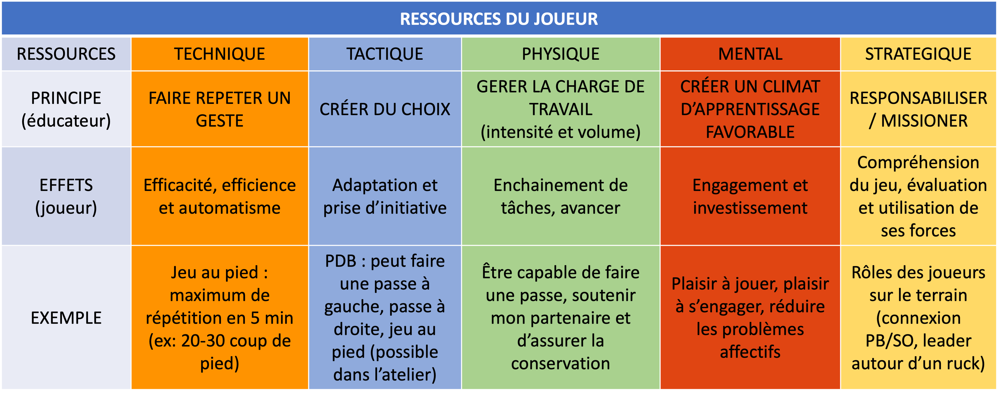
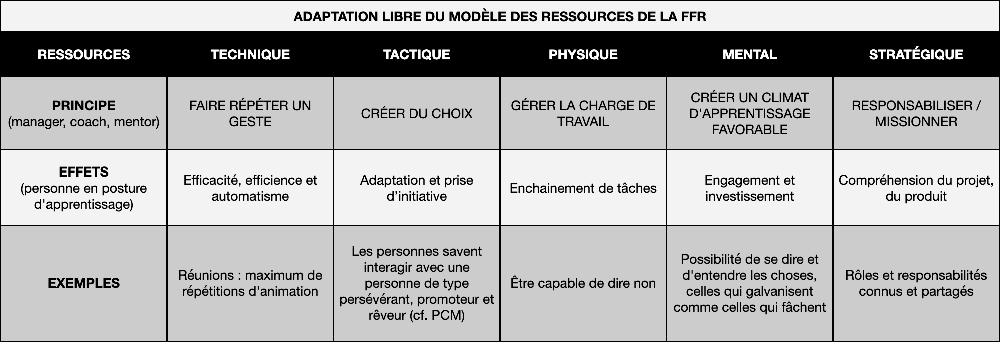

Si vous savez lire entre les lignes ou si vous me connaissez, vous savez qu'en plus d'être un coach qui traîne dans les Directions Produit ou Informatique, je suis un amoureux du rugby.

Il s'avère que cette année, je rechausse les crampons pour entraîner un collectif de 48 enfants de 10 à 12 ans. Je ne suis évidemment pas tout seul, nous sommes 6 éducateurs pour cette catégorie d'âge.
Ca fait 18 ans que je n'avais pas entraîné à l'école de rugby et quand mon club m'a proposé de me former, j'ai dit banco.  
Ma précédente formation datait de presque 20 ans. Elle s'était déroulée sur 2 jours avec au milieu une observation lors d'un des entraînements avec mon équipe.

En 2023, la même formation c'est 8 jours, des "devoirs" entre chaque session et toujours de l'observation !

Un autre format. Une autre intensité. Une autre précision... Une autre qualité.

# Qualité 

C'est ce qui me marque en premier : la qualité !

Pour cette formation, j'ai 3 formateurs : une personne du comité départemental, le directeur technique d'un des clubs de Paris et l'entraîneur des espoirs du Stade Français, ancien international !  
On parle d'une formation pour les éducateurs de la catégorie des moins de 12 ans. Des enfants qui participent au moins à la coupe du monde du tournoi du samedi après-midi entre 3 ou 4 équipes du coin.

La qualité de cette formation fait que j'écoute beaucoup, que je prends du plaisir, que je suis parfois en difficulté sur mon animation ou sur ma préparation de séance. La qualité de la formation entraîne les participant.e.s vers des zones d'inconfort.
Et comme dirait Johnny Wilkinson : *"si tu étais à l'aise, tu ne serais pas en train d'apprendre"* (dans un des épisodes de la web série Terrains favorables).

Dans tout ce qui est mis à notre disposition, deux outils résonnent tout particulièrement avec mes rôles de coach, formateur, mentor ou manager : 
- Comment travailler les ressources du joueur (moins de 12 et moins de 14 ans) ?
- Comment préparer une séance d'entraînement avec ces mêmes joueurs pour travailler une ressource spécifiquement ? (ça, ça sera dans un prochain post)

# Comment travailler les ressources du joueur ?

Ce qui m'a le plus interpelé, à ce moment de la formation (elle se termine en avril je crois), c'est ce tableau.  
Comment travailler spécifiquement la ressource à développer, à renforcer ? En tant d'éducateur, que faut-il mettre en place ? Que faut-il regarder ? Que faut-il valoriser ?

Je répète depuis longtemps que pour se former, il faut répéter les gestes. Répéter. Que ce soit pour apprendre à marcher, à faire du vélo ou pour écrire une user story.  
Oui pour se former sur la technique, mais il y a d'autres dimensions, d'autres ressources comme les appelle la FFR (Fédération Française de Rugby).

Je vous laisse prendre le temps de le relire, de faire des ponts dans vos têtes, de réfléchir, ...

## Les 5 ressources

### Qu'est-ce qui se cache derrière chacune des ressources ?

La **ressource mentale** c'est "tout ce qui touche à l'engagement et à l'investissement dans l'activité".  
La **ressource technique** c'est "tout ce qui permet la réalisation d'un geste".  
La **ressource stratégique** c'est "tout ce qui se décide avant le match, avant l'action." (ça peut être avant la saison, avant le match, avant une touche, ...)  
La **ressource tactique** c'est "tout ce qui se décide dans l'action".  
La **ressource physique** c'est "le moteur de la joueuse, du joueur". (l'endurance, la vitesse, la force, la vitesse et la coordination).  

Ça, ce sont les mots de la FFR. Ce qui m'a, très vite, frappé c'est que tout cela existe aussi dans mon quotidien professionnel plus en lien avec les directions Produit, Informatique, Digital Factory, ... :  
  
* l'engagement des personnes, leur investissement.  
* la technique des développeurs, des POs, des managers, des UX, des RH, des commerciaux, ...  
* la stratégie : "tout ce qui se décide avant l'action", ce sont les sprints planning, l'example mapping, les réflexions avant d'animer un atelier, de coder, avant de se lancer dans un nouveau produit, ...  
* la tactique : "ce qui se décide dans l'action". Ça aussi ça me parle. Rencontre non prévue avec un iceberg de code legacy, l'aménagement de la facilitation durant un atelier, ...  
* Le physique : c'est sans doute là où, dans un premier temps, le parallèle m'a le moins parlé. Et puis, je me suis dit qu'il fallait être en forme pour pouvoir interagir avec les collègues, avancer sur les tâches pour lesquelles on compte sur moi, encaisser la charge de travail, ...  

### Qu'est-ce que cela pourrait donner pour mon quotidien pro ?

### Comment j'ai commencé à l'utiliser dans mon quotidien ?

Avec ma cliente, on prend le temps régulièrement de regarder le périmètre d'action de son équipe Product Ops, de zoomer sur certaines zones. La fois à laquelle je pense, on zoome sur une communauté de pairs, on parle de choix, de roadmaps.
Pendant la discussion, le mot "choix" me renvoie directement à la ressource tactique vue pendant ma formation, idem "roadmap" m'évoque la ressource stratégie.

Je lui partage le tableau brut de fonderie. Elle regarde silencieuse. Ca semble lui parler. Elle me partage ce qu'elle en conclut, quelque chose comme *"ok, il faut donc les aider à se créer du choix et à les responsabiliser."* Cool, même analyse de mon côté.

Elle ajoute *"Donc nous, il faut que l'on fasse répéter les gestes."* Inception ! Génial ! Mais oui !

# Et maintenant ?

Je débute dans l'utilisation de ce nouvel outil, je découvre des possibilités. Je l'ai encore testé ce matin pour un début de mentorat. J'aime cette période de découverte. Des frizzi pazzi. Ca pétille, ça surprend.

