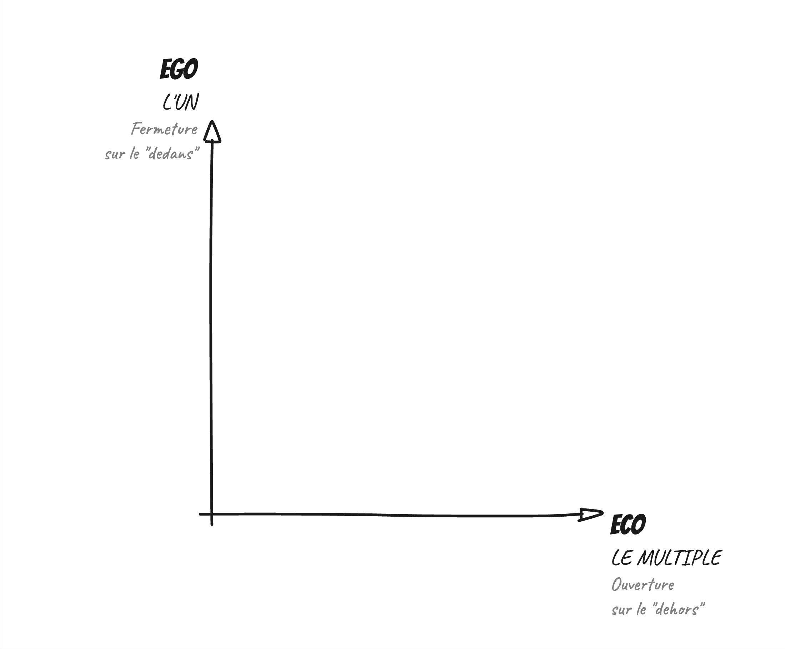
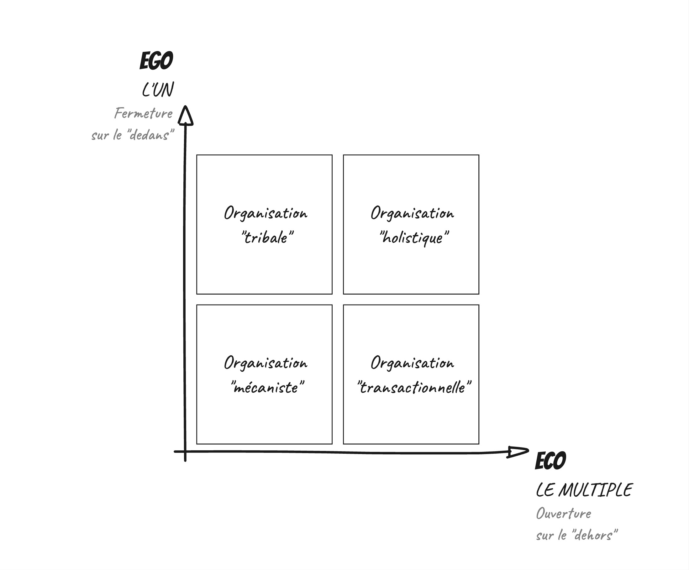
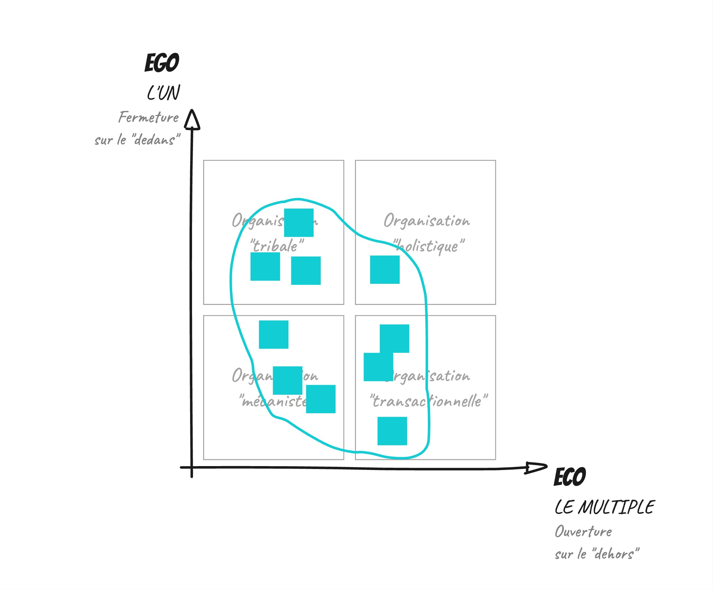
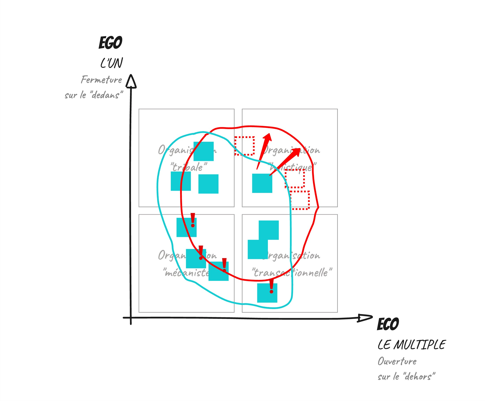

Lors de la formation intitulée Organisations souhaitables et animée par l'Institut des futurs souhaitables que j’ai mentionnée dans mon précédent post sur la différence entre pensée de groupe et [l’intelligence collective](https://www.nilslesieur.fr/2024/02/lintelligence-collective-cest-pas-automatique/), j’ai également découvert la notion de sociodynamique et notamment la matrice EGO / ECO.

# Dialectique
Je lis que la matrice EGO / ECO repose sur une dialectique, comme je n’étais pas sûr de la définition, j’ai ouvert un dictionnaire. Selon le Robert, la dialectique c’est la “ *marche de la pensée reconnaissant le caractère **inséparable** des propositions **contradictoires** que l'on peut unir dans une synthèse* ”.

Ici, elle peut être représentée par 2 axes : EGO (l'un) et ECO (le multiple). (Les mots EGO et ECO semblent être empruntés à Edgar Morin).

## Les axes

**EGO**, c’est l’identité, l’unité, le nombre de choses en commun, ce qui fait que nous sommes unis, que nous nous sentons unis.  
C’est “ *la fermeture sur le DEDANS* ”.  

**ECO**, c’est la diversité, regarder son environnement, l’accueillir, c’est “ *réagir aux évolutions de l’environnement* ”. (Les citations en guillemets proviennent du livre “Le mix organisation” de Jacques Johem)  
C’est “ *l’ouverture sur le DEHORS* ”.

## Evolution
EGO est fort, c’est-à-dire l’unité, la fermeture sur le DEDANS est forte quand les personnes sont impliquées, quand elles s’approprient collectivement l’entreprise. Il est faible quand les personnes sont interchangeables, se considèrent de passage.

ECO est fort quand l’entreprise est ouverte à l’extérieur (clients, fournisseurs, communautés, médias, concurrents, …), prend des décisions en fonction de cet extérieur, en tire des bénéfices, des enseignements, des informations. Il est faible quand l’extérieur est réduit à une fonction commerciale.

La dialectique de cette matrice c’est donc de penser en fonction de ces 2 axes qui semblent s’opposer. Est-il possible d’avoir un EGO fort et un ECO fort ?  
Autrement dit, est-il possible :  

* d’avoir plein de composantes qui fédèrent en interne  
* et de créer plein d’interactions avec l’extérieur, d’en tirer des bénéfices, de faire évoluer l’entreprise en fonction de ce que l’on perçoit à l’extérieur ?  

# La matrice en quelques mots

De cette dialectique naît 4 zones :  

* EGO faible / ECO faible : organisation dite **mécaniste**  
* EGO fort / ECO faible : organisation dite **tribale**  
* EGO faible / ECO fort : organisation dite **transactionnelle**  
* EGO fort / ECO fort : organisation dite **holistique**  

Nous le verrons : aucune zone n’est mauvaise, n’est bonne, elles possèdent toutes des avantages, des inconvénients. 

J’ai choisi de présenter ces zones en mentionnant justement ces points faibles, ces forts et la notion d’énergie.
J’aurai pu pour chacune des types d’organisations parler de management, de finalité, des valeurs, … Le livre [le mix organisation](https://www.eyrolles.com/Entreprise/Livre/le-mix-organisation-9782212559989/) (de Jacques Jochem) le fait très très bien.

Avant de parcourir les 4 types d’organisations du modèle, je précise qu’une entreprise réelle ne se résume très rarement qu’à un seul type, que certains de ces composants (le livre parle de “micro-forces”) sont d’un certain type, d’autres composants sont d’un autre type. Tous les types ne sont peut-être pas présents dans une entreprise à une date donnée.

# Organisation Mécaniste

Peut-être qu’à première vue, vous vous dîtes “pas de d’unité et pas d’ouverture sur l’extérieur” c’est pas fou.
Détrompez-vous ! Alors oui ici c’est le domaine des processus plus que des personnes.
Un processus peut permettre d’automatiser des tâches que l’on fait plusieurs fois par semaine, par jour peut-être. Ça permet de ne pas réinventer la roue à chaque fois, de ne pas se perdre, il y a un côté reposant à suivre des processus.

Je vais illustrer chaque type d’organisation par un bateau, des métaphores que j’emprunte à Martin Serralta. Ici, c’est comme un gros porte-conteneurs avec des dizaines de milliers de conteneurs à bord. C’est normé, processé, stable. Chaque personne a sa place, son rôle.
Un autre aspect de ce type d’organisation est qu’il va se diffuser à l’extérieur, le porte-conteneurs demande un port avec suffisamment de fonds, avec des grues à conteneurs, …

Côté énergie, je l’ai écrit un peu avant, c’est reposant. Je fais ce qui est écrit.

# Organisation Tribale

Ici, c’est le domaine d’une unité forte et d’une faible ouverture sur l’extérieur.
Les personnes sont unies par un nombre conséquent d’éléments, il y a un fort sentiment d’appartenance, une fierté à faire partie du groupe.
Des inconvénients ? Ce type d’organisation repose sur un.e chef charismatique, son départ peut engendrer la perte de la “tribu”. Un autre ? Il y a beaucoup d'énergie dans ce type d’organisation, une bonne partie est dissipée sous forme de passion.

Un bateau ? Un navire école. Un navire où l’on peut apprendre, expérimenter, où tout le monde est capable d’aider à plusieurs endroits, sur différentes tâches. Un navire où ça se serre les coudes.

On voit que l’énergie n’est pas la même que dans le type mécaniste, il y en a plus.

# Organisation Transactionnelle

Pas d’unité forte et une ouverture vers l’extérieur prononcée.
Les personnes restent interchangeables comme dans le type mécaniste, l’ouverture vers l’extérieur est principalement une opportunité pour faire du commerce. L’adaptation à l’environnement est avant tout guidée par la chasse aux profits. C’est le lieu de la compétition, des mercenaires.
La compétition peut être fatigante, dure et source de beaucoup de créativité.

Pour le bateau ? “Les bateaux” devrais-je dire. C’est une flotte de hors-bord. Ca va vite. C’est à celui ou celle qui ira le plus vite, le plus loin. C’est agile. Souple. Adaptable. Indépendant.

Côté énergie, c’est de la compét. C’est stimulant, fatigant. Même niveau d’énergie que tribal mais pas utilisée, générée de la même façon.

# Organisation Holistique

Une unité forte et une ouverture sur l’extérieur forte. L’endroit rêvé ? Le type qu’il faudrait mettre en place absolument ? Non ! Ici, c’est du sport de haut niveau et c’est fatigant.

Pourquoi y aller alors ? Pour y trouver de l’intelligence collective (quelque chose qui dépasse l’expertise de la personne la plus experte), de l’autonomie, un rapport à l’extérieur qui va au-delà de la fonction commerciale, qui permet de créer un réseau multiple. Multiple en nombre de relations et en nature de relations.

Côté énergie ? C’est le type qui demande le plus d’énergie, la dialectique est forte. Beaucoup de choses se font en collectif, les prises de décisions notamment. Sur de nombreux sujets. Le psyché est très sollicité.

# Exemple avec le recrutement d’une nouvelle personne
Il est rare qu'une entreprise ne se résume à un seul type, cela signifie que certain bouts que l'on peut appelait micro-forces se situent dans un type.
Je m'essaie à la narration de processus fictifs de recrutement en utilisant la matrice EGO ECO.
  
* Mécaniste : Suite à une annonce publiée, l’entreprise reçoit des candidatures sous forme de CV. Un logiciel analyse les CVs et les classe par pertinence. La personne dont le CV apparaît en premier est rencontrée.  
* Tribal : La personne pressentie pour le poste rencontre tout ou une partie de l’entreprise lors d’un événement interne, elle participe à un afterwork. Le dernier mot revient au “chef de la tribu”.  
* Transactionnel : Un.e commercial.e détecte une opportunité commerciale, cette opportunité nécessite le recrutement d’une personne. Cette information n’est pas partagée au reste de l’équipe commerciale. Le ou la commercial.e mène des actions individuelles : regarde les derniers CVs reçus, appelle, rencontre des personnes.  
* Holistique : La décision de recruter une nouvelle personne est prise en groupe. La tâche de sélectionner le CV revient à une personne soit par vote du groupe soit parce que cela fait partie de ces responsabilités. Cette personne propose 3 CVs au groupe. Il a été expérimenté plusieurs modes de recrutements. Le groupe propose le mode de recrutement en fonction de ce qui a été testé, des profils personnes à rencontrer et du poste.
Les personnes participent notamment à un moment de travail avec l’équipe. Un client participe comme observateur au recrutement. La décision revient à une groupe de personnes dont un des mandats est de décider des recrutements.

# Utilisation
## Comment je m’en sers actuellement
Comment faire pour que cette nouveauté irrigue ma pratique
Depuis cette découverte, j’en ai beaucoup parlé autour de moi pour m'approprier la matrice, j’ai lu le livre “le mix organisation” pour découvrir des détails.  

Ma mission actuelle me donne également l’occasion de tester ce modèle, de réfléchir à ce que je vois chez mon client en prenant ce modèle comme lunettes de vue : quel axe est-on en train de développer ? Quels sont les apports espérés ? Pour quels risques ? Si nous réfléchissons sur l’autre axe, quel serait l’apport ? ...

## Les micro-forces

Une autre utilisation qui est présentée dans le livre et que j’ai expérimentée lors de la formation est de l’utiliser pour situer une entreprise sur cette matrice :  

* Raconter une situation d’une entreprise.  
* Identifier les composantes, les micro-forces (système de recrutement, management, approche clients, modèle de décision, marqueurs culturels, reconnaissance, …).  
* Les noter sur des post-it.  
* Les positionner sur la matrice : dans quel type ? Plus en haut ? En bas ? Plus à gauche ?... (voir l'image ci-dessous).  
* Entourer ces micro-forces. Cette forme (ronde, haricot, croissant, …) peut être vue comme l’enveloppe d’un ballon de baudruche. (en bleu sur l'image).  

Vous voulez étirer ce ballon, modifier sa forme, le déplacer vers un autre emplacement, ... ? (un exemple est en rouge sur l'image ci-dessous).  

* Identifier quelles sont les micro-forces les plus proches : ce sont vos prochaines actions.  
* Identifier les micro-forces à l’opposé, elles agissent comme des freins, comme des ancres. Il faudra sans doute également agir dessus. C’est l'homéostasie du système qui s’exprime.   

Bonne réflexion !  

# Bibliographie 
* Le livre ["le mix organisation"](https://www.eyrolles.com/Entreprise/Livre/le-mix-organisation-9782212559989/) de Jacques Jochem.  
* Une [présentation .pdf](https://cache.media.eduscol.education.fr/file/Numerique/85/7/3._Presentation_Marc_Smia_427857.pdf) de la sociodynamique par l'institut de la sociodynamique.
* Un [article](https://www.korsakoff-syndrom.eu/2017/12/sociodynamique/) sur la sociodynamique. 

